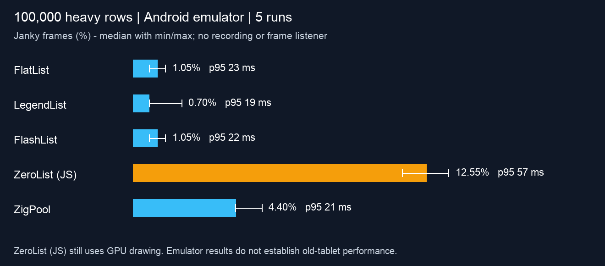
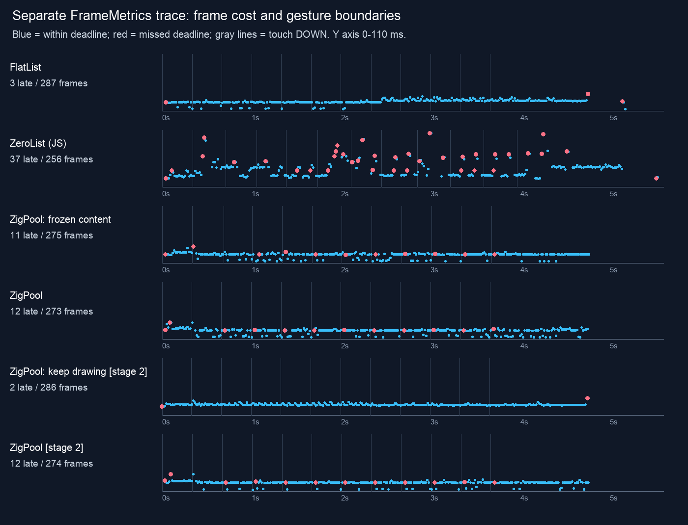
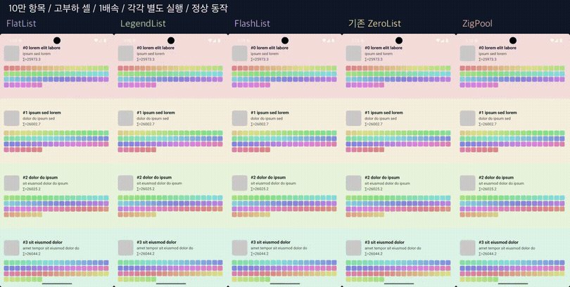

# Five-list comparison and ZigPool jank ablations

The original JS-virtualized ZeroList is now included alongside FlatList, LegendList, FlashList and ZigPool. On this Android emulator, original ZeroList has the most deadline misses in this workload. ZigPool reduces JS callbacks and mounts, but its normal mode still misses more deadlines than the three established lists. A paired drawing-cadence experiment removes most of ZigPool's excess misses without changing its item binding logic.

**“Original ZeroList” does not mean GPU disabled.** Its virtualizer runs in JS and its React Native views still use Android's hardware-rendered display pipeline. This experiment compares virtualization/placement approaches, not GPU on versus off.

## Normal lists: five repetitions each

Release/Hermes/Fabric, Android 16 API 36 arm64 emulator, 1080×2400 px at 420 dpi. Each list contains **100,000 heavy fixed-height items (234 dp)**. Each heavy cell performs a 4,000-iteration square-root loop and contains 64 colored child Views. Warm up 3 seconds, issue twelve sequential 300 ms swipes from (540,1800) to (540,600), then settle for 1.2 seconds. Rotate engine order across repetitions. No recording, FrameMetrics listener, local build or video encoding runs during measurements.

Values below are medians of five independent runs, not pooled frames. Counter deltas exclude the warm-up.

| List | Janky frames | Range | Late frames / rendered frames¹ | gfxinfo p95 | Cell renders | JS callbacks | Mounts / unmounts |
|---|---:|---:|---:|---:|---:|---:|---:|
| FlatList | 1.05% | 0.69–1.39% | 3 / 287 | 23 ms | 25 | 241 | 25 / 0 |
| LegendList | 0.70% | 0.69–2.08% | 2 / 287 | 19 ms | 26 | 210 | 2 / 0 |
| FlashList | 1.05% | 0.69–1.39% | 3 / 287 | 22 ms | 25 | 240 | 1 / 0 |
| ZeroList (original JS) | 12.55% | 11.52–13.50% | 34 / 271 | 57 ms | 25 | 239 | 25 / 5 |
| ZigPool | 4.40% | 4.38–5.51% | 12 / 273 | 21 ms | 26 | 26 | 0 / 0 |

¹ Numerator, denominator and percentage each have their own run-level median, so dividing the displayed medians need not reproduce the percentage exactly.



Original ZeroList's 25 cell renders are close to ZigPool's 26, despite much worse frame timing. Therefore these counters alone do not explain the original implementation's misses. Its JS window/spacer updates and wrapper mount/layout work remain profiling candidates; this experiment does **not** establish a particular one as its root cause. Nor does having more JS callbacks necessarily cause more jank: FlatList has more callbacks and fewer misses here.

## What causes ZigPool's higher percentage here?

Two intentionally broken controls separate content binding from slot placement. These are diagnostic modes, **not usable list alternatives or performance improvements**.

| Stage 1 condition | Janky frames (median) | Late / rendered frames | Cell renders | JS callbacks |
|---|---:|---:|---:|---:|
| Normal ZigPool | 4.40% | 12 / 273 | 26 | 26 |
| Freeze JS content binding | 4.76% | 13 / 273 | 0 | 25 |
| Freeze slot positions after initialization | 20.78% | 16 / 77 | 25 | 25 |

Freezing content removes measured Cell rerenders but leaves the misses. Content changes are therefore not necessary for this repeated-jank pattern. Freezing slot positions radically reduces rendered frames and changes what is drawn; its high ratio does not show that positioning is expensive. A smaller denominator can make this percentage worse even when much less work is drawn.

The separate native FrameMetrics trace shows normal ZigPool's repeated misses about **34–44 ms after a new gesture starts**, following a **33.33 ms gap between app frames**. These resumed frames have a **16.67 ms deadline**, and typically finish around 17–21 ms. Ten of the twelve misses in each normal ZigPool trace follow this pattern. Frozen-content mode retains it.

### Paired follow-up: keep drawing across short gesture gaps

A second APK adds an opt-in `keepAlive` diagnostic. During touch activity, it invalidates the window on each animation callback until 250 ms after the latest touch. It leaves item data, binding, placement and scroll physics unchanged. Normal and keep-alive modes are each measured five times **on this same second APK**, with alternating order.

| Stage 2 condition | Janky frames | Range | Late / rendered frames | gfxinfo p95 | Cell renders | JS callbacks |
|---|---:|---:|---:|---:|---:|---:|
| Normal ZigPool | 4.40% | 4.36–5.51% | 12 / 273 | 20 ms | 26 | 26 |
| Keep drawing (diagnostic) | 0.70% | 0.70–0.70% | 2 / 286 | 23 ms | 26 | 26 |

Absolute misses fall from 12 to 2, while rendered frames rise only from 273 to 286. This is **not merely percentage dilution**. The separate trace also loses the repeated gesture-restart misses. This supports interrupted/resumed drawing cadence as a major contributor to ZigPool's excess jank in this scripted emulator workload. It does not prove the exact framework/driver scheduling mechanism, and the p95 duration does not improve.

`keepAlive` remains **off by default**, confined to the example Activity. Extra invalidations can consume power and rendering work. We have not adopted continuous invalidation as a production optimization or verified benefits on physical tablets, long flings or other interaction patterns.



Blue dots meet their per-frame deadline; red dots miss it; vertical lines mark touch DOWN. Trace runs are separate from the five-run statistics. Listener-reported dropped callbacks are zero in all nine traced conditions. Analysis includes intended VSYNC from one refresh before the first DOWN through 1.2 s after the final UP; intended VSYNC can precede input dispatch in the same refresh. This touch-relative window is slightly different from the gfxinfo-reset window, so total frame counts can differ at the boundary. Raw logs and the exact analysis are included.

## Meaning and limits of the metrics

“Janky frames” is the non-legacy `dumpsys gfxinfo` deadline-miss ratio, **not input latency** or the percentage of time frozen. It is not simply “all frames exceeding 16.67 ms”: available frame deadlines differ in this capture. Android exposes `TOTAL_DURATION` and `DEADLINE` separately, and warns that stage durations do not necessarily sum to total duration. See the [official FrameMetrics reference](https://developer.android.com/reference/android/view/FrameMetrics).

GPU duration, command issue and buffer-swap timings can include pipeline/synchronization effects in this emulator; they do not independently establish pure GPU compute load. The trace identifies a timing pattern and the cadence intervention tests its importance; no Perfetto scheduler/driver trace was collected.

This is a small synthetic emulator benchmark. It does not establish old-tablet performance, thermal behavior, power, memory use, startup time, dynamic-height correctness or end-to-end input-to-photon latency. Lists virtualize: 100,000 data items does not mean 100,000 mounted cells, and these gestures cover only the beginning of the dataset. Engines have different scroll physics and distances. Frozen controls are not functionally equivalent to normal lists. Results from the two APK stages are reported separately.

## Visual evidence

All five normal engines were recorded again on the stage 2 APK, with diagnostics off. Each uses the same nine scripted gestures: two slow forward, four fast forward, three reverse. Recordings are separate from quantitative tests. Full-height before/after screenshots allow checking content overlap and row continuity; complex and heavy heights are shared across engines.

- [Heavy: five engines, 1×](comparison-heavy.mp4)
- [Complex: five engines, 1×](comparison-complex.mp4)
- [Heavy crop, 0.25×, source seconds 2–8, no interpolation](heavy-detail-slow.mp4)
- [All five engines × two cell types at rest](layout-check.jpg)
- [Heavy before/after](contact-heavy.jpg)



| Engine | Heavy original | Complex original |
|---|---|---|
| FlatList | [MP4](heavy-flatlist.mp4) | [MP4](complex-flatlist.mp4) |
| LegendList | [MP4](heavy-legend.mp4) | [MP4](complex-legend.mp4) |
| FlashList | [MP4](heavy-flashlist.mp4) | [MP4](complex-flashlist.mp4) |
| Original ZeroList | [MP4](heavy-zerolist.mp4) | [MP4](complex-zerolist.mp4) |
| ZigPool | [MP4](heavy-zigpool.mp4) | [MP4](complex-zigpool.mp4) |

Host emulator capture avoids the earlier Android screenrecord timestamp mismatch. `capture-manifest.json` records wall time, encoded duration, each gesture timestamp and source SHA-256. Panels start at recording time zero but are not frame-perfect gesture or scroll-position synchronization. GIF is only a navigation preview. `video-validation.json` contains full-decode and format checks for all 13 MP4 files.

## Reproduction and artifacts

- [Provenance / APK SHA-256 / environment](provenance.json)
- Stage 1: [all 35 runs](results-main.json), [raw logs/screenshots/XML](raw-main.zip), [7 separate trace runs](results-trace.json), [trace logs](raw-trace.zip)
- Stage 2: [10 paired runs](results-cadence-main.json), [raw logs/screenshots/XML](raw-cadence-main.zip), [2 separate trace runs](results-cadence-trace.json), [trace logs](raw-cadence-trace.zip)
- [Run-level summary](summary.json), [per-miss trace timing](trace-summary.json)
- [Measurement script](measure.py), [analysis](analyze.py), [capture](capture.py), [video composition](visualize.py)

Stage 1 application source: `75a8264`; stage 2 and video application source: `37d99c7`. Use stage 1's script at that commit to reproduce its exact command line; the later script adds an explicitly false keepAlive extra in ordinary runs.

```sh
# Build/install the desired source revision first. Use separate output directories.
ADB=/path/to/adb OUT=/tmp/main python3 docs/benchmarks/2026-09-05-ablation/measure.py
ADB=/path/to/adb TRACE=1 OUT=/tmp/trace python3 docs/benchmarks/2026-09-05-ablation/measure.py
ADB=/path/to/adb STAGE=cadence OUT=/tmp/cadence-main python3 docs/benchmarks/2026-09-05-ablation/measure.py
ADB=/path/to/adb STAGE=cadence TRACE=1 OUT=/tmp/cadence-trace python3 docs/benchmarks/2026-09-05-ablation/measure.py
# After quantitative measurements finish:
ADB=/path/to/adb OUT="$PWD/docs/benchmarks/2026-09-05-ablation" RAW=/tmp/videos-webm python3 docs/benchmarks/2026-09-05-ablation/capture.py
python3 docs/benchmarks/2026-09-05-ablation/analyze.py
python3 docs/benchmarks/2026-09-05-ablation/visualize.py
```

Earlier layout/CI repair evidence remains in the [four-engine report](../2026-09-05-large-list/README.md). Do not combine its samples with this follow-up.
