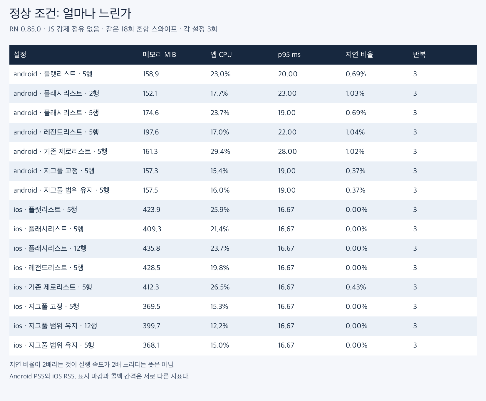
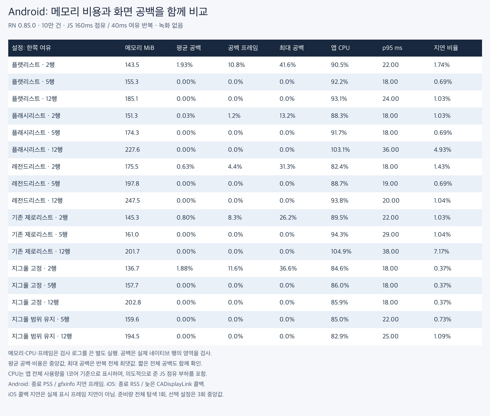
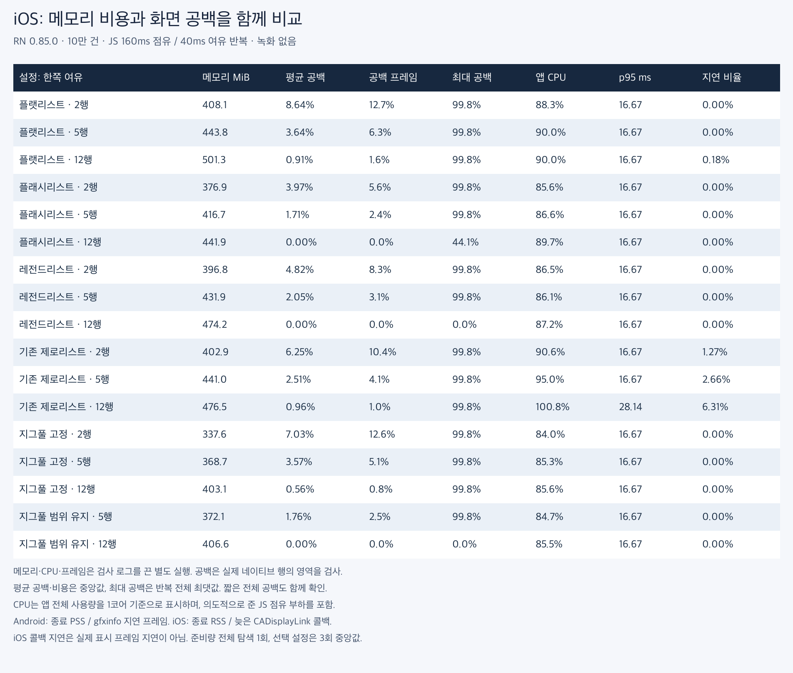

# 같은 메모리와 공백 수준에서 비교한 다섯 리스트 — RN 0.85.0

**이번 고정 높이·10만 건 조건에서는 ZigPool이 비슷한 메모리의 FlatList보다 느려졌다는 근거가 없었고, CPU 비용이 낮았다.** iOS에서는 범위 유지 예측이 같은 공백 수준을 더 적은 메모리로 달성하는 후보였다. 실험을 계속할 근거는 있지만, 실물 저사양 기기와 동적 높이를 검증한 제품 도입 결론은 아니다.

유효 실행은 총 **207회**다. 전체 17개 설정을 양 플랫폼에서 정상 공백·JS 부하 공백·JS 부하 성능으로 탐색했고, Android 7개·iOS 8개 후보의 부하 공백/성능은 총 3회, 정상 성능은 별도 3회로 비교했다. 초기 보관량과 검사 반올림을 조정하기 전 실행은 합산하지 않았다.

[상세 측정 방법과 한계](methodology-ko.md) · [설정 선택 근거](selection.json) · [한글 CSV](comparison-ko.csv)

## 정상 조건: 얼마나 느린가

Android 약 160MiB 구간에서 FlatList p95 중앙값은 **20ms**, ZigPool은 **19ms**, 기존 ZeroList는 **28ms**였다. p95는 느린 상위 5% 경계다. 전체 실행 속도의 배수로 바꾸지 않는다.

ZigPool과 FlatList의 CPU 중앙값은 각각 **15.4% / 23.0%**로, 이번 같은 입력에서 ZigPool이 약 **32.9%** 낮았다. 프레임 시간 분포는 겹치므로 프레임이 그 비율만큼 빨라졌다는 의미는 아니다. GPU API를 바꾼 실험도 아니다.



### Android 정상 성능: 각 3회

| 설정 | 종료 메모리 MiB | CPU % | p95 ms | p95 범위 | 지연 비율 % |
|---|---:|---:|---:|---:|---:|
| FlatList · 5행 | 158.9 | 23.0 | 20.00 | 19.00–26.00 | 0.69 |
| FlashList · 2행 | 152.1 | 17.7 | 23.00 | 18.00–24.00 | 1.03 |
| FlashList · 5행 | 174.6 | 23.7 | 19.00 | 18.00–19.00 | 0.69 |
| LegendList · 5행 | 197.6 | 17.0 | 22.00 | 19.00–26.00 | 1.04 |
| 기존 ZeroList · 5행 | 161.3 | 29.4 | 28.00 | 28.00–29.00 | 1.02 |
| ZigPool 고정 · 5행 | 157.3 | 15.4 | 19.00 | 19.00–20.00 | 0.37 |
| ZigPool 범위 유지 · 5행 | 157.5 | 16.0 | 19.00 | 18.00–22.00 | 0.37 |

### iOS 정상 성능: 각 3회

| 설정 | 종료 메모리 MiB | CPU % | p95 ms | p95 범위 | 지연 비율 % |
|---|---:|---:|---:|---:|---:|
| FlatList · 5행 | 423.9 | 25.9 | 16.67 | 16.67–16.67 | 0.00 |
| FlashList · 5행 | 409.3 | 21.4 | 16.67 | 16.67–16.67 | 0.00 |
| FlashList · 12행 | 435.8 | 23.7 | 16.67 | 16.67–16.67 | 0.00 |
| LegendList · 5행 | 428.5 | 19.8 | 16.67 | 16.67–16.67 | 0.00 |
| 기존 ZeroList · 5행 | 412.3 | 26.5 | 16.67 | 16.67–16.67 | 0.43 |
| ZigPool 고정 · 5행 | 369.5 | 15.3 | 16.67 | 16.67–16.67 | 0.00 |
| ZigPool 범위 유지 · 12행 | 399.7 | 12.2 | 16.67 | 16.67–16.67 | 0.00 |
| ZigPool 범위 유지 · 5행 | 368.1 | 15.0 | 16.67 | 16.67–16.67 | 0.00 |

iOS의 p95·지연 비율은 CADisplayLink 콜백 간격이며 실제 표시 프레임의 끊김이 아니다. Android PSS와 iOS RSS도 직접 비교하지 않는다. CPU는 프로세스 전체를 1코어 기준으로 나타낸 비율이다.

## JS가 바쁠 때: 같은 메모리 구간과 같은 공백 수준

JS를 160ms 점유하고 40ms 여유를 반복한다. 모든 목록에 같은 부하를 주며 전용 반영 지연 타이머는 사용하지 않는다. 공백 검사의 메모리가 아니라, 검사 로그를 끈 별도 성능 실행의 메모리를 사용했다.

### Android 전체 준비량 탐색



| 설정 | 메모리 MiB | 평균 공백 면적 % | 공백 이동 프레임 % | 최대 공백 면적 % | CPU % | 공백/성능 반복 |
|---|---:|---:|---:|---:|---:|---:|
| FlatList · 2행 | 143.5 | 1.934 | 10.76 | 41.58 | 90.5 | 1/1 |
| FlatList · 5행 | 155.3 | 0.000 | 0.00 | 0.00 | 92.2 | 3/3 |
| FlatList · 12행 | 185.1 | 0.000 | 0.00 | 0.00 | 93.1 | 1/1 |
| FlashList · 2행 | 151.3 | 0.026 | 1.19 | 13.17 | 88.3 | 3/3 |
| FlashList · 5행 | 174.3 | 0.000 | 0.00 | 0.00 | 91.7 | 3/3 |
| FlashList · 12행 | 227.6 | 0.000 | 0.00 | 0.00 | 103.1 | 1/1 |
| LegendList · 2행 | 175.5 | 0.635 | 4.42 | 31.29 | 82.4 | 1/1 |
| LegendList · 5행 | 197.8 | 0.000 | 0.00 | 0.00 | 88.7 | 3/3 |
| LegendList · 12행 | 247.5 | 0.000 | 0.00 | 0.00 | 93.8 | 1/1 |
| 기존 ZeroList · 2행 | 145.3 | 0.799 | 8.33 | 26.21 | 89.5 | 1/1 |
| 기존 ZeroList · 5행 | 161.0 | 0.000 | 0.00 | 0.00 | 94.3 | 3/3 |
| 기존 ZeroList · 12행 | 201.7 | 0.000 | 0.00 | 0.00 | 104.9 | 1/1 |
| ZigPool 고정 · 2행 | 136.7 | 1.879 | 11.55 | 36.58 | 84.6 | 1/1 |
| ZigPool 고정 · 5행 | 157.7 | 0.000 | 0.00 | 0.00 | 86.0 | 3/3 |
| ZigPool 고정 · 12행 | 202.8 | 0.000 | 0.00 | 0.00 | 85.9 | 1/1 |
| ZigPool 범위 유지 · 5행 | 159.6 | 0.000 | 0.00 | 0.00 | 85.0 | 3/3 |
| ZigPool 범위 유지 · 12행 | 194.5 | 0.000 | 0.00 | 0.00 | 82.9 | 1/1 |

### iOS 전체 준비량 탐색



| 설정 | 메모리 MiB | 평균 공백 면적 % | 공백 이동 프레임 % | 최대 공백 면적 % | CPU % | 공백/성능 반복 |
|---|---:|---:|---:|---:|---:|---:|
| FlatList · 2행 | 408.1 | 8.635 | 12.75 | 99.77 | 88.3 | 1/1 |
| FlatList · 5행 | 443.8 | 3.641 | 6.29 | 99.77 | 90.0 | 3/3 |
| FlatList · 12행 | 501.3 | 0.910 | 1.55 | 99.77 | 90.0 | 1/1 |
| FlashList · 2행 | 376.9 | 3.966 | 5.57 | 99.77 | 85.6 | 1/1 |
| FlashList · 5행 | 416.7 | 1.708 | 2.40 | 99.77 | 86.6 | 3/3 |
| FlashList · 12행 | 441.9 | 0.000 | 0.00 | 44.05 | 89.7 | 3/3 |
| LegendList · 2행 | 396.8 | 4.816 | 8.33 | 99.77 | 86.5 | 1/1 |
| LegendList · 5행 | 431.9 | 2.050 | 3.08 | 99.77 | 86.1 | 3/3 |
| LegendList · 12행 | 474.2 | 0.000 | 0.00 | 0.00 | 87.2 | 1/1 |
| 기존 ZeroList · 2행 | 402.9 | 6.249 | 10.43 | 99.77 | 90.6 | 1/1 |
| 기존 ZeroList · 5행 | 441.0 | 2.508 | 4.10 | 99.77 | 95.0 | 3/3 |
| 기존 ZeroList · 12행 | 476.5 | 0.965 | 1.01 | 99.77 | 100.8 | 1/1 |
| ZigPool 고정 · 2행 | 337.6 | 7.026 | 12.57 | 99.77 | 84.0 | 1/1 |
| ZigPool 고정 · 5행 | 368.7 | 3.572 | 5.05 | 99.77 | 85.3 | 3/3 |
| ZigPool 고정 · 12행 | 403.1 | 0.558 | 0.79 | 99.77 | 85.6 | 1/1 |
| ZigPool 범위 유지 · 5행 | 372.1 | 1.760 | 2.51 | 99.77 | 84.7 | 3/3 |
| ZigPool 범위 유지 · 12행 | 406.6 | 0.000 | 0.00 | 0.00 | 85.5 | 3/3 |

평균 공백은 이동 중 관측 프레임에서 비어 있는 세로 면적의 평균이다. 2px/포인트 반올림 오차를 허용했다. 최대 공백은 반복 실행 전체의 최댓값이다. 평균 0% 중앙값만으로 모든 실행에 공백이 없었다고 말하지 않는다.

### 반복한 주요 비교의 범위

| 플랫폼·설정 | 메모리 범위 MiB | 평균 공백 면적 범위 % | CPU 범위 % |
|---|---:|---:|---:|
| android · FlatList · 5행 | 153.0–159.2 | 0.000–0.000 | 92.1–93.0 |
| android · FlashList · 2행 | 151.0–151.4 | 0.010–0.093 | 85.8–90.0 |
| android · FlashList · 5행 | 172.5–174.6 | 0.000–0.000 | 91.5–92.4 |
| android · ZigPool 고정 · 5행 | 157.3–159.1 | 0.000–0.000 | 84.5–86.3 |
| ios · FlatList · 5행 | 419.9–447.4 | 3.480–3.980 | 89.7–90.4 |
| ios · FlashList · 5행 | 412.2–421.7 | 1.138–1.982 | 86.1–88.1 |
| ios · FlashList · 12행 | 440.2–443.7 | 0.000–0.322 | 89.3–90.0 |
| ios · ZigPool 고정 · 5행 | 368.5–378.3 | 3.227–3.725 | 85.0–85.4 |
| ios · ZigPool 범위 유지 · 5행 | 372.0–375.7 | 0.841–2.862 | 84.7–85.3 |
| ios · ZigPool 범위 유지 · 12행 | 405.6–418.5 | 0.000–0.000 | 85.4–86.1 |

### 풀 크기를 늘리지 않은 예측

iOS에서 기본 5행과 범위 유지 예측 5행은 모두 풀 14개다. 종료 RSS 중앙값은 각각 **368.7/372.1MiB**, 평균 공백 면적 중앙값은 **3.572/1.760%**였다. 작은 예측의 공백 범위는 0.841–2.862%다. 풀을 늘린 효과와 범위 배분·유지 효과를 구분해야 하며, 이 작은 풀에서도 공백을 모두 없앤 것은 아니다.


iOS 공백 억제 후보인 FlashList 12행과 범위 유지 예측 12행의 종료 RSS 중앙값 차이는 **35.2MiB**였다. 공칭 여유가 같아도 내부 보관량·갱신·메모리 관리가 다르므로 메모리가 같지는 않다. 최대 메모리나 GC 후 최소 사용량을 측정한 것은 아니다.

## 판단

- **ZigPool 접근은 계속 검증할 가치가 있다.** Android의 비슷한 메모리 구간에서 CPU 비용이 낮았고, iOS 범위 유지 예측은 메모리와 공백을 함께 개선할 후보였다.
- **Android에서는 고정 5행이 우선 후보다.** 같은 작은 풀의 범위 유지 예측은 부하 p95가 더 높아 기본 적용 근거가 없었다.
- **작은 풀만 고집하면 공백은 남는다.** ZigPool도 준비 공간의 제약을 받는다. 범위를 유지하는 예측과 충분한 여유의 결합을 평가해야 한다.
- **기존 ZeroList는 이번 정상 조건의 CPU와 p95 비용이 더 컸다.** GPU 선택 하나로 설명되는 차이가 아니라 셀 갱신·생성·재사용 경로 전체의 비교다.
- **보편적인 라이브러리 순위로 확장하지 않는다.** FlashList의 작은 여유 설정은 낮은 메모리 후보이고, 각 목록의 기능·동적 높이·초기 표시·실물 기기의 비용은 아직 이 표에 없다.
- **제품 기본값은 유지한다.** bufferRows와 공통 검사는 Solo 예제의 측정 옵션이다. 구형 태블릿에서 메모리 압박·GC·발열과 실제 표시 프레임을 확인하기 전 일반 도입을 확정하지 않는다.

## 별도 비교 영상

정량 실행이 모두 끝난 뒤 같은 데이터와 JS 부하로 별도 녹화했다. Android는 FlatList 5행·FlashList 2행·ZigPool 고정 5행, iOS는 FlatList 5행·FlashList 5행·범위 유지 예측 12행이다. 서로 다른 실행이며 같은 시각의 같은 행을 비교하는 영상은 아니다. 원본은 1배속이고, 합성본은 60fps로 배치하며 짧은 클립이 끝나면 마지막 화면을 유지한다.

- [Android 비교](android-compare-block.mp4)
- [iOS 비교](ios-compare-block.mp4)

## 검증·재현·원자료

73개 테스트, 린트, 라이브러리 타입 검사와 Android arm64 Release·iOS arm64 시뮬레이터 Release 빌드를 통과했다. 빌드 CI는 추가하지 않았다.

- [전체 원자료 행렬](matrix.json), [집계](summary.json), [비교 점](points.json), [실행 그룹](groups.json)
- [바이너리·코드 해시](provenance.json), [코드 변경](runtime.patch)
- [측정](record.py), [후보 반복](repeat.py), [수집](collect.py), [분석](analyze.py), [한글 이미지](make_images.py)
- [녹화](capture.py), [영상 검증](video-validation.json), [녹화 입력·시각](capture-manifest.json)

```sh
PLATFORM=android MODE=audit BLOCK_MS=160 OUT=/private/tmp/budget-new-audit python3 -I docs/benchmarks/2026-09-05-budget/record.py
PLATFORM=ios MODE=perf BLOCK_MS=0 REPEATS=3 CONFIGS=flatlist-5,zigpool-5 OUT=/private/tmp/budget-new-perf python3 -I docs/benchmarks/2026-09-05-budget/record.py
```

이 자료는 RN 0.85.0 바이너리의 결과다. 재현하려면 provenance의 기반 커밋과 runtime.patch를 적용한 별도 체크아웃에서 RN 0.85.0 앱을 빌드한다. 최신 RN 앱으로 이 스크립트만 실행한 결과를 합산하면 안 된다. 항상 새 출력 경로를 사용한다. Android는 세로 1080×2400이 필요하며 설정을 자동 변경하지 않는다. [측정 방법](methodology-ko.md)에 조건과 지표의 한계를 상세히 적었다.

- [final-android-audit-0-raw.zip](final-android-audit-0-raw.zip)
- [final-android-audit-160-raw.zip](final-android-audit-160-raw.zip)
- [final-android-perf-160-raw.zip](final-android-perf-160-raw.zip)
- [isolated-ios-audit-0-raw.zip](isolated-ios-audit-0-raw.zip)
- [isolated-ios-audit-160-raw.zip](isolated-ios-audit-160-raw.zip)
- [isolated-ios-audit-160-repeat-raw.zip](isolated-ios-audit-160-repeat-raw.zip)
- [isolated-ios-perf-0-repeat-raw.zip](isolated-ios-perf-0-repeat-raw.zip)
- [isolated-ios-perf-160-raw.zip](isolated-ios-perf-160-raw.zip)
- [isolated-ios-perf-160-repeat-raw.zip](isolated-ios-perf-160-repeat-raw.zip)
- [isolated-ios-small-audit-160-raw.zip](isolated-ios-small-audit-160-raw.zip)
- [isolated-ios-small-perf-0-raw.zip](isolated-ios-small-perf-0-raw.zip)
- [isolated-ios-small-perf-160-raw.zip](isolated-ios-small-perf-160-raw.zip)
- [repeat-android-audit-160-raw.zip](repeat-android-audit-160-raw.zip)
- [repeat-android-perf-0-raw.zip](repeat-android-perf-0-raw.zip)
- [repeat-android-perf-160-raw.zip](repeat-android-perf-160-raw.zip)
