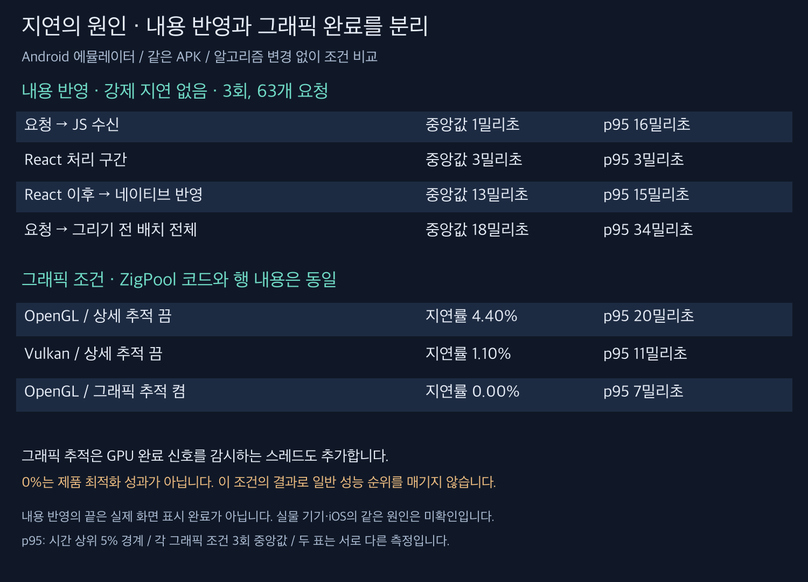

# 지연 프레임과 내용 준비 지연의 원인 분리

**이번에는 ZigPool의 처리 알고리즘을 바꾸지 않고, 내용 반영 단계와 Android 그래픽 계측 조건을 분리했다.** 내용 준비는 계산량보다 React 결과가 네이티브에 반영되는 대기가 컸다. 지연 프레임은 에뮬레이터의 그래픽 완료 신호와 마감 판정에 크게 좌우됐다. 따라서 기존 지연률 차이를 그대로 리스트 계산 성능 차이로 해석하면 안 된다.

## 1. 내용 준비가 많아서 늦는가?

이번 일반 비교 3회에서 수정 ZigPool의 추가 행 렌더는 매번 21회, FlatList는 25~26회였다. ZigPool이 10만 건을 매 스크롤마다 다시 만드는 것은 아니다. 데이터와 offsets는 준비 단계에서 만들고 재사용한다. 한 행을 재사용할 때 새 내용의 React 계산과 네이티브 반영은 여전히 필요하다.

상세 시스템 추적을 끄고, 같은 APK에서 내용 반영 로그만 켠 3회의 **63개 완결된 요청**을 연결했다. 강제 내용 지연은 0ms다.

| 구간 | 중앙값 | p95 | 최대 |
|---|---:|---:|---:|
| 네이티브 요청 → JS 수신 | 1ms | 16ms | 19ms |
| JS 수신 → React 렌더 진입 | 0ms | 1ms | 1ms |
| 렌더 진입 → React 레이아웃 효과 | 3ms | 3ms | 5ms |
| React 레이아웃 효과 → 네이티브 속성 반영 | **13ms** | 15ms | 17ms |
| 네이티브 속성 반영 → 그리기 전 배치 | 1ms | 2ms | 2ms |
| 요청 → 그리기 전 배치 전체 | **18ms** | **34ms** | 37ms |

0ms는 작업이 없다는 뜻이 아니라 밀리초 벽시계의 해상도 안에 들어왔다는 뜻이다. 단계별 중앙값은 일반적으로 합쳐도 전체 중앙값과 같지 않다. `useLayoutEffect`까지의 구간은 순수 JS CPU 실행 시간이나 `HeavyCell` 함수 시간과 같지 않다. 끝 지점은 화면 표시 완료가 아닌 그리기 전 배치다.

별도 상세 추적에서 복잡한 행을 제목만 있는 단순 행으로 줄이면 React 처리 구간 중앙값은 3→1ms였지만 전체는 둘 다 18ms였다. 단순 행은 높이와 지나간 행 수까지 달라지므로 이 비교만으로 정확한 최적화 효과를 주장하지 않는다. 시스템 추적 없이 수집한 위 63개 요청에서도 네이티브 반영 대기가 큰 것은 재확인했다.

현재 설치된 React Native 0.85 코드에서 JS 스레드의 마운트 작업은 큐에 들어가고, UI 스레드의 프레임 콜백이 이를 처리한다. [scheduleMountItem](https://github.com/facebook/react-native/blob/v0.85.0/packages/react-native/ReactAndroid/src/main/java/com/facebook/react/fabric/FabricUIManager.java)과 같은 파일의 `doFrameGuarded`가 근거다. 요청 수신에도 프레임 주기의 영향을 받는 꼬리 지연이 있다. **주된 대기가 다음 UI 반영 시점을 기다리는 것이라는 해석을 지지한다. 다른 리스트보다 이 단계가 더 느리다는 비교까지 한 것은 아니다.**

강제 120/400ms 지연에서 빈 공간이 생긴 이유도 별개가 아니다. 준비된 여유 행보다 스크롤이 앞서가면 다음 내용이 아직 없다. 대략 필요한 선행 준비 거리는 `스크롤 속도 × 내용 반영 시간`이며, 안전 여유도 필요하다. 현재 고정 개수의 양방향 여유 행은 임의의 속도·JS 지연을 모두 흡수하지 못한다. 잘못된 내용을 먼저 옮기지 않도록 수정한 뒤 이 경우가 빈 공간으로 드러난 것이다.

## 2. 지연 프레임은 어디서 길어지는가?

내용 로그·상세 추적을 끈 같은 APK 비교에서도 지연률 중앙값은 FlatList 0.70%, 수정 ZigPool 4.40%로 재현됐다. 단순히 새 계측 코드를 추가해서 문제가 사라진 것은 아니다.

기본 OpenGL, 프레임 로그만 켠 첫 진단 실행의 지연 프레임 12개에서:

| 항목 | 지연 프레임의 중앙값 |
|---|---:|
| 전체 프레임 시간 | 17.85ms |
| 부여된 마감시간 | **16.67ms** |
| GPU 완료 시간으로 기록되는 구간 | **14.74ms** |
| 입력 처리 | 0.25ms |
| 레이아웃·측정 | 0.03ms |
| 그리기 명령 기록 | 0.02ms |
| 렌더 스레드 동기화 | 0.41ms |
| 명령 제출 | 0.66ms |

단계가 겹칠 수 있어 이 표의 합은 전체 시간이 아니다. 같은 실행의 전체 프레임 마감 중앙값은 33.33ms다. 즉 평소보다 짧은 16.67ms 마감을 받는 그리기 재개 시점에서 약 17~18ms 프레임이 기한을 넘는 구조가 반복된다. [이전 그리기 재개 실험](../2026-09-05-ablation/README.md)과도 일치한다.

**GPU 완료 구간 14.74ms를 실제 GPU 계산 14.74ms로 읽으면 안 된다.** [Android 16 CanvasContext 참조 소스](https://android.googlesource.com/platform/frameworks/base/+/android16-release/libs/hwui/renderthread/CanvasContext.cpp)의 `onSurfaceStatsAvailable`은 acquire fence 완료 시각을 사용해 `GpuCompleted`와 프레임 완료 시각을 갱신한다. 이는 순수 셰이더 실행 시간과 다르다.

## 3. 계측 도구 자체가 동작을 바꿨다

먼저 상세 추적을 켜자 지연 프레임이 거의 사라졌다. 이를 성능 개선으로 채택하지 않고 추적 설정을 분리했다.

| 같은 APK의 조건 | 반복 | 지연률 중앙값 | p95 중앙값 |
|---|---:|---:|---:|
| 프레임 로그만 | 3 | 4.40% | 20ms |
| 내용 반영 로그 추가 | 3 | 4.40% | 19ms |
| FrameTimeline만 | 3 | 4.40% | 20ms |
| ftrace·여러 Android 추적 범주 | 3 | 0.36% | 8ms |
| 위 추적 + FrameTimeline | 3 | 0.00% | 7ms |

범주를 다시 분리한 1차 탐색에서 CPU 스케줄링만, 뷰만, 앱만 추적한 경우는 모두 4.40%였다. **그래픽(`gfx`)만 추적했을 때만 0%**가 됐다. 이후 꺼짐/그래픽 추적을 교차한 3쌍에서도 꺼짐 4.40%, 그래픽 추적 0.00%가 재현됐다.

첫 교차 실행에서 전체 프레임의 GPU 완료 구간 중앙값은 **14.49→0.81ms**로 바뀌었다. 입력·레이아웃·명령 제출 시간은 비슷했다. CPU 스케줄링 추적만으로는 차이가 나지 않았으므로 단순한 전체 추적 부하만으로 설명하기 어렵다.

[Android 16 Surface.cpp](https://android.googlesource.com/platform/frameworks/native/+/android16-release/libs/gui/Surface.cpp)에는 그래픽 추적을 켜면 `GPU completion`이라는 [FenceMonitor](https://android.googlesource.com/platform/frameworks/native/+/android16-release/libs/gui/FenceMonitor.cpp)를 만들어 GPU 완료 신호를 별도 스레드에서 기다리는 분기가 있다. 실제 상세 추적에서도 그 스레드의 `waitForever` 243회를 확인했다. **단순히 기록만 추가되는 것이 아니라 GPU 완료 신호를 관찰하는 방식도 달라진다.** 참조 소스가 실행 중인 에뮬레이터 시스템 바이너리와 비트 단위로 동일하다는 뜻은 아니다.

여기까지는 설정 분리와 실행 추적으로 확인했다. 그 감시가 에뮬레이터 드라이버의 신호 통지 시점을 어떻게 바꾸는지, 실제 표시 시각과 통계 중 어느 쪽에 얼마만큼 영향을 주는지는 아직 확정하지 않았다. GPU 완료 신호·관측·마감 판정 경로가 유력하다는 결론이며, 드라이버 내부 버그 하나를 특정했다는 결론은 아니다.

FrameTimeline만 켠 자료에는 `Unknown Jank`와 `Early Present`가 함께 나오는 경우가 많다. 이를 사용자 체감 끊김 횟수로 그대로 바꿔 세지 않았다. [Perfetto FrameTimeline 설명](https://perfetto.dev/docs/data-sources/frametimeline)을 기준으로 원자료와 기존 `gfxinfo` 판정을 구분한다.

## 4. 그래픽 백엔드만 바꿔도 결과가 달라졌다

시스템 상세 추적을 끄고, 동일 APK·동일 행·동일 제스처에서 OpenGL/Vulkan 순서를 `GL, VK, VK, GL, GL, VK`로 바꿨다. `gfxinfo`의 실제 Pipeline 값도 확인했다.

| ZigPool의 그래픽 백엔드 | 지연률 중앙값 | 범위 | p95 중앙값 |
|---|---:|---:|---:|
| OpenGL | **4.40%** | 3.65~4.40% | 20ms |
| Vulkan | **1.10%** | 0.73~1.82% | 11ms |

추가 행 렌더는 20~21회로 비슷했다. 별도 Vulkan 3회 비교에서 FlatList는 지연률 0.35%·p95 12ms, ZigPool은 1.09%·p95 11ms였다. 지연률과 p95가 같은 순서를 보장하지 않으며, Vulkan에서도 ZigPool의 우위를 입증한 것은 아니다.

이것은 그래픽 경로의 영향이 크다는 원인 분리 실험이다. 앱의 기본 백엔드를 바꾸는 최적화로 채택하지 않았다. 실험 후 시스템 값을 원래 `skiagl`로 복원하고 일반 앱을 다시 실행했다.

## 판단과 다음 수정 순서

1. **행 계산량이 많아서 모든 지연이 생긴다는 가설은 현재 근거와 맞지 않는다.** 상세 추적 중 `ZL.reposition` 259회의 평균은 0.0088ms, 최대는 0.1100ms였다. 이 값도 그래픽 추적이 켜진 조건의 값이며 정상 조건의 정밀 CPU 프로파일로 확대 해석하지 않는다.
2. **내용 준비는 요청부터 실제 사용 가능한 상태까지의 대기가 핵심이다.** 속도·반영 지연에 맞춘 선행 준비, 마운트 완료까지의 시간 예산을 먼저 다뤄야 한다. 여유 행을 늘리면 메모리·초기 비용도 증가한다.
3. **지연 프레임은 실제 기기의 GPU 완료·화면 표시 자료로 검증해야 한다.** 현재 에뮬레이터 숫자만으로 ZigPool 구조가 본질적으로 느리다고 단정하지 않는다. 반대로 실물 성능 우위가 확인된 것도 아니므로 도입 권장으로 결론을 뒤집지는 않는다.
4. 전체 그리기 유지나 그래픽 추적을 상시 켜 지표를 낮추는 방식은 제품 최적화로 쓰지 않는다. React의 내부 마운트 큐를 임의로 강제 실행하는 변경도 하지 않았다.

이번 변경은 Android 예제의 선택적 단계 로그, 시스템 추적 허용 설정과 재현 스크립트다. iOS·실물 구형 태블릿·동적 높이에 동일 원인이 있다고 입증한 것은 아니다. 기존 120/400ms 강제 지연 검사를 정상 응답 시간 측정과 혼동하지 않는다. 빌드 CI는 추가하지 않았다.

## 재현과 원자료

- [내용 단계·프레임 로그 분석](analyze.py), [분석 결과](analysis.json), [63개 요청 요약](binding-summary.json)
- [기본 추적](record.py), [설정](trace.cfg), [원자료](initial-raw.zip), [SQL](trace_summary.sql)
- [계측 설정 분리](probe_modes.py): 기본 3회, `STAGE=categories REPEATS=1`, `STAGE=categories VARIANTS=off,gfx REPEATS=3`
- [기본 비교](normal-results.json), [원자료](normal-raw.zip)
- [계측 분리 결과](probe-modes-results.json), [원자료](probe-modes-raw.zip)
- [범주 탐색 결과](categories-results.json), [원자료](categories-raw.zip)
- [그래픽 추적 교차 결과](gfx-confirm-results.json), [원자료](gfx-confirm-raw.zip)
- [Vulkan 참고 비교](vulkan-results.json), [원자료](vulkan-raw.zip)
- [백엔드 교차 스크립트](probe_renderer.py), [결과](renderer-confirm-results.json), [원자료](renderer-confirm-raw.zip)
- [APK·코드 변경 해시](provenance.json), [측정 앱의 변경 내역](runtime.patch)

모든 측정은 Android 16/API 36 arm64 에뮬레이터, 복잡한 고정 높이 행 10만 건, Release 앱, 스와이프 12회다. 단순 행 조건은 별도로 표시했다. 녹화·다른 플랫폼 측정·빌드와 동시에 실행하지 않았다. 시간 로그는 같은 기기의 밀리초 벽시계를 사용하고 요청 버전으로 연결한다. 네이티브 로그는 단조 시계도 보관한다. 단방향 측정의 완결된 버전만 분석했으며 이 간단한 연결기는 임의의 왕복·동시 변경용 범용 지연 측정기는 아니다.

APK 빌드, 기존 71개 테스트, 린트, 라이브러리 타입 검사를 통과했다. 이 결과는 성능 우위의 근거와 구분한다.
