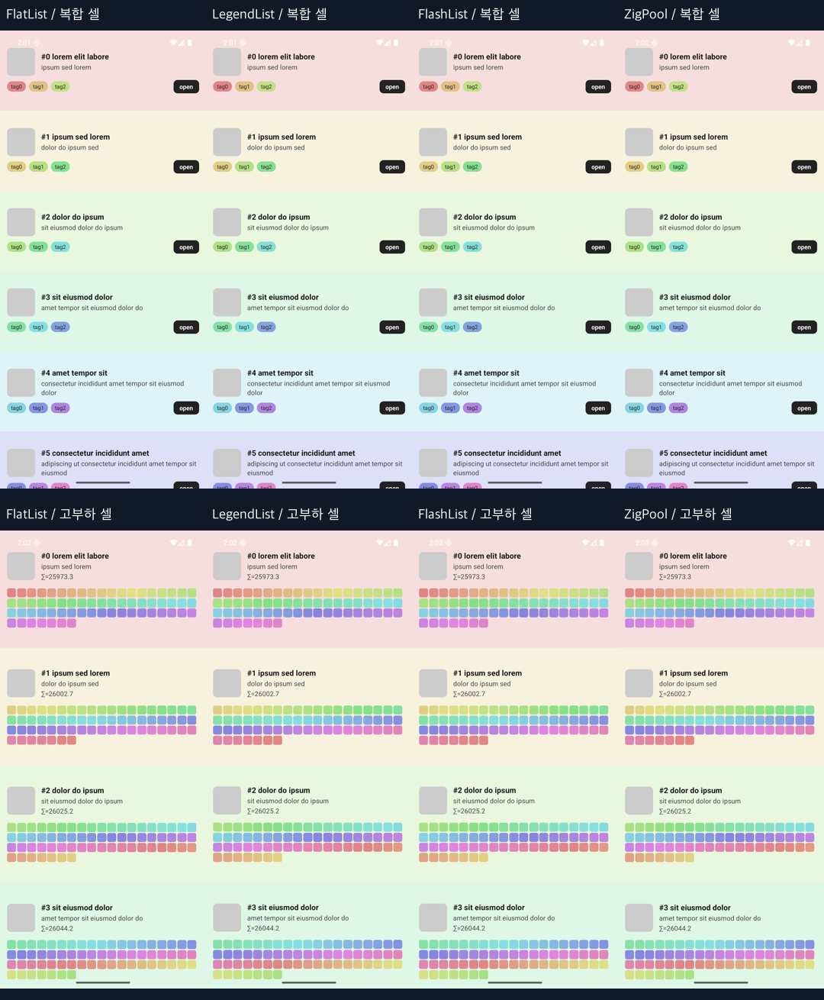

# 셀 겹침 수정 후 10만 항목 비교

후속 자료: [기존 ZeroList를 포함한 다섯 목록 비교와 그리기 중단·재개 원인 실험](../2026-09-05-ablation/README.md). 아래는 겹침 수정 직후의 이전 측정이며 후속 결과와 분리한다. 용어가 어렵다면 후속 문서의 한글 용어 표를 먼저 참고한다.

이전 88dp 셀은 내용이 행 밖으로 넘쳐 겹쳤으며, 유효한 시각 비교가 아니었다. 그 영상과 표를 이번 수정 APK의 결과로 교체했다. 기존 결과와 수치 증감을 비교하지 않는다: 레이아웃, 화면 내 셀 수, 스와이프 횟수가 바뀌었다.

## 레이아웃 수정

셀 종류·화면 너비·글자 배율을 기준으로 행 높이를 계산한다. 데이터의 height, prefix offsets, 엔진별 목록 힌트, ZigPool 네이티브 슬롯이 같은 값을 사용한다. fixed/variable 본문은 최대 3줄이며 dynamic은 자연 높이를 유지한다. 64개 색상 View는 그대로 렌더하며 단순히 overflow로 숨긴 수정이 아니다.

이 에뮬레이터에서는 complex 160dp, heavy 234dp다. 아래는 동일한 10만 데이터의 초기 화면으로, 위쪽 복합 셀 / 아래쪽 고부하 셀, 왼쪽부터 FlatList·LegendList·FlashList·ZigPool이다.



## 수정 후 정량 결과

10만 개 데이터 + 고부하 셀, 각 엔진 5회. 회차별 지표의 중앙값이며 괄호는 지연률 최소–최대다.

| 엔진 | 지연률 % (범위) | 중앙값(밀리초) | 95% 기준(밀리초) | 셀 렌더 | JS 콜백 | 추가 마운트 |
|---|---:|---:|---:|---:|---:|---:|
| FlatList | 0.70% (0.70–1.05) | 17 | 21 | 26 | 269 | 26 |
| LegendList | 1.05% (0.69–1.34) | 17 | 22 | 26 | 209 | 2 |
| FlashList | 0.70% (0.70–1.05) | 17 | 21 | 25 | 242 | 1 |
| ZigPool | 4.78% (4.41–5.11) | 17 | 22 | 25 | 25 | 0 |


**ZigPool은 JS 콜백과 추가 마운트가 적지만, 이번 조건에서는 지연 프레임 비율이 더 높다.** 콜백 횟수 감소를 부드러움의 개선으로 해석하지 않는다.

- 지연률은 Android `gfxinfo`의 비 legacy `Janky frames / Total frames rendered`다. 입력 지연 시간, JS 스레드 정지율, 단순 16.7ms 초과율이 아니다.
- p95는 각 실행에서 집계한 프레임 시간의 95백분위이며 표는 그 값 5개의 중앙값이다. 실제 화면 표시 간격이나 터치 응답 시간을 직접 측정한 것은 아니다.
- JS 콜백은 엔진별 scroll/recycle로 의미가 다르다. 횟수는 CPU 시간이 아니다. 렌더/마운트는 초기 준비 이후 스크롤 전후 차이다.
- 한 실행당 272–299 프레임. 짧은 샘플이며 동일 입력이어도 스크롤 물리에 따라 이동 거리와 프레임 수가 다르다. 통계적 우열을 확증한 결과가 아니다.
- [results-100k-heavy.json](results-100k-heavy.json), [raw-100k-heavy.zip](raw-100k-heavy.zip)에 프레임 분자/분모, framestats와 JS 로그를 보존했다.

## 수정 후 영상

복합 셀(complex)은 이미지·텍스트·태그, 고부하 셀(heavy)는 렌더마다 sqrt 4,000회 및 View 64개를 추가한 합성 부하다. 가상화하므로 10만 셀을 동시에 그리지 않으며, 전체 목록 끝까지 이동한 테스트도 아니다.

| 조건 | 4개 엔진 비교 | 개별 화면 MP4 |
|---|---|---|
| 복합 셀 | [1배속 9초](comparison-complex.mp4) | [FlatList](complex-flatlist.mp4) · [LegendList](complex-legend.mp4) · [FlashList](complex-flashlist.mp4) · [ZigPool](complex-zigpool.mp4) |
| 고부하 셀 | [1배속 9초](comparison-heavy.mp4) | [FlatList](heavy-flatlist.mp4) · [LegendList](heavy-legend.mp4) · [FlashList](heavy-flashlist.mp4) · [ZigPool](heavy-zigpool.mp4) |
| 고부하 셀 확대 | [0.25배속](heavy-detail-slow.mp4) | 각 원본 2–8초 구간 중앙 영역, 프레임 보간 없음 |


이전 Android 앱 내부 screenrecord는 20초 설정과 9–29초 파일 길이가 불일치해 폐기했다. 이번에는 **호스트 에뮬레이터 화면 녹화**로 교체하고, 각 파일의 재생 길이와 호스트 경과 시간 차이가 0.3초 이하인지 검사한다. 8개 모두 차이는 0.025초 이하였으며, 원본 WebM에서 시간축을 유지해 MP4로 변환했다. 입력 시각/벽시계 시간/원본 길이 및 해시는 [capture-manifest.json](capture-manifest.json), MP4 정보는 [video-validation.json](video-validation.json)에 있다.

각 패널은 별도 실행이다. 입력과 녹화 시작의 작은 오차, 엔진별 스크롤 물리 차이 때문에 동일 항목/위치가 정확히 동기화되지 않는다. 녹화 자체의 부하 및 60fps 캡처 제한이 있으므로 프레임 지연은 별도 비녹화 측정으로 판단한다. GIF는 10fps 축소본이며 원본의 부드러움을 재현하지 않는다.

정지 화면에서 겹침을 확인하고, 1회차 종료 후 UI 계층에서 위→아래 항목 ID 순서를 확인했다. 영상은 육안 검토 자료이며, 모든 순간의 슬롯/내용 일치를 자동 증명한 것은 아니다.

## 환경과 재현

- Android 16 arm64 `sdk_gphone64_arm64`, emulator-5554, 1080×2400. 저사양 구형 태블릿 실측이 아니다.
- 수정한 소스로 새 Android release APK를 빌드·설치했다. APK SHA-256: `89b9ed953e419379747b67babb8371d068e8f730d31e35714f1678069f0d4454`.
- 앱 코드 기준 `49553f4c91f32091f15f0715bf2e2b42e670c2cd`. 이후 변경은 CI/Apple 패키징/빌드 의존성 추적/웹 미지원 안내/문서다. 소스 패키지 버전은 RN 0.85.0, LegendList 2.0.19, FlashList 2.3.1.
- 측정: 매회 앱 재시작 → 3초 준비 → gfxinfo reset → (540,1800)→(540,600) 300ms 스와이프 **12회** → 1.2초 대기 → 프레임/JS 카운터 수집. 엔진 순서를 회차별 순환한다.
- 영상: 앱 준비 4초 후 녹화, 느린 스와이프 2회 → 빠른 스와이프 4회 → 역방향 3회. 정량 측정과 별도 실행이다.
- 동적 높이, 장시간 발열/메모리, 명시적인 JS 정지, 실기기 성능은 미측정이다.

```sh
# 저장소 최상위에서 시작해 배포용 앱을 빌드하고 설치한다
bun install --frozen-lockfile
bun run zig:build
bun run codegen
cd apps/example/android
./gradlew assembleRelease -PreactNativeArchitectures=arm64-v8a
adb install -r app/build/outputs/apk/release/app-release.apk
```

이 폴더에서 다음을 실행한다. adb 화면 크기는 1080×2400 기준이며 측정과 녹화를 동시에 실행하지 않는다.

```sh
ADB=adb SERIAL=emulator-5554 COUNT=100000 CELL=heavy SWIPES=12 OUT=/tmp/zerolist-measure python3 measure.py
ADB=adb SERIAL=emulator-5554 COUNT=100000 OUT=/tmp/zerolist-videos RAW=/tmp/zerolist-webm python3 capture.py
```

`capture.py`는 Android Emulator console, ffmpeg/ffprobe가 필요하다. `visualize.py`는 이 폴더의 녹화 파일과 결과 JSON을 사용하며 Pillow와 ffmpeg가 필요하다. 비교 영상의 fps 정규화는 편집용이고 프레임 성능 계측이 아니다.

## 검증 범위

Android release 앱 실행, 라이브러리/웹 빌드, lint, library typecheck, 3 suites / 68 tests를 확인했다. 루트 예제 전체 TypeScript 검사는 기존 RN 내부 codegen 타입·Legend ref 등의 오류가 남아 있으며 library typecheck와 구분한다. 네이티브 빌드와 녹화/정량 측정의 결과를 각각 확인한다.

추가 검증: Zig를 소스에서 다시 빌드·링크한 JNI 브리지의 `.text`와 `.rodata`가 측정 APK 내 브리지와 바이트 단위로 일치했다. APK 패키징 전후 전체 바이너리 해시는 stripping 차이 때문에 동일성 기준으로 사용하지 않았다.

설명 이미지와 영상 자막은 한글로 다시 만들었다. 앱 안의 의미 없는 시험 문구와 `open`(열기) 버튼은 측정 당시 원본 화면으로 보존한다. 수치와 원본 영상의 시간축은 변경하지 않았다. 시각화에는 한글 글꼴이 필요하며 기본값은 macOS의 Apple SD 산돌고딕 Neo다.
