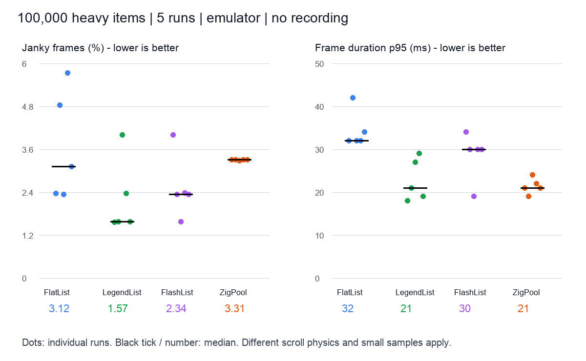
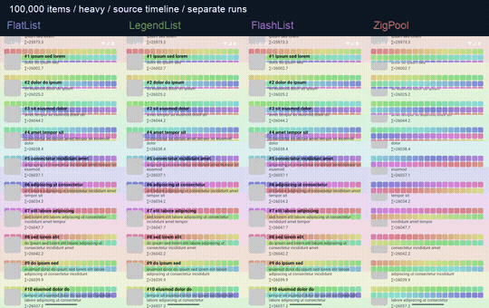
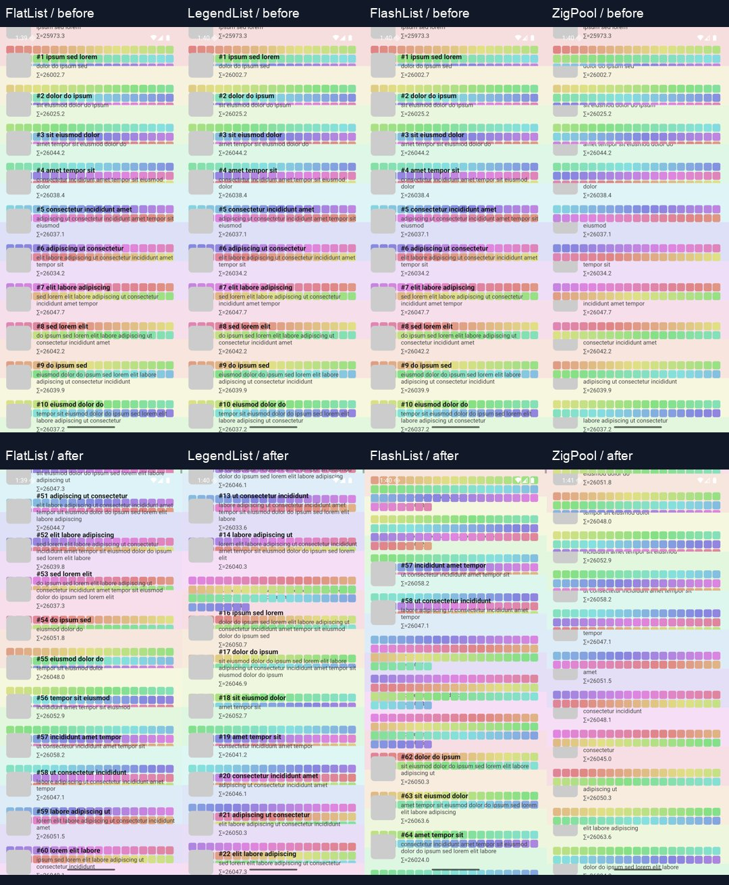

# 10만 항목 목록 비교: 측정과 영상

ZigPool은 JS 콜백 및 추가 마운트를 줄였지만 **프레임 지연률 우위는 확인되지 않았다**. 무거운 셀에서 FlatList보다 p95가 낮았으며, LegendList와 p95 중앙값이 같았다. 짧은 에뮬레이터 측정으로 일반적인 우열을 확정할 수 없다.

## 측정 결과

100,000개 데이터, heavy 셀, 고정 높이 88dp, 각 엔진 5회. 각 run 지표의 중앙값이며 괄호는 지연률 최소–최대다.

| 엔진 | 지연률 % (범위) | p50 ms | p95 ms | 셀 렌더 | JS 콜백 | 추가 마운트 |
|---|---:|---:|---:|---:|---:|---:|
| flatlist | 3.12% (2.34–5.74) | 24 | 32 | 25 | 114 | 25 |
| legend | 1.57% (1.56–4.00) | 17 | 21 | 26 | 92 | 3 |
| flashlist | 2.34% (1.57–4.00) | 21 | 30 | 24 | 107 | 1 |
| zigpool | 3.31% (3.28–3.31) | 17 | 21 | 26 | 26 | 0 |



- 지연률은 Android `gfxinfo`의 비 legacy `Janky frames / Total frames rendered`다. 입력 지연 시간이나 JS 스레드 정지율이 아니다. OS가 판정한 프레임 deadline 관련 지표로, 단순히 16.7ms를 넘은 비율과 같지 않다.
- p95는 해당 run에서 집계한 프레임 시간의 95백분위다. 표는 그 값 5개의 중앙값이다. 지연률과 다른 통계이므로 순위가 다를 수 있다. 실제 화면 표시 간격이나 터치 응답 시간을 직접 측정한 것은 아니다.
- JS 콜백은 엔진별 scroll/recycle 이벤트 계측으로 의미가 다르다. 횟수를 실행 시간으로 해석하지 않는다. 셀 렌더 및 마운트는 초기 준비 이후 스크롤 전후 차이다.
- 한 run은 약 121–128 프레임으로 짧다. 원시 분자/분모와 framestats는 [raw-100k-heavy.zip](raw-100k-heavy.zip), 집계는 [results-100k-heavy.json](results-100k-heavy.json)에 있다.
- [20,000개 complex 셀 이전 결과](baseline-20k/REPORT.md)도 첨부했다. 데이터 수와 셀 부하를 함께 바꿨으므로 두 결과의 차이를 데이터 수만의 효과라고 할 수 없다.

## 영상

모두 **100,000개** 데이터다. complex는 이미지/텍스트/태그, heavy는 추가로 렌더마다 sqrt 4,000회와 색상 View 64개를 사용하는 합성 부하다. 데이터 전체를 메모리에 생성하지만 가상화하므로 10만 개를 동시에 그리는 것이 아니며, 전체 목록 끝까지 이동한 테스트도 아니다.

| 조건 | 4개 엔진 비교 | 개별 원본 |
|---|---|---|
| complex | [원본 시간축 MP4](comparison-complex.mp4) | [FlatList](complex-flatlist.mp4) · [LegendList](complex-legend.mp4) · [FlashList](complex-flashlist.mp4) · [ZigPool](complex-zigpool.mp4) |
| heavy | [원본 시간축 MP4](comparison-heavy.mp4) | [FlatList](heavy-flatlist.mp4) · [LegendList](heavy-legend.mp4) · [FlashList](heavy-flashlist.mp4) · [ZigPool](heavy-zigpool.mp4) |
| heavy 확대 | [0.25배속, 2–8초 구간](heavy-detail-slow.mp4) | 프레임 보간 없이 중앙 영역을 잘라 확대 |



GIF는 10fps 축소 미리보기다. **녹화 시간축 검증에서 20초 설정과 달리 원본 재생 길이가 약 9–29초로 달랐다. 원인 미확정이며 원본 MP4도 실제 벽시계 속도/부드러움을 보장하지 않는다.** 비교 영상은 파일 시간축을 유지하고 complex 9초, heavy 11초로 잘라 종료 프레임 반복을 피했다. 0.25배속도 파일 시간축 기준이다. 따라서 영상은 내용 갱신/공백/겹침 관찰용이며 체감 속도 순위를 증명하지 않는다. 상세 길이는 `video-validation.json`을 참조한다. 4개 패널은 각각 별도 실행에 같은 입력을 보낸 영상이다. 엔진마다 스크롤 물리가 다르고 시작 시각 오차도 있어 동일 항목/프레임이 정확히 동기화되지 않는다.



**화면 결함도 그대로 포함했다.** 기존 하네스는 고정 88dp를 초과하는 셀 내용이 겹치거나 잘린다. 이것을 정상적인 제품 UI로 보거나 특정 엔진의 성능 이점으로 해석하면 안 된다. 영상은 육안 검토 자료이며, 빠른 스크롤 중 일시적인 슬롯/항목 불일치를 배제하는 자동 검증은 아니다.

## 환경과 방법

- Android 16 arm64 `sdk_gphone64_arm64`, emulator-5554, 화면 1080×2400. 저사양 구형 태블릿 실기기 테스트가 아니다.
- 기존 release APK 실행. 설치 APK와 로컬 `apps/example/android/app/build/outputs/apk/release/app-release.apk` SHA-256 일치: `046ccf593e83123b25642994356c69f603e44fb5ad7ffe35880d1e52cf15f2b1`.
- 소스 기준점 `78b29818a3b9ccc5f6db20f09124d4088f20f007`. 현재 소스에서 APK를 재빌드하지 않았으므로 이 커밋에서 생성된 바이너리임을 보장하지 않는다. 소스 의존성 RN 0.85.0 / LegendList 2.0.19 / FlashList 2.3.1은 APK 내부에서 별도 검증하지 않았다.
- 정량 측정: 앱 재시작 → 3초 준비 → gfxinfo reset → (540,1800)에서 (540,600)으로 300ms 스와이프 4회 → 1.2초 대기 → gfxinfo/JS 카운터 수집. 엔진 순서를 회차별 순환했다. 녹화하지 않은 별도 실행이다.
- 영상: 앱 재시작 후 4초 준비, 540×1200 screenrecord. 느린 스와이프 2회 → 빠른 스와이프 4회 → 역방향 3회. 입력 시각은 [capture-manifest.json](capture-manifest.json)에 기록했다. 녹화 부하가 있으므로 영상에서 정량 지표를 추정하지 않는다.
- 동적 높이, 장시간 발열/메모리, 명시적인 JS 정지, 실제 저사양 기기는 미측정이다. 10만 항목 영상만으로 이런 환경의 성능을 주장할 수 없다.

## 재현

SoloActivity와 기존 JS0 계측이 포함된 release 앱을 설치한 뒤, 기기 화면을 1080×2400으로 맞추고 실행한다. 스크립트는 해당 앱을 반복 종료/실행한다. 성능 측정 중 녹화·빌드·다른 기기 작업을 병행하지 않는다.

```sh
ADB=adb SERIAL=emulator-5554 COUNT=100000 CELL=heavy OUT=/tmp/zerolist-measure python3 measure.py
ADB=adb SERIAL=emulator-5554 COUNT=100000 OUT=/tmp/zerolist-videos python3 capture.py
# 같은 스크립트로 이전 조건 재현
ADB=adb SERIAL=emulator-5554 COUNT=20000 CELL=complex OUT=/tmp/zerolist-baseline python3 measure.py
```

원본 영상에서 비교/확대 영상 및 차트를 생성하는 `visualize.py`는 Python Pillow와 ffmpeg가 필요하다. 시각물의 프레임 정규화는 편집 편의를 위한 것이며 원본 성능 측정이 아니다.

## 검증

- `bun run lint`, `bun run typecheck` 통과.
- `bun run test --runInBand`: 3 suites, 68 tests 통과.
- 모든 MP4 전체 디코딩 성공, Python 스크립트 구문 검사 및 문서 로컬 링크 검사 완료.
