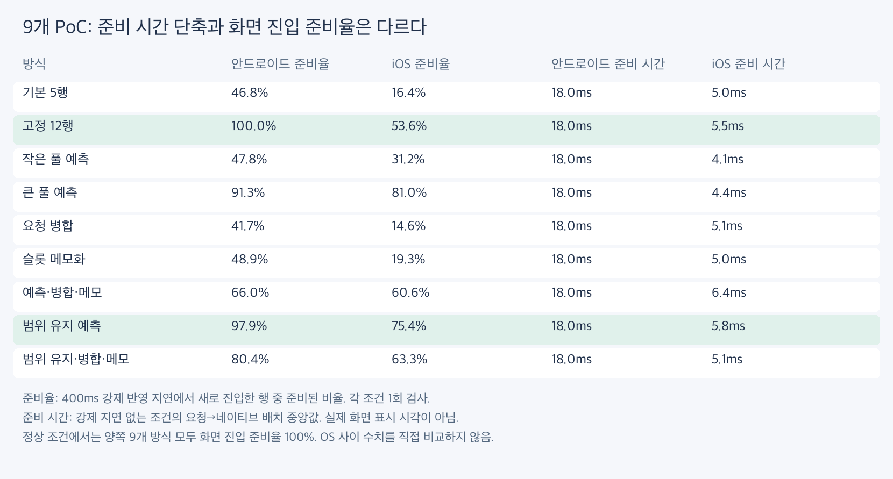
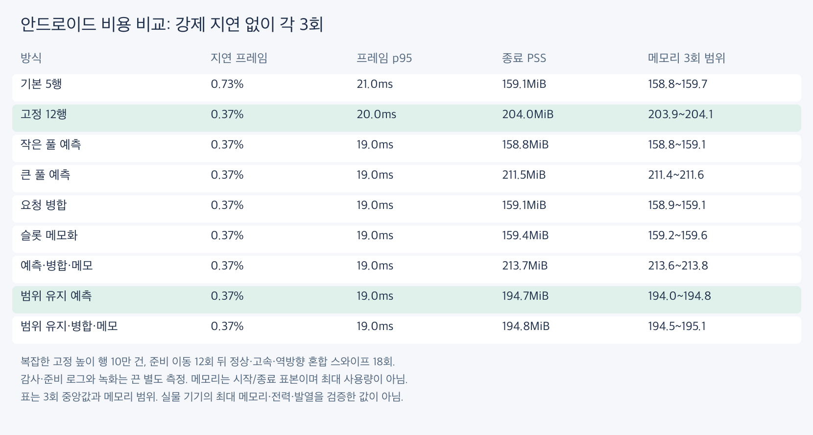
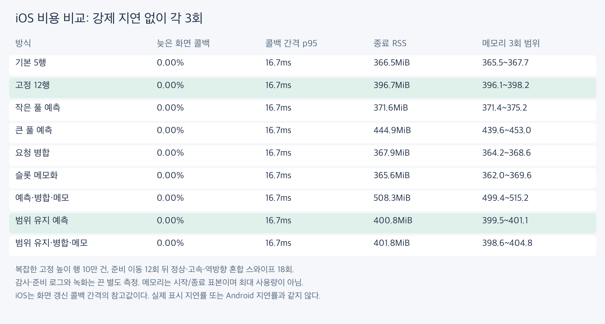
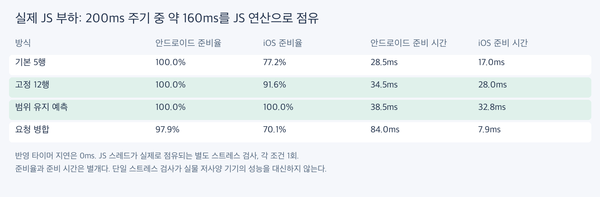

# 내용 준비 PoC 9종: 양 플랫폼 비교

**미리 준비하는 효과는 확인했지만, 내용 반영 대기 자체를 일반적으로 단축했다는 근거는 얻지 못했다.** Android에서는 고정 여유 확대가 단순하고 안정적이었고, iOS에서는 요청 범위를 유지하는 예측이 강제 지연에 더 잘 대응했다. 풀 확대의 메모리 비용이 있어 기본값은 기존 방식으로 유지했다.



## 비교한 구현

| 이름 | 풀 크기 | 바뀐 부분 |
|---|---:|---|
| 기본 5행 (`baseline`) | 14 | 앞뒤 여유 5행, 기존 반영 경로 |
| 고정 12행 (`wide`) | 28 | 앞뒤 여유 12행 |
| 작은 풀 예측 (`adaptive-small`) | 14 | 기존 풀에서 속도·반영 시간으로 앞뒤 배분 |
| 큰 풀 예측 (`adaptive`) | 28 | 확대한 풀에서 속도·반영 시간으로 앞뒤 배분 |
| 요청 병합 (`coalesce`) | 14 | 한 요청 반영 중에는 다음 요청을 보류하고 완료 후 최신 범위 요청 |
| 슬롯 메모화 (`memo`) | 14 | 이미 memo인 Cell에 더해 슬롯 래퍼도 memo |
| 예측·병합·메모 (`combined`) | 28 | 확대한 예측 풀 + 요청 병합 + 슬롯 memo |
| 범위 유지 예측 (`adaptive-stable`) | 28 | 필요한 여유를 포함하는 요청 범위는 유지 |
| 범위 유지·병합·메모 (`combined-stable`) | 28 | 범위 유지 예측 + 요청 병합 + 슬롯 memo |

풀 크기는 이번 기기·고정 행 높이의 값이다. 코드는 화면 높이/행 높이의 올림에 여유 10개 또는 24개를 더하고, 데이터 길이로 제한한다. React JSX와 Cell 내용은 유지한다. PoC는 예제의 선택 옵션이며 제품 목록 API로 완성한 기능이 아니다.

예측은 네이티브 스크롤 위치 차이/시간의 이동 평균과 완료된 최근 32개 요청의 p95를 사용한다. 시간 예산은 34~500ms, 계산식은 `속도 × (시간 예산 × 1.25 + 16ms)`에 2행 여유를 더한 값이다. 반대 방향에 최소 3행을 남기고 풀 용량으로 제한한다. 속도 추정은 플랫폼 콜백 주기의 영향을 받으므로 이번 구현의 결과를 모든 예측 알고리즘의 한계로 확대하지 않는다.

범위 유지 변형은 **이미 요청한 범위**가 필요한 선행/후행 여유를 포함하면 그 범위를 유지한다. 아직 반영되지 않은 요청까지 완료됐다고 간주하는 것은 아니다. 완료된 내용과 행 번호 매핑은 같은 React 커밋으로 전달하며, 네이티브에서는 배치 후 버전을 확인한다.

## 준비 완료율과 반영 시간

화면 진입 준비율은 관측 프레임에서 새로 가시 영역에 들어온 행 중 실제 내용과 위치가 맞게 준비된 행의 비율이다. 빈 공간의 면적이나 지속 시간과는 다른 지표다. `blank_moving_frames`는 위치가 바뀐 관측 프레임에서 2px를 넘는 빈 공간이 있던 횟수다. 반올림 1px 공백은 허용한다.

| 방식 | Android 120ms | Android 400ms | iOS 120ms | iOS 400ms |
|---|---:|---:|---:|---:|
| 기본 5행 | 100.0% | 46.8% | 59.8% | 16.4% |
| 고정 12행 | 100.0% | 100.0% | 86.7% | 53.6% |
| 작은 풀 예측 | 100.0% | 47.8% | 74.8% | 31.2% |
| 큰 풀 예측 | 100.0% | 91.3% | 100.0% | 81.0% |
| 요청 병합 | 87.0% | 41.7% | 50.8% | 14.6% |
| 슬롯 메모화 | 100.0% | 48.9% | 60.2% | 19.3% |
| 예측·병합·메모 | 95.8% | 66.0% | 100.0% | 60.6% |
| 범위 유지 예측 | 100.0% | 97.9% | 100.0% | 75.4% |
| 범위 유지·병합·메모 | 100.0% | 80.4% | 89.2% | 63.3% |

각 준비 검사 조건은 1회 탐색이다. 정상 0ms 조건은 양쪽 9개 방식 모두 준비율 100%, 실제 행 불일치와 겹침은 모든 감사 조건에서 0회다. 숫자 차이를 통계적으로 확정한 보편적 순위로 읽지 않는다.

준비 시간은 요청부터 Android의 그리기 전 배치 또는 iOS의 하위 뷰 반영 후 배치까지다. 실제 화면 표시 완료 시간이 아니다. 같은 실행 안에서 요청 버전과 완료 버전을 연결한다. 반영되지 않은 버전은 지연 분포에서 제외되며, 병합 때문에 아직 보내지 않은 요청의 대기는 포함하지 않는다. 따라서 완료된 요청의 p50이 낮아졌다는 이유만으로 내용 전체의 지연이 줄었다고 판단하지 않는다.

## 지연 프레임과 메모리





같은 최종 바이너리에서 9개 방식의 순서를 회전해 각 3회 비교했다. 준비/감사 로그와 녹화를 끈 별도 실행이다. Android는 `gfxinfo` 마감 초과 판정, iOS는 CADisplayLink 시각 간격이 이전 예산의 1.5배를 넘는 비율이다. **iOS 값은 실제 표시 프레임의 지연률이 아니다.**

Android 메모리는 앱 PSS, iOS는 시뮬레이터 프로세스 RSS의 시작/종료 표본이다. 최대 메모리·전력·발열·실물 저사양 기기를 검증한 것은 아니다. 행을 두 배 준비할 때의 메모리 부담을 함께 보아야 한다. 초기 마운트 완료 시간도 별도로 측정하지 않았다.

## 실제 JS 점유 부하



160ms 동안 `performance.now()`를 확인하며 JS 스레드를 점유하고, 40ms 여유를 둔다. 별도의 반영 지연 타이머는 0ms다. 네 방식, 양 플랫폼에서 실행하고 실제 점유 로그를 확인했다. 정상 앱 동작을 대표하는 부하가 아니라, JS 스레드가 바쁠 때의 별도 스트레스 조건이다. 부하가 걸린 상태로 준비 이동을 한 뒤 측정했으므로 갑작스러운 부하 변화에 대한 검증은 아니다.

## 해석과 채택 판단

- **고정 여유 확대:** 가장 단순한 유효 대안. Android의 강제 지연 공백을 크게 줄였지만 메모리 비용이 늘었다. 메모리 상한에 맞춘 풀 크기 선택이 필요하다.
- **범위 유지 예측:** iOS에서 고정 확대보다 강제 지연 대응이 좋았다. 단순 예측이 같은 첫 행 안에서 요청 범위를 바꾸며 작업을 늘리는 문제를 줄였다.
- **단순 예측:** 준비율 개선이 있어도 불필요한 범위 이동과 갱신 증폭이 컸다. 현재 형태를 기본값으로 채택하지 않는다.
- **요청 병합:** 요청 수 감소가 준비율 개선으로 이어지지 않았다. 반영 중 다음 요청을 보류하는 대기가 추가된다. 큰 풀과 결합해도 항상 유리하지 않다.
- **슬롯 메모화:** Cell 자체는 이미 memo였으며, 래퍼 최적화만으로 반영 대기를 뚜렷하게 줄이지 못했다.

전체 결론은 기다리는 시간을 GPU나 Zig가 없앴다는 것이 아니다. 이미 준비한 행을 유지하고 적절한 선행 여유를 확보하는 접근의 효과와 비용을 확인했다. 동적 높이, 이미지 네트워크 다운로드/실제 대형 이미지 디코딩, 데이터 교체, 실물 구형 태블릿까지 검증한 제품 기능은 아니다.

## 영상

400ms 강제 지연에서 기본·고정 여유 확대·범위 유지 예측을 각각 별도로 녹화했다. 정량 측정과 분리하며 정상 속도 영상이다. 실행별 스크롤 물리와 입력 전달 시간이 달라 프레임별 동기 비교는 아니다. iOS 영상에는 세 방식 모두 내용이 비는 구간이 있으며, 정지 후 다시 채워진다. 400ms 강제 지연에서 공백을 완전히 없앤다는 의미가 아니다.

- [Android 비교](android-compare-400.mp4)
- [iOS 비교](ios-compare-400.mp4)

## 재현과 원자료

- [측정 스크립트](record.py), [수집/검증](collect.py), [표·그림 생성](make_report.py)
- [한글 CSV](comparison-ko.csv)
- [전체 행렬](matrix.json), [요약](summary.json), [바이너리와 코드 해시](provenance.json), [측정 코드 변경](runtime.patch)
- [영상 녹화](capture.py), [녹화 시각·입력·해시](capture-manifest.json)

```sh
PLATFORM=android MODE=audit OUT=/private/tmp/preparation-new-audit python3 -I docs/benchmarks/2026-09-05-preparation/record.py
PLATFORM=ios MODE=perf OUT=/private/tmp/preparation-new-perf python3 -I docs/benchmarks/2026-09-05-preparation/record.py
BLOCK_MS=160 DELAYS=0 VARIANTS=baseline,wide,adaptive-stable,coalesce OUT=/private/tmp/preparation-new-block python3 -I docs/benchmarks/2026-09-05-preparation/record.py
```

항상 새 OUT 디렉터리를 사용한다. Android는 세로 1080×2400을 검사하며 화면 설정을 자동 변경하지 않는다. 10만 건의 복잡한 고정 높이 행, 준비용 빠른 스와이프 12회와 관성 중단 터치·2초 대기 후, 정상 3회·고속 6회·역방향 6회·정상 3회를 측정한다. 준비용 이동으로 목록 시작 경계가 큰 풀에 주는 이점을 줄였다. OS별 입력 좌표와 스크롤 물리가 달라 OS 간 수치를 직접 비교하지 않는다.

최초 파일럿에서 초기 내용이 같은 경우 완료 확인이 다음 스크롤까지 늦어지는 Android PoC 문제를 발견했다. 버전 반영 시 그리기를 요청해 수정한 후 다시 측정했다. 파일럿은 최종 수치에 합산하지 않는다. A는 완료 확인 수정 후 7개 Android 방식, B는 범위 유지 2개와 기본 대조군 재검사, C는 JS 점유 옵션과 iOS 로그 전달을 추가한 최종 바이너리다. Android 기본 대조군은 A/B 모두 정상 준비 시간 중앙값 18ms로 재확인했다. 전체 성능 교차 비교와 iOS·JS 점유 검사는 C다.

73개 테스트, 린트, 라이브러리 타입 검사, Android arm64 Release와 iOS arm64 시뮬레이터 Release 빌드를 통과했다. 빌드 CI는 추가하지 않았다.
- [android-audit-a-raw.zip](android-audit-a-raw.zip)
- [android-audit-b-raw.zip](android-audit-b-raw.zip)
- [android-block-raw.zip](android-block-raw.zip)
- [android-perf-raw.zip](android-perf-raw.zip)
- [ios-audit-raw.zip](ios-audit-raw.zip)
- [ios-block-raw.zip](ios-block-raw.zip)
- [ios-perf-raw.zip](ios-perf-raw.zip)
