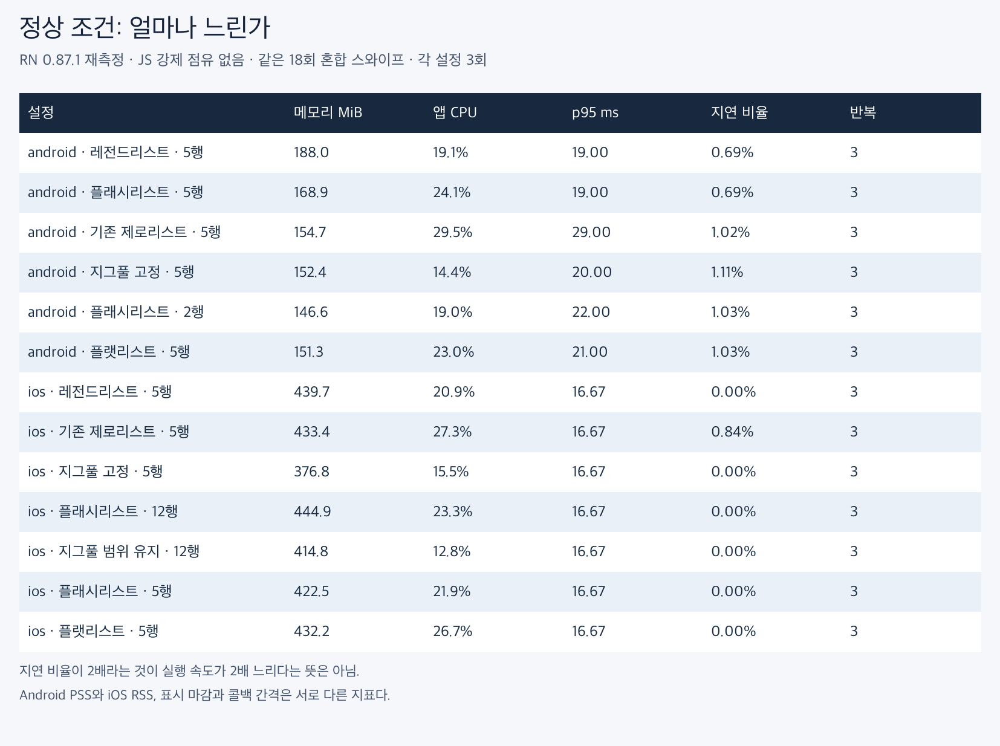
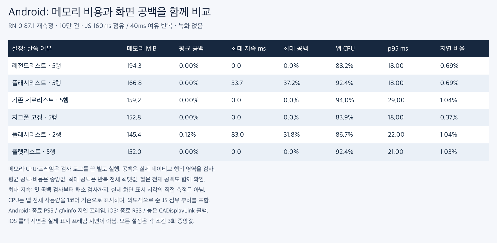
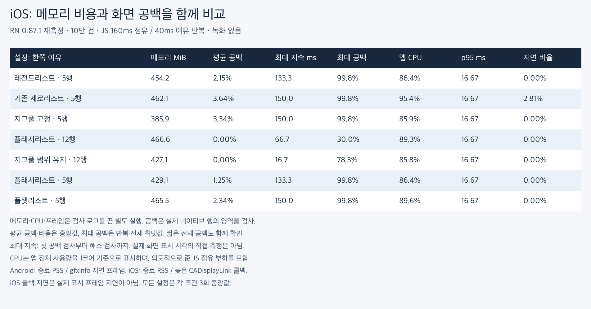

# RN 0.87.1 독립 재비교 — 같은 5행 조건 포함

지난 99회와 같은 RN 0.87.1 바이너리로 **117회**를 추가 측정했다. Android 6개·iOS 7개 설정에 대해 일반 비용, JS 부하 공백, JS 부하 비용을 각각 3회 실행했다. 이전 결과와 합쳐 평균을 내지 않고 나란히 표시한다.

## 이번 재측정에서 확인한 우위와 한계

- Android 일반 스크롤에서 ZigPool/FlatList의 종료 메모리는 **152.4/151.3MiB**, CPU는 **14.4/23.0%**였다. ZigPool의 CPU가 **37.2% 낮았다**. 같은 입력의 앱 프로세스 비용이며 화면이 그만큼 빨라졌다는 뜻은 아니다.
- 같은 두 설정의 p95 중앙값은 **20/21ms**였다. 다른 리스트까지 포함한 프레임 시간 범위는 아래에서 확인한다. CPU 우위를 프레임 속도 전체 순위로 바꾸지 않는다.
- iOS 부하에서 범위 유지 12행/FlashList 12행의 종료 RSS는 **427.1/466.6MiB**였다. 범위 유지 설정의 차이는 **-39.5MiB**다. 공백 없는 실행은 각각 **2/3, 2/3회**다.
- 순간 최대 공백 면적은 두 iOS 설정에서 **78.3/30.0%**, 검사상 최대 공백 지속 시간은 **16.7/66.7ms**였다. 면적 %는 시간 비율이 아니다.

- 같은 5행 iOS 일반 조건에서 ZigPool/FlatList CPU는 **15.5/26.7%**, 종료 RSS는 **376.8/432.2MiB**였다. 반면 JS 부하의 평균 공백은 **3.34/2.34%**로 ZigPool이 더 나빴다.
- Android 일반 조건의 지연 프레임 비율도 ZigPool/FlatList **1.11/1.03%**로 ZigPool이 소폭 높았다. p95 한 지표만으로 모든 끊김이 줄었다고 평가하지 않는다.

[어디서 앞서며 어떤 접근을 했는가](approach-ko.md)

## 조건

고정 높이의 무거운 RN 셀 10만 건, 준비 스와이프 12회, 측정 스와이프 18회. JS 부하는 160ms 점유/40ms 여유 반복이다. Android API 36 에뮬레이터와 iOS 26.2 시뮬레이터에서 Release/Fabric/Hermes로 실행했다. 정량 구간에서는 빌드·녹화를 하지 않았고 다른 플랫폼의 앱은 종료했다. 실행 순서를 고정 seed로 섞었다.

모든 리스트의 5행 준비 조건을 포함했다. **같은 5행 설정이 같은 메모리 사용량을 보장하는 것은 아니다.** 기존 선택 설정인 Android FlashList 2행, iOS FlashList 12행·ZigPool 범위 유지 12행도 유지했다. FlashList 2.3.1·LegendList 2.0.19이며 라이브러리 자체나 앱 런타임 코드는 바꾸지 않았다.

[기존 측정 방법](../2026-09-05-budget/methodology-ko.md) · [바이너리 해시](provenance.json) · [실행 스크립트](run_matrix.py)

## Android 일반 스크롤

| 설정 | 메모리 MiB | CPU % | p95 ms | p95 반복 범위 |
|---|---|---|---|---|
| LegendList · 5행 | 188.0 | 19.1 | 19.00 | 19.00–20.00 |
| FlashList · 5행 | 168.9 | 24.1 | 19.00 | 18.00–25.00 |
| 기존 ZeroList · 5행 | 154.7 | 29.5 | 29.00 | 28.00–29.00 |
| ZigPool 고정 · 5행 | 152.4 | 14.4 | 20.00 | 20.00–21.00 |
| FlashList · 2행 | 146.6 | 19.0 | 22.00 | 19.00–24.00 |
| FlatList · 5행 | 151.3 | 23.0 | 21.00 | 20.00–21.00 |

## Android JS 부하

| 설정 | 메모리 MiB | 공백 없는 실행 | 평균 공백 % | 최대 공백 % | 최대 지속 ms | CPU % | p95 ms |
|---|---|---|---|---|---|---|---|
| LegendList · 5행 | 194.3 | 3/3 | 0.000 | 0.0 | 0.0 | 88.2 | 18.00 |
| FlashList · 5행 | 166.8 | 2/3 | 0.000 | 37.2 | 33.7 | 92.4 | 18.00 |
| 기존 ZeroList · 5행 | 159.2 | 3/3 | 0.000 | 0.0 | 0.0 | 94.0 | 29.00 |
| ZigPool 고정 · 5행 | 152.8 | 3/3 | 0.000 | 0.0 | 0.0 | 83.9 | 18.00 |
| FlashList · 2행 | 145.4 | 1/3 | 0.119 | 31.8 | 83.0 | 86.7 | 22.00 |
| FlatList · 5행 | 152.0 | 3/3 | 0.000 | 0.0 | 0.0 | 92.4 | 21.00 |

## iOS 일반 스크롤

| 설정 | 메모리 MiB | CPU % | p95 ms | p95 반복 범위 |
|---|---|---|---|---|
| LegendList · 5행 | 439.7 | 20.9 | 16.67 | 16.67–16.67 |
| 기존 ZeroList · 5행 | 433.4 | 27.3 | 16.67 | 16.67–16.67 |
| ZigPool 고정 · 5행 | 376.8 | 15.5 | 16.67 | 16.67–16.67 |
| FlashList · 12행 | 444.9 | 23.3 | 16.67 | 16.67–16.67 |
| ZigPool 범위 유지 · 12행 | 414.8 | 12.8 | 16.67 | 16.67–16.67 |
| FlashList · 5행 | 422.5 | 21.9 | 16.67 | 16.67–16.67 |
| FlatList · 5행 | 432.2 | 26.7 | 16.67 | 16.67–16.67 |

## iOS JS 부하

| 설정 | 메모리 MiB | 공백 없는 실행 | 평균 공백 % | 최대 공백 % | 최대 지속 ms | CPU % | p95 ms |
|---|---|---|---|---|---|---|---|
| LegendList · 5행 | 454.2 | 0/3 | 2.154 | 99.8 | 133.3 | 86.4 | 16.67 |
| 기존 ZeroList · 5행 | 462.1 | 0/3 | 3.635 | 99.8 | 150.0 | 95.4 | 16.67 |
| ZigPool 고정 · 5행 | 385.9 | 0/3 | 3.340 | 99.8 | 150.0 | 85.9 | 16.67 |
| FlashList · 12행 | 466.6 | 2/3 | 0.000 | 30.0 | 66.7 | 89.3 | 16.67 |
| ZigPool 범위 유지 · 12행 | 427.1 | 2/3 | 0.000 | 78.3 | 16.7 | 85.8 | 16.67 |
| FlashList · 5행 | 429.1 | 0/3 | 1.251 | 99.8 | 133.3 | 86.4 | 16.67 |
| FlatList · 5행 | 465.5 | 0/3 | 2.344 | 99.8 | 150.0 | 89.6 | 16.67 |

## 지난 RN 0.87.1 비교와 달라진 정도

| 같은 설정 | CPU %: 이전 → 이번 | p95 ms: 이전 → 이번 |
|---|---|---|
| android · LegendList · 5행 | 19.2 → 19.1 | 21.00 → 19.00 |
| android · 기존 ZeroList · 5행 | 29.7 → 29.5 | 29.00 → 29.00 |
| android · ZigPool 고정 · 5행 | 16.2 → 14.4 | 22.00 → 20.00 |
| android · FlashList · 2행 | 22.2 → 19.0 | 21.00 → 22.00 |
| android · FlatList · 5행 | 24.6 → 23.0 | 25.00 → 21.00 |
| ios · LegendList · 5행 | 20.1 → 20.9 | 16.67 → 16.67 |
| ios · 기존 ZeroList · 5행 | 26.8 → 27.3 | 16.67 → 16.67 |
| ios · ZigPool 고정 · 5행 | 15.3 → 15.5 | 16.67 → 16.67 |
| ios · FlashList · 12행 | 23.0 → 23.3 | 16.67 → 16.67 |
| ios · ZigPool 범위 유지 · 12행 | 12.8 → 12.8 | 16.67 → 16.67 |
| ios · FlatList · 5행 | 26.2 → 26.7 | 16.67 → 16.67 |

| 같은 설정 | 평균 공백 %: 이전 → 이번 | 최대 공백 %: 이전 → 이번 |
|---|---|---|
| android · LegendList · 5행 | 0.000 → 0.000 | 0.0 → 0.0 |
| android · 기존 ZeroList · 5행 | 0.000 → 0.000 | 0.0 → 0.0 |
| android · ZigPool 고정 · 5행 | 0.000 → 0.000 | 0.0 → 0.0 |
| android · FlashList · 2행 | 0.883 → 0.119 | 56.0 → 31.8 |
| android · FlatList · 5행 | 0.000 → 0.000 | 0.0 → 0.0 |
| ios · LegendList · 5행 | 1.763 → 2.154 | 99.8 → 99.8 |
| ios · 기존 ZeroList · 5행 | 3.114 → 3.635 | 99.8 → 99.8 |
| ios · ZigPool 고정 · 5행 | 3.624 → 3.340 | 99.8 → 99.8 |
| ios · FlashList · 12행 | 0.000 → 0.000 | 24.9 → 30.0 |
| ios · ZigPool 범위 유지 · 12행 | 0.000 → 0.000 | 47.4 → 78.3 |
| ios · FlatList · 5행 | 3.474 → 2.344 | 99.8 → 99.8 |

## 지표의 뜻과 한계

- 메모리는 종료 시점 PSS(Android)/RSS(iOS)이며 피크나 메모리 상한이 아니다. CPU는 앱 프로세스 전체를 1코어 기준으로 표시하며 부하 조건에는 인위적인 JS 점유도 포함한다.
- 평균 공백은 이동 중 검사 프레임의 빈 면적 평균을 실행별로 계산한 뒤 취한 중앙값이다. 최대 공백은 반복 전체의 최댓값이다. 2px/포인트 오차를 허용한다.
- 최대 지속 시간은 첫 공백 관측부터 첫 해소 관측까지의 검사 시각 차이다. 정지 구간도 포함하며 실제 화면 표시 시각을 직접 측정한 값은 아니다. 마지막까지 공백이 남은 경우 하한이며 `blank_tail_open`에 기록한다.
- iOS p95는 CADisplayLink 콜백 간격이다. 실제 표시 프레임의 끊김과 같지 않다. Android 지표와 직접 비교하지 않는다.
- 같은 제스처여도 관성과 스케줄링에 따라 이동 거리가 다르다. 카운트를 전체 처리 속도로 환산하지 않는다. 실물 저사양 기기·동적 높이·배터리·발열은 미검증이다.

- 공통 검사 39회에서 내용 불일치와 겹침은 0이었다. 모든 설정이 무공백이었다는 의미는 아니다.

## 원자료

[행렬](matrix.json) · [집계](summary.json) · [한글 CSV](comparison-ko.csv) · [코드와 원인 설명](approach-ko.md)

- [zerolist-recheck-android-audit-160-raw.zip](zerolist-recheck-android-audit-160-raw.zip)
- [zerolist-recheck-android-perf-0-raw.zip](zerolist-recheck-android-perf-0-raw.zip)
- [zerolist-recheck-android-perf-160-raw.zip](zerolist-recheck-android-perf-160-raw.zip)
- [zerolist-recheck-ios-audit-160-raw.zip](zerolist-recheck-ios-audit-160-raw.zip)
- [zerolist-recheck-ios-perf-0-raw.zip](zerolist-recheck-ios-perf-0-raw.zip)
- [zerolist-recheck-ios-perf-160-raw.zip](zerolist-recheck-ios-perf-160-raw.zip)