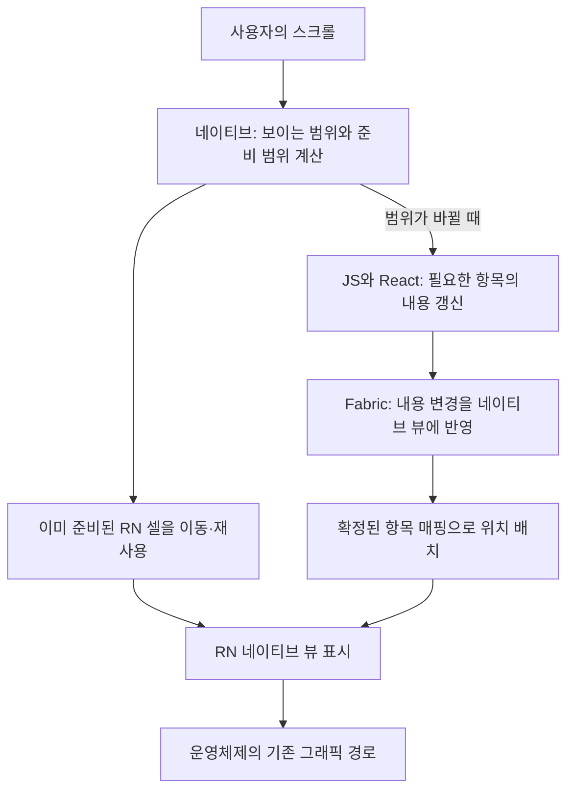

# 어디서 앞서고, 무엇을 바꿔서 개선했는가

**우리 접근은 셀을 GPU 전용 그림으로 바꾸는 것이 아니라, RN 셀을 유지하면서 스크롤 중 범위 결정·배치·재사용의 책임을 네이티브로 옮기는 것이다.** React는 셀의 내용을 계속 만든다. 성능 이점은 CPU·메모리·화면 준비 품질을 나눠 판단해야 한다.

## 이번 재측정에서 확인한 우위와 한계

- Android 일반 스크롤에서 ZigPool/FlatList의 종료 메모리는 **152.4/151.3MiB**, CPU는 **14.4/23.0%**였다. ZigPool의 CPU가 **37.2% 낮았다**. 같은 입력의 앱 프로세스 비용이며 화면이 그만큼 빨라졌다는 뜻은 아니다.
- 같은 두 설정의 p95 중앙값은 **20/21ms**였다. 다른 리스트까지 포함한 프레임 시간 범위는 아래에서 확인한다. CPU 우위를 프레임 속도 전체 순위로 바꾸지 않는다.
- iOS 부하에서 범위 유지 12행/FlashList 12행의 종료 RSS는 **427.1/466.6MiB**였다. 범위 유지 설정의 차이는 **-39.5MiB**다. 공백 없는 실행은 각각 **2/3, 2/3회**다.
- 순간 최대 공백 면적은 두 iOS 설정에서 **78.3/30.0%**, 검사상 최대 공백 지속 시간은 **16.7/66.7ms**였다. 면적 %는 시간 비율이 아니다.

- 같은 5행 iOS 일반 조건에서 ZigPool/FlatList CPU는 **15.5/26.7%**, 종료 RSS는 **376.8/432.2MiB**였다. 반면 JS 부하의 평균 공백은 **3.34/2.34%**로 ZigPool이 더 나빴다.
- Android 일반 조건의 지연 프레임 비율도 ZigPool/FlatList **1.11/1.03%**로 ZigPool이 소폭 높았다. p95 한 지표만으로 모든 끊김이 줄었다고 평가하지 않는다.

## 구조를 확인하는 보조 계측

| 일반 스크롤 설정 | CPU % | 계측 콜백 | Cell 렌더 | Cell 생성 | Cell 제거 |
|---|---|---|---|---|---|
| android · LegendList · 5행 | 19.1 | 214 | 55 | 0 | 0 |
| android · FlashList · 5행 | 24.1 | 242 | 53 | 0 | 0 |
| android · 기존 ZeroList · 5행 | 29.5 | 246 | 46 | 46 | 46 |
| android · ZigPool 고정 · 5행 | 14.4 | 46 | 46 | 0 | 0 |
| android · FlashList · 2행 | 19.0 | 244 | 50 | 0 | 0 |
| android · FlatList · 5행 | 23.0 | 251 | 44 | 44 | 44 |
| ios · LegendList · 5행 | 20.9 | 441 | 134 | 0 | 0 |
| ios · 기존 ZeroList · 5행 | 27.3 | 462 | 123 | 123 | 124 |
| ios · ZigPool 고정 · 5행 | 15.5 | 97 | 124 | 0 | 0 |
| ios · FlashList · 12행 | 23.3 | 468 | 155 | 0 | 0 |
| ios · ZigPool 범위 유지 · 12행 | 12.8 | 63 | 125 | 0 | 0 |
| ios · FlashList · 5행 | 21.9 | 472 | 152 | 0 | 0 |
| ios · FlatList · 5행 | 26.7 | 460 | 133 | 133 | 132 |

동일한 18회 입력 후 3회 중앙값이다. 콜백 종류와 로그 경계의 한계는 아래에 설명한다.

## 우리가 선택한 구조

다른 RN 리스트도 네이티브 스크롤을 사용한다. 차이는 스크롤 자체의 네이티브 여부가 아니라 **가시 범위·준비 범위·슬롯 매핑을 누가 결정하며, JS와 얼마나 자주 협의하는가**다. JS가 막혀 있어도 이미 준비된 내용은 이동할 수 있지만 새 내용의 React 렌더와 Fabric 반영까지 없어진 것은 아니다.

셀은 평범한 JSX와 RN `View`·`Text`·`Image`를 유지한다. 셀 내부의 React/Fabric/Yoga 경로를 없앤 것이 아니다. 사용자에게 보이는 내용을 만드는 일과 리스트가 어떤 셀을 어디에 둘지 결정하는 일을 나눈 것이다. JSX 유지와 FlatList 전체 props/ref 호환은 별개의 문제다.

## 코드에서 확인한 개선 요소

| 요소 | 구현한 동작 | 기대 효과와 확인 범위 |
|---|---|---|
| 고정 슬롯 재사용 | 슬롯 번호를 React key로 유지하고 슬롯이 보여줄 데이터 번호만 교체 | 준비 후 셀 컴포넌트 생성·제거를 줄임. FlashList·LegendList도 재사용하므로 이것만으로 두 라이브러리 대비 차이를 설명할 수 없음 |
| 네이티브 범위 결정 | Android는 Kotlin→JNI→Zig, iOS는 Objective-C++→Zig로 가시 범위를 계산 | 스크롤 이벤트마다 JS가 목록 범위를 판단하는 경로를 줄임. Zig 언어만의 효과를 분리 측정한 것은 아님 |
| 범위가 바뀔 때만 요청 | 준비 창이 같으면 항목 매핑 문자열 생성과 JS 이벤트 전송을 건너뜀 | JS 진입과 상태 변경 기회를 줄임. 전체 JS 작업이 0이라는 뜻은 아님 |
| 내용·위치 동시 확정 | 요청 매핑과 React가 반영한 매핑을 구분하고, 확정된 내용의 매핑으로 배치 | 옛 내용을 새 위치에 붙이는 불일치 방지. 정확성 개선이며, 그 자체가 내용 준비 시간을 줄이는 최적화는 아님 |
| 진행 방향 선행 준비 | 스크롤 속도와 최근 내용 반영 시간의 p95를 이용해 앞으로 필요한 여유를 계산 | JS가 바쁠 때 새 항목이 화면에 들어오기 전에 준비할 기회를 줌. 추가 슬롯의 메모리 비용과 함께 평가해야 함 |
| 준비 범위 유지 | 기존 준비 범위가 필요한 영역을 포함하면 바로 줄이거나 방향을 뒤집지 않음 | 이미 준비한 내용을 버리고 다시 요청하는 일을 줄임. 예측과 큰 풀이 함께 적용된 설정의 결과이므로 기여율을 각각 분리해 말하지 않음 |

Android의 고정 5행 설정은 예측·요청 병합·별도 슬롯 메모화 옵션을 켠 설정이 아니다. iOS의 범위 유지 12행 설정은 선행 준비와 범위 유지를 사용한다. 과거에 시험한 모든 PoC를 이번 개선의 원인으로 묶어 설명하지 않는다. 공통 `Cell`의 `React.memo`도 다른 리스트에 적용돼 있으므로 우리만의 이점으로 계산하지 않는다.

## 기존 ZeroList와 달라진 점

이 벤치마크에서 **기존 ZeroList**로 표시한 컴포넌트는 `ScrollView` 위에서 JS가 윈도우를 계산하고, 항목 번호를 key로 하는 행을 추가·제거한다. 이미 윈도우 경계가 바뀔 때만 상태를 갱신하도록 최적화돼 있지만, 스크롤 이벤트의 범위 판정은 JS가 수행한다.

**ZigPool**은 네이티브가 슬롯과 항목의 대응을 결정한다. 고정된 셀 집합을 재사용하고, JS는 전달받은 항목 매핑의 내용을 렌더한다. Android는 확정된 셀의 `translationY`를 그리기 전에 적용하며, iOS는 내용 반영 후 확정 좌표를 배치하고 평소 이동은 `UIScrollView`가 처리한다.

양쪽 모두 RN 컴포넌트를 사용한다. 'GPU 없는 ZeroList 대 GPU 있는 ZigPool' 비교가 아니다. 이번 Android 그래픽 설정은 양쪽 모두 `skiagl`이며, 별도 Vulkan 렌더러로 RN 셀을 대체하지 않았다. iOS도 UIKit/Fabric의 네이티브 뷰 경로를 사용한다.

## 왜 더 빠르다고 해석하는가

코드상으로는 불필요한 JS 진입과 셀 생성·제거를 줄이는 구조다. 실측의 낮은 CPU와 적은 콜백·생성·제거 횟수가 이 설명과 일치하면 **구조와 관측이 같은 방향을 가리킨다**고 말할 수 있다.

그러나 프로세스 CPU 차이를 요소별로 분해한 인과 실험은 아니다. '34% 중 20%는 Zig, 14%는 재사용'처럼 나눌 근거는 없다. 초기 오프셋 계산은 준비 구간 전에 이루어지므로 이번 스크롤 CPU 차이를 SIMD 초기화 속도로 설명할 수도 없다. 프레임 시간 분포가 겹치는 상황에서 CPU 절감을 화면 속도 배수로 표현하지 않는다.

콜백 계측은 다른 리스트의 스크롤 콜백과 ZigPool의 재사용 콜백을 세며, 라이브러리 내부의 모든 JS 작업을 포괄하지 않는다. 횟수도 이동 거리·이벤트 병합·스케줄링에 따라 달라진다. 셀 렌더·생성·제거는 공통 Cell에서 세지만, 이 값도 그 자체로 걸린 시간은 아니다. 작업 횟수는 1초 간격 누적 로그의 차이라 CPU 측정 구간과 경계가 완전히 일치하지 않으며, 구조를 확인하는 보조 지표로 사용한다.

## 알고리즘 개선과 측정 조건 수정을 구분한다

이전 작업의 행 높이·겹침 수정, FlatList 초기 보관량을 실제 화면 행 수로 맞춘 조정, LegendList 고정 높이 힌트 제공은 비교 조건과 정확성을 바로잡은 작업이다. 이런 조정으로 달라진 순위를 전부 ZigPool 알고리즘의 가속 효과라고 설명하지 않는다.

내용과 위치를 함께 확정하는 수정도 우선 정확성 개선이다. 화면이 움직였다는 사실만으로 내용 준비가 빨라졌다고 평가하지 않는다. 이번 공통 검사는 실제 항목 번호·텍스트·화면 좌표를 함께 확인하며, CPU·프레임 측정은 그 검사를 끈 별도 실행에서 수행한다.

선행 준비는 내용 반영 요청부터 실제 배치 확인까지의 최근 시간을 참고한다. 이 시간에는 JS 처리뿐 아니라 React/Fabric 반영과 네이티브 배치 대기도 포함된다. 이를 이용해 기다림을 없애는 것이 아니라 **화면에 필요해지기 전에 요청할 시간을 확보**한다. 준비 공간이 부족하거나 방향이 급변하면 여전히 공백이 생길 수 있다.

## 아직 앞선다고 말할 수 없는 영역

- 모든 리스트·모든 준비량을 최적화한 뒤의 보편적인 최고 성능.
- iOS의 실제 표시 프레임 지연. 현재 p95는 CADisplayLink 콜백 간격이다.
- JS가 오래 막혀도 항상 공백이 없는 동작. 선행 준비는 시간을 벌어 주며 JS 한계를 제거하지 않는다.
- 저사양 실기기, 동적 높이, 큰 이미지·네트워크 로딩, 긴 사용 중 메모리 압박·발열·배터리.
- 완성된 대체 API. 현재 예제는 고정 높이 중심이고 프로그램 스크롤은 `useNoopScrollable`을 사용한다. 기능 차이도 개발·도입 비용에 포함해야 한다.

## 코드 근거

- [기존 ZeroList의 JS 윈도우 관리](../../../packages/zerolist/src/list.tsx)
- [ZigPool React 슬롯과 항목 매핑](../../../apps/example/src/harness/engines/zigpool.tsx)
- [Android 범위 계산·준비·커밋 배치](../../../apps/example/android/app/src/main/java/zerolist/example/ZlPoolList.kt)
- [Android JNI→Zig 범위 계산](../../../apps/example/android/app/src/main/cpp/zlbridge.cpp)
- [iOS 범위 계산·준비·커밋 배치](../../../apps/example/ios/ZerolistExample/ZlPoolListComponentView.mm)
- [공통 Cell과 계측](../../../apps/example/src/harness/cells.tsx), [작업 횟수 계측](../../../apps/example/src/harness/instrument.ts)
