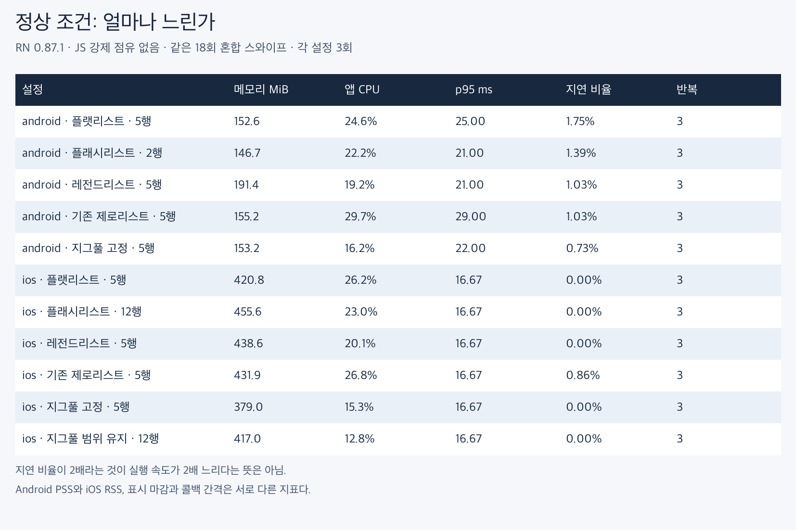
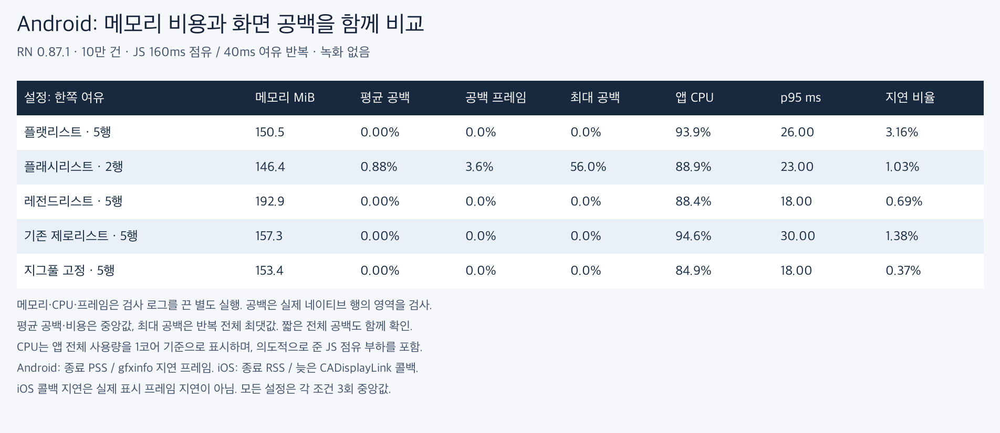
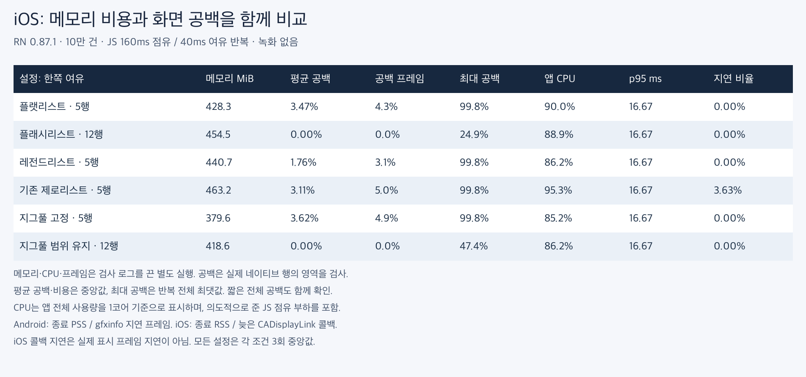

# RN 0.87.1에서 다시 비교한 리스트 성능

최신 안정판 확인 당시 npm latest는 **0.87.1**이었다. 같은 React 19.2.3, FlashList 2.3.1, LegendList 2.0.19를 유지하고 RN 및 관련 네이티브 도구를 갱신했다. 기존 RN 0.85.0의 207회와 별도로 **99회**를 측정했다.

Android·iOS 모두 arm64 Release, Fabric, Hermes다. 각 실행 전 앱의 네이티브 RN 버전이 0.87.1인지 검사했다. Android 에뮬레이터와 iOS 시뮬레이터를 사용했다. 실물 저사양 기기 결과는 아니다.

## 조건과 선택

이전 탐색에서 Android는 메모리 약 160MiB 근처의 FlatList 5행, FlashList 2행, ZeroList 5행, ZigPool 5행을 선택했고 LegendList 5행을 함께 유지했다. iOS는 공백을 억제한 FlashList 12행과 ZigPool 범위 유지 12행을 포함했다. **이번 버전에서 모든 준비량을 다시 최적화한 순위는 아니다.**

10만 건의 고정 높이 무거운 셀, 준비 스와이프 12회와 측정 스와이프 18회다. 일반 비용·JS 부하 공백·JS 부하 비용은 각각 별도 3회다. JS 부하는 160ms 점유 후 40ms 여유를 반복한다. 측정 중 다른 플랫폼의 앱은 종료하며 화면 녹화와 빌드는 하지 않았다.

[기존 상세 측정 방법](../2026-09-05-budget/methodology-ko.md)을 동일하게 사용했다. 메모리는 종료 시점 PSS(Android)/RSS(iOS)이며 최대 사용량이 아니다. CPU는 앱 프로세스 전체를 1코어 기준으로 표시한다. Android와 iOS 수치를 직접 비교하지 않는다. 같은 제스처를 입력했지만 관성·이벤트 처리에 따라 이동 거리가 다를 수 있으므로 CPU 차이를 항목 처리 속도의 배수로 환산하지 않는다. 원자료의 travel_rows로 이동 범위를 확인할 수 있다.

## 결과 판단

Android 일반 스크롤에서 ZigPool의 CPU는 FlatList 대비 **-34.2%**였고, 종료 메모리는 각각 **153.2/152.6MiB**였다. p95 중앙값은 **22/25ms**다. 프레임 시간의 반복 범위를 함께 확인하며 앱 전체 속도의 배수로 환산하지 않는다.

iOS JS 부하에서 범위 유지 12행의 공백 없는 실행은 **2/3회**였다. 종료 RSS는 **418.6MiB**, FlashList 12행은 **454.5MiB**였다. 최대 공백 면적은 각각 **47.4%/24.9%**였다. 평균 공백 중앙값이 같아도 순간 공백 품질이 같은 것은 아니다.

[실제 개발 가치와 제품화 조건](decision-ko.md)

## android: 일반 스크롤

| 설정 | 종료 메모리 MiB | CPU % | p95 ms | p95 범위 | 반복 |
|---|---|---|---|---|---|
| FlatList · 5행 | 152.6 | 24.6 | 25.00 | 21.00–31.00 | 3 |
| FlashList · 2행 | 146.7 | 22.2 | 21.00 | 21.00–22.00 | 3 |
| LegendList · 5행 | 191.4 | 19.2 | 21.00 | 19.00–22.00 | 3 |
| 기존 ZeroList · 5행 | 155.2 | 29.7 | 29.00 | 28.00–30.00 | 3 |
| ZigPool 고정 · 5행 | 153.2 | 16.2 | 22.00 | 20.00–23.00 | 3 |

## android: JS가 바쁠 때

| 설정 | 메모리 MiB | 평균 공백 % | 최대 공백 % | CPU % | p95 ms | 공백/비용 반복 |
|---|---|---|---|---|---|---|
| FlatList · 5행 | 150.5 | 0.000 | 0.00 | 93.9 | 26.00 | 3/3 |
| FlashList · 2행 | 146.4 | 0.883 | 56.00 | 88.9 | 23.00 | 3/3 |
| LegendList · 5행 | 192.9 | 0.000 | 0.00 | 88.4 | 18.00 | 3/3 |
| 기존 ZeroList · 5행 | 157.3 | 0.000 | 0.00 | 94.6 | 30.00 | 3/3 |
| ZigPool 고정 · 5행 | 153.4 | 0.000 | 0.00 | 84.9 | 18.00 | 3/3 |

## ios: 일반 스크롤

| 설정 | 종료 메모리 MiB | CPU % | p95 ms | p95 범위 | 반복 |
|---|---|---|---|---|---|
| FlatList · 5행 | 420.8 | 26.2 | 16.67 | 16.67–16.67 | 3 |
| FlashList · 12행 | 455.6 | 23.0 | 16.67 | 16.67–16.67 | 3 |
| LegendList · 5행 | 438.6 | 20.1 | 16.67 | 16.67–16.67 | 3 |
| 기존 ZeroList · 5행 | 431.9 | 26.8 | 16.67 | 16.67–16.67 | 3 |
| ZigPool 고정 · 5행 | 379.0 | 15.3 | 16.67 | 16.67–16.67 | 3 |
| ZigPool 범위 유지 · 12행 | 417.0 | 12.8 | 16.67 | 16.67–16.67 | 3 |

## ios: JS가 바쁠 때

| 설정 | 메모리 MiB | 평균 공백 % | 최대 공백 % | CPU % | p95 ms | 공백/비용 반복 |
|---|---|---|---|---|---|---|
| FlatList · 5행 | 428.3 | 3.474 | 99.77 | 90.0 | 16.67 | 3/3 |
| FlashList · 12행 | 454.5 | 0.000 | 24.94 | 88.9 | 16.67 | 3/3 |
| LegendList · 5행 | 440.7 | 1.763 | 99.77 | 86.2 | 16.67 | 3/3 |
| 기존 ZeroList · 5행 | 463.2 | 3.114 | 99.77 | 95.3 | 16.67 | 3/3 |
| ZigPool 고정 · 5행 | 379.6 | 3.624 | 99.77 | 85.2 | 16.67 | 3/3 |
| ZigPool 범위 유지 · 12행 | 418.6 | 0.000 | 47.41 | 86.2 | 16.67 | 3/3 |

iOS의 p95는 **CADisplayLink 콜백 간격**이며 실제 표시 프레임 지연이 아니다. 평균 공백은 이동 중 관측 프레임의 빈 면적 평균이다. 표의 평균 공백은 실행 간 중앙값, 최대 공백은 모든 반복의 최댓값이다. 중앙값 0%만으로 모든 실행이 공백 없었다고 말하지 않는다.

## RN 버전별 일반 스크롤 비교

같은 설정만 비교했다. 서로 다른 시점의 실행이므로 아래 변화 전체를 RN 업그레이드의 인과 효과로 단정하지 않는다.

| 같은 설정 | CPU %: 0.85 → 0.87 | 메모리 MiB: 0.85 → 0.87 | p95 ms: 0.85 → 0.87 |
|---|---|---|---|
| android · FlatList · 5행 | 23.0 → 24.6 | 158.9 → 152.6 | 20.00 → 25.00 |
| android · FlashList · 2행 | 17.7 → 22.2 | 152.1 → 146.7 | 23.00 → 21.00 |
| android · LegendList · 5행 | 17.0 → 19.2 | 197.6 → 191.4 | 22.00 → 21.00 |
| android · 기존 ZeroList · 5행 | 29.4 → 29.7 | 161.3 → 155.2 | 28.00 → 29.00 |
| android · ZigPool 고정 · 5행 | 15.4 → 16.2 | 157.3 → 153.2 | 19.00 → 22.00 |
| ios · FlatList · 5행 | 25.9 → 26.2 | 423.9 → 420.8 | 16.67 → 16.67 |
| ios · FlashList · 12행 | 23.7 → 23.0 | 435.8 → 455.6 | 16.67 → 16.67 |
| ios · LegendList · 5행 | 19.8 → 20.1 | 428.5 → 438.6 | 16.67 → 16.67 |
| ios · 기존 ZeroList · 5행 | 26.5 → 26.8 | 412.3 → 431.9 | 16.67 → 16.67 |
| ios · ZigPool 고정 · 5행 | 15.3 → 15.3 | 369.5 → 379.0 | 16.67 → 16.67 |
| ios · ZigPool 범위 유지 · 12행 | 12.2 → 12.8 | 399.7 → 417.0 | 16.67 → 16.67 |

[개발 가치와 제품화 조건](decision-ko.md)

## 검증 및 재현

- Android·iOS Release 빌드 통과, JS 테스트 73개 통과, 린트·라이브러리 타입 검사·라이브러리 빌드 통과. 빌드 CI 추가 없음.
- Android: 공식 템플릿에 맞춰 SDK 37, Gradle 9.4.1, Kotlin 2.2.0 및 AGP 9 호환 플래그 적용. targetSdk 36 유지.
- iOS: 잔존한 0.85.0 사전 빌드 코어를 `pod update React-Core-prebuilt --no-repo-update`로 갱신했다. [실제 Pod 잠금 스냅샷](pods-lock.txt)에서 React-Core-prebuilt 0.87.1 확인 가능.
- [측정 행렬](matrix.json), [집계](summary.json), [CSV](comparison-ko.csv), [바이너리 및 검증](provenance.json), [실행 스크립트](run_matrix.py).
- iOS는 RN 0.87의 정보 로그가 simctl 콘솔에 나타나지 않아 Solo 계측 태그를 NSLog에도 기록했다. 최초 로그 확인 실패 실행은 정량 결과에 넣지 않았다. 마지막 iOS 비용 그룹은 simctl FIFO 충돌로 미실행한 시도가 있어, 이미 완료한 결과를 보존하고 같은 조건으로 RESUME=1을 사용해 이어갔다. 실패 로그도 원자료 압축에 보존했다.
- 재측정: 새 출력 경로를 지정해 `record.py` 사용. `run_matrix.py`의 출력 경로가 이미 존재하면 덮어쓰지 않고 중단한다.

## 별도 비교 영상

정량 측정 후 RN 0.87.1 앱으로 별도 녹화했다. 각 패널은 다른 실행이며 1배속·60fps 합성이다. 짧은 클립의 끝부분은 마지막 화면을 유지한다. Android는 FlatList 5행·FlashList 2행·ZigPool 고정 5행, iOS는 FlatList 5행·FlashList 12행·ZigPool 범위 유지 12행이다.

[Android 영상](android-compare-block.mp4) · [iOS 영상](ios-compare-block.mp4) · [녹화 조건](capture-manifest.json) · [영상 검사](video-validation.json)

## 원자료 압축 파일

- [zerolist-rn087-android-audit-160-raw.zip](zerolist-rn087-android-audit-160-raw.zip)
- [zerolist-rn087-android-perf-0-raw.zip](zerolist-rn087-android-perf-0-raw.zip)
- [zerolist-rn087-android-perf-160-raw.zip](zerolist-rn087-android-perf-160-raw.zip)
- [zerolist-rn087-ios-audit-160-raw.zip](zerolist-rn087-ios-audit-160-raw.zip)
- [zerolist-rn087-ios-perf-0-raw.zip](zerolist-rn087-ios-perf-0-raw.zip)
- [zerolist-rn087-ios-perf-160-raw.zip](zerolist-rn087-ios-perf-160-raw.zip)