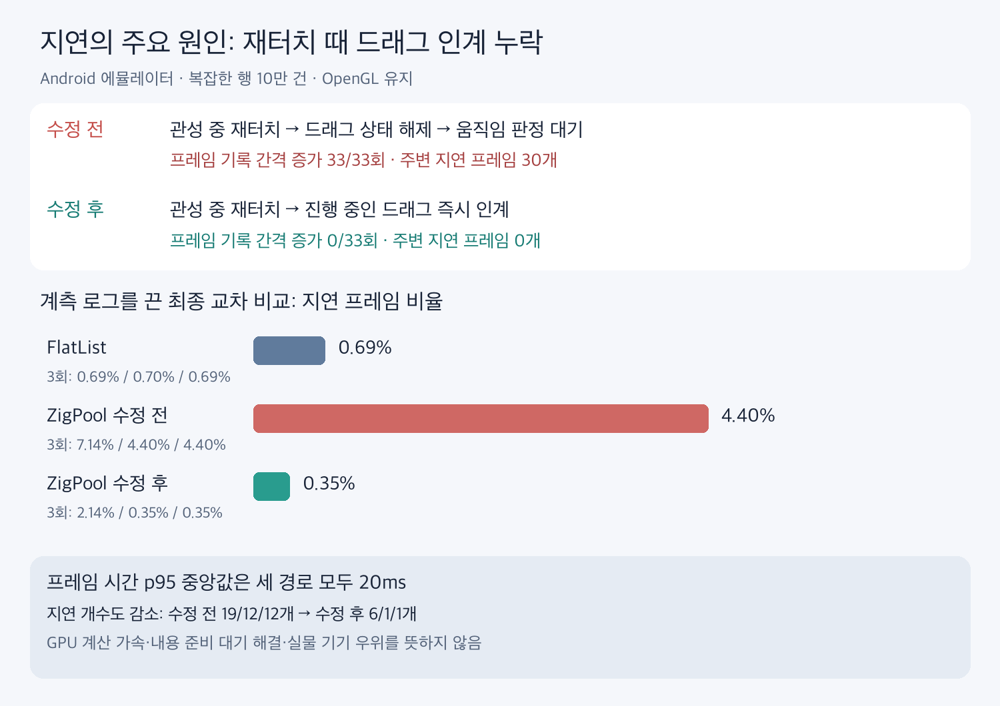

# 재터치 시 드래그 인계 누락이 만든 지연 프레임

**Android ZigPool이 관성 스크롤 중 재터치를 받을 때 드래그 상태를 무조건 해제하던 것이 이번 반복 스와이프 비교의 주요 원인이었다.** Android 기본 ScrollView처럼 진행 중인 관성 이동을 확인하고 곧바로 드래그를 인계하자, 같은 APK의 지연 프레임 중앙값이 4.40%에서 0.35%로 줄었다. FlatList는 0.69%였다. GPU 백엔드는 모두 기존 OpenGL이다.



## 무엇이 달랐나

기존 `ZlPoolListView.onInterceptTouchEvent`는 `ACTION_DOWN`마다 `dragging=false`로 만들고 관성 이동을 종료했다. 이후 움직임이 임계값을 넘으면 다시 터치를 가로챘다. 이미 움직이던 목록에서도 새로운 드래그가 시작되기를 기다리는 셈이다.

Android 16 [ScrollView 참조 구현](https://android.googlesource.com/platform/frameworks/base/+/android16-release/core/java/android/widget/ScrollView.java)의 같은 분기는 `computeScrollOffset()`으로 관성 이동의 종료 상태를 확인하고, 아직 이동 중이면 즉시 `mIsBeingDragged=true`로 처리한다. RN 0.85의 [ReactScrollView](https://github.com/facebook/react-native/blob/v0.85.0/packages/react-native/ReactAndroid/src/main/java/com/facebook/react/views/scroll/ReactScrollView.java)는 기본 ScrollView의 터치 처리로 이어진다. 관성을 터치로 멈추는 것 자체는 양쪽 모두 필요한 동작이다. **차이는 멈춘 뒤 드래그를 인계하는가, 판정을 처음부터 다시 기다리는가다.**

수정은 다음 두 줄이다. 아래에서 `resumeDrag`는 기본 true이며, false는 예제에서 수정 전 경로를 비교하기 위한 옵션이다.

```kotlin
if (resumeDrag) scroller.computeScrollOffset()
dragging = resumeDrag && !scroller.isFinished
scroller.forceFinished(true)
```

정지 상태에서의 새 터치는 기존처럼 이동 임계값으로 드래그를 판정한다. React 문법, 행 내용, 풀 크기, Zig 계산, 그래픽 API는 이 수정으로 바뀌지 않는다. 계속 빈 프레임을 그리게 하는 keepAlive도 사용하지 않았다.

## 입력과 프레임을 연결한 근거

선택적 `motionTrace`로 실제 스크롤 위치와 그리기 전 시각, 관성 갱신을 기록하고, 별도 프레임 로그의 intended-vsync 및 deadline과 연결했다. 상세 그래픽 추적은 껐다. 각 실행의 12번 스와이프 중 최초 입력을 제외한 11번 재터치, 3회 합계 33번을 비교했다.

| 진단 조건 | 재터치 뒤 25ms 초과 프레임 기록 간격 | 재터치 주변 지연 프레임 |
|---|---:|---:|
| ZigPool 수정 전 | **33회** | **30개** |
| ZigPool 수정 후 | **0회** | **0개** |
| FlatList, 수정 전 진단 그룹 | 1회 | 1개 |
| FlatList, 수정 후 진단 그룹 | 0회 | 0개 |

프레임 간격은 재터치 후 0~80ms에서 끝나는 인접 FrameMetrics 기록의 intended-vsync 차이다. 지연 프레임은 재터치 전 16.67ms부터 후 80ms까지의 `total > deadline` 기록이다. 최초 정지 화면에서 스크롤을 시작할 때와 마지막 관성이 끝날 때의 기록은 위 재터치 합계에 포함하지 않는다. `gfxinfo`의 총 지연 개수와 FrameMetrics 콜백의 집계 범위·판정은 같다고 가정하지 않는다.

대표 실행에서는 수정 전 재터치마다 프레임 기록 간격이 약 33.33ms로 벌어지고, 다시 기록되는 프레임에 16.67ms 마감이 부여됐다. 전체 처리 시간은 약 17~18ms라 마감을 넘었다. 수정 후에는 같은 재터치 구간의 반복적인 간격 증가와 짧은 마감이 사라졌다.

**그리기 전 콜백 자체가 멈춘 것은 아니었다.** 수정 전에도 그 콜백은 대체로 16.67ms 간격으로 실행됐지만 스크롤 위치가 그대로인 구간이 있었다. 그리기 전 호출 횟수와 새 프레임 기록 수는 다르다. 따라서 앞선 “그리기 요청이 끊긴다”는 설명은 “재터치 때 내용 이동이 잠시 멈추며 새 프레임 제출 기록에 공백이 생긴다”로 구체화한다. 실제 디스플레이에서 픽셀이 표시된 시각을 측정한 것은 아니다.

## 로그를 끈 최종 교차 비교

최종 Release APK 하나에서 FlatList / ZigPool 수정 전 / 수정 후 순서를 회전해 각각 3회 실행했다. `trace=false`, `motionTrace=false`, 상세 시스템 추적 꺼짐, 감사 로그 꺼짐, 녹화 꺼짐이다. Android 16/API 36 arm64 에뮬레이터, 세로 1080×2400, 복잡한 고정 높이 행 10만 건, 300ms 스와이프 12회, 이후 1.2초 대기 조건이다.

| 경로 | 1회 지연률 | 2회 지연률 | 3회 지연률 | 중앙값 | p95 중앙값 |
|---|---:|---:|---:|---:|---:|
| FlatList | 0.69% | 0.70% | 0.69% | **0.69%** | 20ms |
| ZigPool 수정 전 | 7.14% | 4.40% | 4.40% | **4.40%** | 20ms |
| ZigPool 수정 후 | 2.14% | 0.35% | 0.35% | **0.35%** | 20ms |

수정 전 지연 개수는 19/12/12개, 수정 후 6/1/1개다. 총 프레임은 각각 266/273/273개와 280/284/284개다. **분모가 늘어서 비율만 낮아진 것이 아니라 지연 개수도 줄었다.** 다만 실행 1의 변동을 제외하지 않았다. 수정 후 p95는 27/19/20ms였으며 p95 개선을 입증한 결과는 아니다.

FlatList보다 모든 상황에서 빠르다는 결론도 아니다. 처리 경로에 따라 Android가 부여하는 마감 예산이 다르고, 기존 조사에서 그래픽 추적·백엔드에 따른 완료 신호 기록 차이도 있었다. 이번 실험은 그 설정들을 고정하고 **재터치 처리 두 줄의 효과를 되돌릴 수 있게 확인한 것**이다. 입력부터 실제 화면 표시까지의 지연, 전력, 구형 실물 기기, iOS는 이 표로 평가할 수 없다.

## 내용 준비 지연과의 관계

이 수정은 [앞선 내용 반영 조사](../2026-09-05-cause/README.md)의 요청→React→네이티브 대기를 직접 줄이지 않는다. 기존 18ms 중앙값·34ms p95는 당시 측정값이며 이번 수정 후 다시 측정한 값이 아니다. 행 재사용 결과를 기다리는 문제와 재터치 시 드래그 인계 문제를 구분한다. 강제 내용 지연을 주면 여유 행이 소진돼 빈 공간이 생길 수 있는 한계도 남는다.

이번 결과는 자체 네이티브 스크롤 구현에서 기본 ScrollView가 처리하던 세부 동작 하나가 누락됐다는 근거다. FlatList·다른 RN 목록도 일반적인 네이티브 뷰 경로에서 GPU를 사용한다. GPU 사용 여부만으로 이번 지연 차이를 설명할 수 없다.

## 검증과 재현

- [최종 교차 결과](final-results.json), [원자료](final-raw.zip)
- [수정 전 진단](before-diagnostic-analysis.json), [원자료](before-diagnostic-raw.zip)
- [수정 후 진단](after-diagnostic-analysis.json), [원자료](after-diagnostic-raw.zip)
- [측정 스크립트](record.py), [진단 분석](analyze.py), [그래프 생성](make_chart.py)
- [APK 해시·환경 기록](provenance.json), [최종 측정 앱 변경분](runtime.patch)

```sh
CROSS=true TRACE=false MOTION=false OUT=/private/tmp/zerolist-scroll-final python3 -I docs/benchmarks/2026-09-05-scroll/record.py
```

최초 시도는 에뮬레이터가 가로 방향이어서 기존 세로 좌표 입력이 화면을 벗어났다. 입력·유효 프레임이 없는 실행은 제외했고, 화면 크기와 유효 프레임·내용 갱신을 검사하도록 스크립트를 보강했다. 비교 시 세로 방향으로 맞추고 작업 종료 때 원래 가로 설정으로 복원했다. 이 제외는 성능 이상치를 제거한 것이 아니며 유효한 실행 1의 느린 값은 위 표에 그대로 남겼다.

최종 APK로 기존 [Android 내용 검사](../2026-09-05-sync/audit_android.py)를 다시 실행했다. 느린·빠른·역방향 이동에서 정상/120ms/400ms 세 조건 모두 수정 동기화 경로의 **잘못된 행 0회·겹침 0회**였고, 정상 조건 빈 공간도 0회였다. 400ms 강제 지연에서는 빈 공간 84회가 남았으며 종료 후 정상 배치됐다. 검사기의 대조군인 이전 동기화 경로에서는 잘못된 행 15/56/57회가 검출됐다. 이 대조군 이름 `legacy`는 재터치 수정 전 옵션과는 다르다. [검사 결과](audit-results.json), [원자료](audit-raw.zip).

최종 Android Release APK 빌드와 기존 71개 테스트, 린트, 라이브러리 타입 검사를 통과했다. 이번 변경은 Android 터치 처리이며 iOS 코드는 바꾸지 않았고 재빌드하지 않았다. 새 빌드 CI는 추가하지 않았다.
