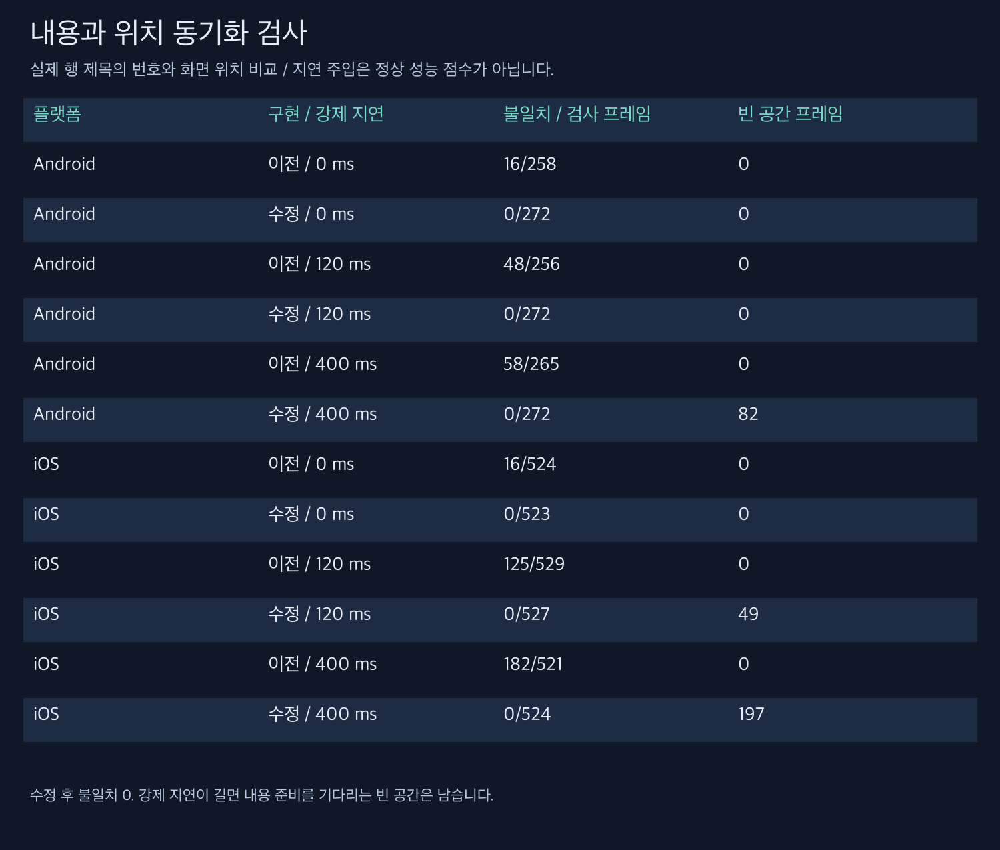
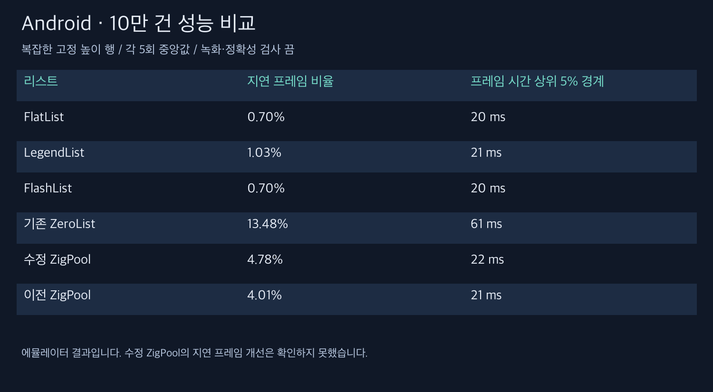
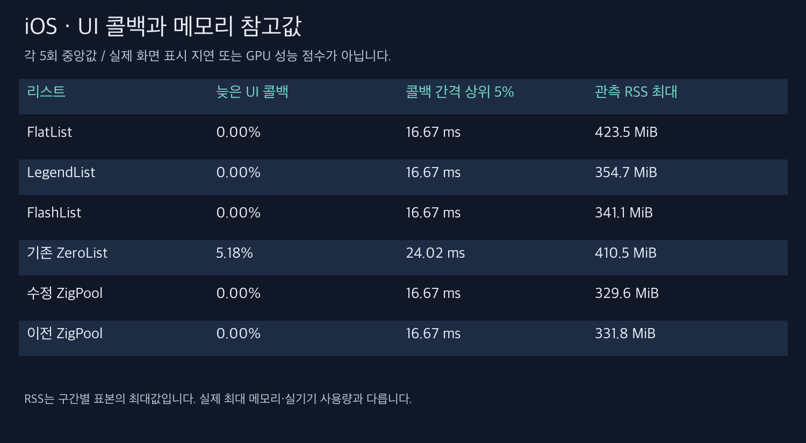

# Android·iOS 동기화 수정과 재검증

내용과 위치가 어긋나는 문제를 양쪽 플랫폼에서 재현하고 수정했습니다. **수정 경로의 이번 정확성 검사에서는 불일치와 겹침이 0회였습니다. Android 지연 프레임 개선은 확인하지 못했습니다.**

## 무엇을 수정했나요?

이전 구현은 네이티브가 재사용할 행의 새 위치를 먼저 적용하고, React가 나중에 내용을 바꿨습니다. 그 사이 이전 내용이 새 위치에 표시될 수 있었습니다. 이제 React가 확정한 행 번호 목록을 내용과 같은 커밋에 전달하고, Android는 그리기 직전, iOS는 네이티브 마운트 트랜잭션 완료 후 위치를 반영합니다. 늦게 도착한 이전 이벤트도 무시합니다. 화면 높이에 맞춰 여유 행을 확보합니다.

React/TypeScript/JSX 문법은 유지됩니다. Android는 Kotlin·JNI C++·Zig, iOS는 Objective-C++·UIScrollView·Zig를 사용합니다. GPU 전용 렌더러를 새로 도입한 변경은 아닙니다. **현재 ZigPool은 고정 높이 실험 구현이며, 동적 높이 지원이 완료된 라이브러리가 아닙니다.**

## 검사 조건과 범위

- 소스: `ff7c77c`의 Release 빌드. 같은 바이너리에서 이전/수정 경로를 선택했습니다. 이전 경로에도 공통 행 컨테이너 크기 보정이 들어가므로 과거 APK와 완전히 같은 바이너리는 아닙니다.
- Android: Android 16/API 36 arm64 에뮬레이터, 1080×2400. iOS: iPhone 17 Pro/iOS 26.2 시뮬레이터, 1206×2622.
- 데이터 100,000건, 복잡한 고정 높이 행, FlatList·LegendList·FlashList·기존 ZeroList·수정 ZigPool·이전 ZigPool 6개 경로를 각 5회 측정했습니다. 순서를 회전했습니다.
- 성능 측정은 준비 3초, 300ms 스와이프 12회, 종료 대기 1.2초입니다. 녹화·동기화 감사 로그·강제 내용 지연은 껐습니다. 10만 건을 준비하지만 전 구간을 스크롤하는 검사는 아닙니다.
- 정확성 검사는 느린 이동·빠른 이동·역방향 이동 18회와 내용 반영 0/120/400ms 강제 지연을 별도로 사용했습니다. 감사 로그가 있으므로 이 실행의 프레임 수를 성능 순위에 사용하지 않습니다.
- 저사양 구형 실물 태블릿, 배터리·발열, 동적 높이, 터치부터 화면 표시까지의 종단 지연은 검증하지 않았습니다.

## 실제 내용과 위치 검사

| 플랫폼 | 구현 / 강제 지연 | 불일치 / 검사 프레임 | 빈 공간 프레임 |
| --- | --- | --- | --- |
| Android | 이전 / 0 ms | 16/258 | 0 |
| Android | 수정 / 0 ms | 0/272 | 0 |
| Android | 이전 / 120 ms | 48/256 | 0 |
| Android | 수정 / 120 ms | 0/272 | 0 |
| Android | 이전 / 400 ms | 58/265 | 0 |
| Android | 수정 / 400 ms | 0/272 | 82 |
| iOS | 이전 / 0 ms | 16/524 | 0 |
| iOS | 수정 / 0 ms | 0/523 | 0 |
| iOS | 이전 / 120 ms | 125/529 | 0 |
| iOS | 수정 / 120 ms | 0/527 | 49 |
| iOS | 이전 / 400 ms | 182/521 | 0 |
| iOS | 수정 / 400 ms | 0/524 | 197 |

불일치는 화면의 `#번호`와 실제 행 위치에서 계산한 번호가 다른 경우입니다. 빈 공간과 겹침은 화면에 잘린 실제 행 사각형을 합쳐 계산하며 반올림 오차 2픽셀까지 허용합니다. iOS의 자연스러운 끝부분 튕김 영역은 제외합니다. 종료 시 수정 경로의 불일치·겹침·유의한 빈 공간은 모두 없어야 통과합니다. 이전 경로에서 문제가 검출되어야 검사 자체의 유효성도 인정합니다.

**수정이 React 작업을 즉시 끝내 주지는 않습니다.** 강제 지연이 길거나 이동이 빠르면 준비된 여유 행을 소진해 빈 공간이 생깁니다. 잘못된 내용을 새 위치에 표시하는 문제를 고쳤지만, 내용 준비 지연까지 없앤 것은 아닙니다. 두 OS는 제스처와 스크롤 물리가 달라 프레임 개수를 서로 직접 비교하면 안 됩니다.

## Android 성능

| 리스트 | 지연 프레임 비율 중앙값 | 프레임 시간 상위 5% 경계 중앙값 |
| --- | --- | --- |
| FlatList | 0.70% | 20 ms |
| LegendList | 1.03% | 21 ms |
| FlashList | 0.70% | 20 ms |
| 기존 ZeroList | 13.48% | 61 ms |
| 수정 ZigPool | 4.78% | 22 ms |
| 이전 ZigPool | 4.01% | 21 ms |

지연 프레임 비율은 Android `gfxinfo`가 기한을 놓쳤다고 분류한 프레임 수를 수집된 프레임 수로 나눈 값입니다. 프레임 시간 상위 5% 경계는 각 실행의 p95입니다. 전체 실행 프레임을 합쳐 계산한 p95가 아니라, 5개 실행의 p95 중앙값입니다. 이 비율은 내용 동기화 오류율·터치 응답 시간과 다른 지표입니다.

수정 ZigPool은 이 조건에서 기존 ZeroList보다 지연 프레임이 적지만 FlatList·LegendList·FlashList보다 많습니다. **이전 ZigPool보다 빨라졌다는 근거도 없습니다.** 기본 스크롤 표시 옵션을 켜는 별도 3쌍 실험에서도 개선이 없어 기본값은 꺼 두었습니다. 이전 연속 그리기 실험은 지연 판정만 줄고 프레임 처리 시간은 줄지 않아 제품 동작에 적용하지 않았습니다. [이전 원인 분석](../2026-09-05-ablation/README.md)을 참고하세요.

FlatList에는 고정 높이 정보를 제공하며 이번 이동 범위도 제한적입니다. 다른 리스트의 강점이 항상 나타나는 조건은 아닙니다. 이 결과를 모든 데이터·행 구조·기기의 보편 순위로 해석하지 않습니다.

## iOS 참고 지표

| 리스트 | 늦은 UI 콜백 비율 중앙값 | 콜백 간격 p95 중앙값 | 관측 RSS 최대 중앙값 |
| --- | --- | --- | --- |
| FlatList | 0.00% | 16.67 ms | 423.5 MiB |
| LegendList | 0.00% | 16.67 ms | 354.7 MiB |
| FlashList | 0.00% | 16.67 ms | 341.1 MiB |
| 기존 ZeroList | 5.18% | 24.02 ms | 410.5 MiB |
| 수정 ZigPool | 0.00% | 16.67 ms | 329.6 MiB |
| 이전 ZigPool | 0.00% | 16.67 ms | 331.8 MiB |

`CADisplayLink` 콜백에서 받은 `timestamp` 간격이 직전 예정 주기의 1.5배를 넘으면 늦은 UI 콜백으로 셌습니다. 콜백에 전달된 화면 갱신 시각의 간격을 보는 보조 지표이며, 콜백 진입의 실제 벽시계 간격과도 구분합니다. 이 지표는 **GPU 완료·실제 화면 표시 시한을 측정하지 않습니다. 0%여도 화면 끊김이 없다는 뜻은 아닙니다.** 계측 콜백은 매 주기 실행되므로 Android의 유휴 후 그리기 재개 지표와도 직접 비교할 수 없습니다.

메모리는 시뮬레이터 프로세스의 RSS를 이동 전·각 이동 후·종료 시 표본 수집한 최대값입니다. 실기기 메모리 사용량이나 연속 측정한 실제 최대값이 아닙니다. `Animation Hitches` 계측은 이 시뮬레이터에서 지원되지 않았습니다. [실제 도구 오류](ios-hitches-unavailable.txt)를 함께 보관합니다.

## 영상

영상은 수치 측정이 끝난 뒤 별도로 촬영했습니다. 플랫폼별 이전/수정 경로를 같은 제스처 순서로 각각 실행했으므로 프레임 단위로 완벽히 동기화된 동시 실행은 아닙니다. 120ms 영상은 문제 관찰을 위한 강제 지연이며 정상 속도 평가에 사용하면 안 됩니다. 원본 화면의 영문 시험 데이터는 증거 보존을 위해 그대로 두었습니다. `open`은 열기입니다. 전체화면 시험 앱의 상단 상태 표시줄·카메라 영역은 원본 그대로이며, 행끼리의 겹침 검사와 구분합니다.

- [Android 정상 조건 비교](android-compare-0.mp4) · [Android 강제 120ms 비교](android-compare-120.mp4)
- [iOS 정상 조건 비교](ios-compare-0.mp4) · [iOS 강제 120ms 비교](ios-compare-120.mp4)
- 관찰용 0.25배속: [Android 강제 지연](android-compare-120-slow.mp4) · [iOS 강제 지연](ios-compare-120-slow.mp4)

## 용어

- ms(밀리초): 1,000ms가 1초입니다. MiB는 메모리 크기 단위로 약 105만 바이트입니다.
- RSS: 운영체제가 해당 프로세스에 잡아 둔 물리 메모리 양입니다.
- 커밋: 여기서는 React가 계산한 화면 변경을 실제 뷰에 반영하는 단계입니다. 소스 커밋은 별도로 코드 버전을 뜻합니다.
- 콜백: 운영체제가 앱의 함수를 호출하는 것입니다. 호출이 규칙적이어도 실제 화면 표시 완료를 보장하지는 않습니다.

## 재현·원자료

- [Android 성능 스크립트](measure_android.py), [결과](performance-android.json), [원자료](performance-android-raw.zip)
- [iOS 참고 계측 스크립트](measure_ios.py), [결과](performance-ios.json), [원자료](performance-ios-raw.zip)
- [Android 정확성 스크립트](audit_android.py), [결과](audit-android.json), [원자료](audit-android-raw.zip)
- [iOS 정확성 스크립트](audit_ios.py), [결과](audit-ios.json), [원자료](audit-ios-raw.zip)
- [스크롤 표시 실험](indicator-android.json), [원자료](indicator-android-raw.zip)
- [동기화 수정 1차 측정](binding-only-android.json), [원자료](binding-only-android-raw.zip)
- [영상 검증 스크립트](validate.py), [전체 디코딩·시각 순서 검사 결과](video-validation.json)
- [녹화 스크립트](capture.py), [녹화 시간·해시·제스처](capture-manifest.json), [빌드 출처](provenance.json)

`OUT`으로 각 측정 저장 폴더를 지정할 수 있습니다. Android는 `ADB`, iOS는 `UDID`로 기기를 지정합니다. Release 앱 설치 후 실행하며 성능 측정 중에는 빌드·녹화·다른 기기 테스트를 병행하지 않습니다. 스크립트의 기본값은 이번 측정 환경이므로 다른 기기에서는 해상도와 제스처 좌표를 먼저 맞춰야 합니다.

React 회귀 테스트 3개를 포함해 전체 71개 테스트, 라이브러리 타입 검사, 린트, Android/iOS Release 빌드를 통과했습니다. 회귀 테스트는 커밋 일치·이전 이벤트 무시·대기 타이머 해제를 확인하며 실제 네이티브 화면 검사와 역할이 다릅니다.
