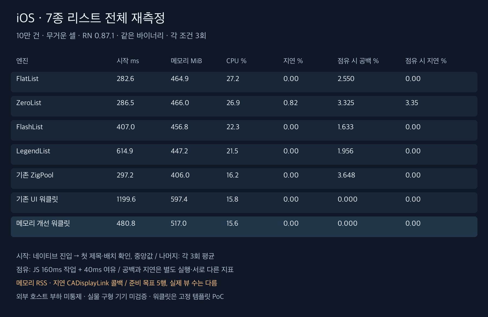
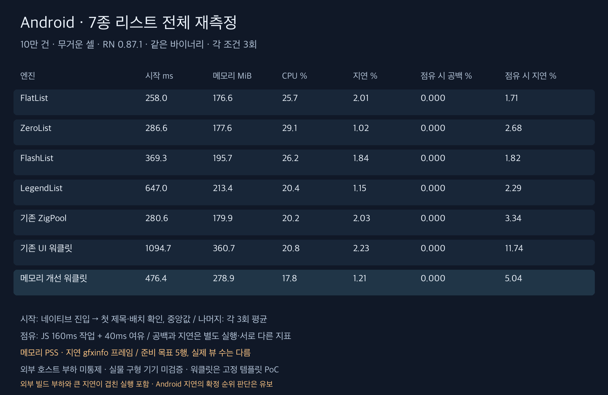

# 7종 리스트 전체 비교

**FlatList·ZeroList·FlashList·LegendList·기존 ZigPool·기존 UI 워클릿·메모리 개선 워클릿을 모두 같은 바이너리에서 새로 측정했다.** 정식 168회와 별도 시작 준비 14회이며 과거 수치를 섞지 않았다. [조건·API 차이·측정 경계](methodology-ko.md)

RN 0.87.1 / FlashList 2.3.1 / LegendList 2.0.19. 10만 건 고정 높이 무거운 셀, 한쪽 5행 준비 목표. 실제 뷰 수와 지원 기능은 엔진마다 다르다. 에뮬레이터·시뮬레이터에서 외부 호스트 부하를 통제하지 못한 탐색 비교다.

**Android 지연 순위는 확정하지 않는다.** 기존 UI 워클릿 한 실행에서 지연 30.91%·p95 117ms와 함께 호스트 1분 부하 약 25.2→27.0가 기록됐다. 인과관계를 단정하거나 느린 실행을 제외하지 않았으며 [큰 지연과 외부 빌드 관측 기록](high-latency-observations.json)에 따로 보존했다.

## iOS 시작과 평상시 비용

시작은 네이티브 진입부터 첫 제목·배치 확인까지의 3회 중앙값, 비용은 3회 평균이다. 괄호는 실행별 범위다. 실제 패널 표시 시각이나 앱 전체 시작 시간은 아니다.

| 엔진 | 시작 ms (범위) | 첫 확인 시 붙은 행 수 중앙값 | 메모리 MiB | CPU % | 지연 % | p95 ms |
|---|---:|---:|---:|---:|---:|---:|
| FlatList | 282.6 (281.8~287.7) | 4 | 464.9 | 27.2 | 0.00 | 16.67 |
| ZeroList | 286.5 (284.8~287.3) | 4 | 466.0 | 26.9 | 0.82 | 16.67 |
| FlashList | 407.0 (400.2~436.0) | 14 | 456.8 | 22.3 | 0.00 | 16.67 |
| LegendList | 614.9 (611.4~622.7) | 12 | 447.2 | 21.5 | 0.00 | 16.67 |
| 기존 ZigPool | 297.2 (290.3~301.7) | 14 | 406.0 | 16.2 | 0.00 | 16.67 |
| 기존 UI 워클릿 | 1199.6 (1008.8~1213.1) | 14 | 597.4 | 15.8 | 0.00 | 16.67 |
| 메모리 개선 워클릿 | 480.8 (474.1~536.0) | 14 | 517.0 | 15.6 | 0.00 | 16.67 |

## iOS JS 160ms 점유 조건

공백 검사와 비용 검사는 별도 실행이다. 평균 공백은 움직이는 구간의 화면 공백 면적 비율이며 지연 프레임 비율과 다르다.

| 엔진 | 평균 공백 % (범위) | 무공백 / 3 | 내용 오류 / 겹침 프레임 | 붙은 행 최대 | 메모리 MiB | CPU % | 지연 % (범위) | p95 ms |
|---|---:|---:|---:|---:|---:|---:|---:|---:|
| FlatList | 2.550 (2.339~2.881) | 0 | 0 / 0 | 6 | 494.0 | 89.7 | 0.00 (0.00~0.00) | 16.67 |
| ZeroList | 3.325 (2.744~3.950) | 0 | 0 / 0 | 15 | 507.7 | 94.8 | 3.35 (3.04~3.51) | 16.67 |
| FlashList | 1.633 (1.233~1.990) | 0 | 0 / 0 | 15 | 463.3 | 87.9 | 0.00 (0.00~0.00) | 16.67 |
| LegendList | 1.956 (1.403~2.482) | 0 | 0 / 0 | 15 | 475.1 | 87.9 | 0.00 (0.00~0.00) | 16.67 |
| 기존 ZigPool | 3.648 (3.504~3.893) | 0 | 0 / 0 | 14 | 415.8 | 85.8 | 0.00 (0.00~0.00) | 16.67 |
| 기존 UI 워클릿 | 0.000 (0.000~0.000) | 3 | 0 / 0 | 14 | 587.9 | 87.9 | 0.00 (0.00~0.00) | 16.67 |
| 메모리 개선 워클릿 | 0.000 (0.000~0.000) | 3 | 0 / 0 | 14 | 507.7 | 87.3 | 0.00 (0.00~0.00) | 16.67 |

## Android 시작과 평상시 비용

시작은 네이티브 진입부터 첫 제목·배치 확인까지의 3회 중앙값, 비용은 3회 평균이다. 괄호는 실행별 범위다. 실제 패널 표시 시각이나 앱 전체 시작 시간은 아니다.

| 엔진 | 시작 ms (범위) | 첫 확인 시 붙은 행 수 중앙값 | 메모리 MiB | CPU % | 지연 % | p95 ms |
|---|---:|---:|---:|---:|---:|---:|
| FlatList | 258.0 (251.5~264.5) | 4 | 176.6 | 25.7 | 2.01 | 24.00 |
| ZeroList | 286.6 (276.0~325.2) | 4 | 177.6 | 29.1 | 1.02 | 29.33 |
| FlashList | 369.3 (365.5~391.1) | 4 | 195.7 | 26.2 | 1.84 | 25.33 |
| LegendList | 647.0 (565.5~669.7) | 12 | 213.4 | 20.4 | 1.15 | 22.67 |
| 기존 ZigPool | 280.6 (276.6~435.3) | 14 | 179.9 | 20.2 | 2.03 | 23.33 |
| 기존 UI 워클릿 | 1094.7 (1086.0~1156.2) | 14 | 360.7 | 20.8 | 2.23 | 20.33 |
| 메모리 개선 워클릿 | 476.4 (437.5~498.7) | 14 | 278.9 | 17.8 | 1.21 | 21.33 |

## Android JS 160ms 점유 조건

공백 검사와 비용 검사는 별도 실행이다. 평균 공백은 움직이는 구간의 화면 공백 면적 비율이며 지연 프레임 비율과 다르다.

| 엔진 | 평균 공백 % (범위) | 무공백 / 3 | 내용 오류 / 겹침 프레임 | 붙은 행 최대 | 메모리 MiB | CPU % | 지연 % (범위) | p95 ms |
|---|---:|---:|---:|---:|---:|---:|---:|---:|
| FlatList | 0.000 (0.000~0.000) | 3 | 0 / 0 | 5 | 176.3 | 95.7 | 1.71 (1.69~1.74) | 27.00 |
| ZeroList | 0.000 (0.000~0.000) | 3 | 0 / 0 | 15 | 185.5 | 96.5 | 2.68 (1.03~5.65) | 35.33 |
| FlashList | 0.000 (0.000~0.000) | 3 | 0 / 0 | 15 | 194.1 | 93.6 | 1.82 (0.69~2.41) | 26.67 |
| LegendList | 0.000 (0.000~0.000) | 3 | 0 / 0 | 15 | 216.5 | 91.3 | 2.29 (1.04~3.39) | 26.67 |
| 기존 ZigPool | 0.000 (0.000~0.000) | 3 | 0 / 0 | 14 | 180.7 | 85.9 | 3.34 (1.50~6.64) | 28.33 |
| 기존 UI 워클릿 | 0.000 (0.000~0.000) | 3 | 0 / 0 | 14 | 360.6 | 91.8 | 11.74 (0.73~30.91) | 55.67 |
| 메모리 개선 워클릿 | 0.000 (0.000~0.000) | 3 | 0 / 0 | 14 | 276.3 | 94.5 | 5.04 (1.09~11.52) | 34.67 |

## 지표별 정렬

아래는 이 조건에서 낮은 수치 순으로 정렬한 결과다. 종합 제품 순위나 통계적으로 확정된 우위를 의미하지 않는다. 지원 범위와 실행별 편차를 함께 봐야 한다.

- ios 첫 제목·배치 확인: FlatList (282.58) → ZeroList (286.52) → 기존 ZigPool (297.23) → FlashList (406.99) → 메모리 개선 워클릿 (480.82) → LegendList (614.95) → 기존 UI 워클릿 (1199.65)
- ios 평상시 메모리: 기존 ZigPool (406.04) → LegendList (447.20) → FlashList (456.80) → FlatList (464.85) → ZeroList (465.99) → 메모리 개선 워클릿 (517.01) → 기존 UI 워클릿 (597.40)
- ios JS 점유 평균 공백: 기존 UI 워클릿 = 메모리 개선 워클릿 (0.00) → FlashList (1.63) → LegendList (1.96) → FlatList (2.55) → ZeroList (3.33) → 기존 ZigPool (3.65)
- android 첫 제목·배치 확인: FlatList (257.98) → 기존 ZigPool (280.60) → ZeroList (286.60) → FlashList (369.33) → 메모리 개선 워클릿 (476.39) → LegendList (647.04) → 기존 UI 워클릿 (1094.70)
- android 평상시 메모리: FlatList (176.59) → ZeroList (177.62) → 기존 ZigPool (179.90) → FlashList (195.69) → LegendList (213.36) → 메모리 개선 워클릿 (278.91) → 기존 UI 워클릿 (360.70)
- android JS 점유 평균 공백: FlatList = ZeroList = FlashList = LegendList = 기존 ZigPool = 기존 UI 워클릿 = 메모리 개선 워클릿 (0.00)

## 워클릿 보조 지표

UI 전체 데이터 접근 시점은 워클릿에만 있는 별도 지표다. 일반 리스트의 값은 해당 없음이며 0으로 간주하지 않는다. 이 시간으로 전체 리스트 시작 순위를 매기지 않았다.

| 플랫폼 | 워클릿 | UI 데이터 접근 가능 중앙값 ms |
|---|---|---:|
| ios | 기존 UI 워클릿 | 1214.0 |
| ios | 메모리 개선 워클릿 | 672.0 |
| android | 기존 UI 워클릿 | 1334.0 |
| android | 메모리 개선 워클릿 | 703.0 |

## 정확성과 검증 한계

스크롤 화면 검사 42회·16,708프레임에서 내용 오류 0프레임, 겹침 0프레임을 관측했다.
시작 검사(준비 포함) 56회에서 내용 오류 0프레임, 겹침 0프레임이었다.

FlatList·ZeroList·FlashList·LegendList는 공통 React 셀을 사용한다. 워클릿은 고정 템플릿과 전용 텍스트를 사용해 React 재렌더와 데이터 전달 경로가 다르다. 고정 높이 힌트가 주어진 이번 결과를 동적 높이·이미지 다운로드·데이터 변경·실물 구형 기기의 종합 성능으로 일반화하지 않는다.

앞선 워클릿 90회 비교에서 관측한 Android 지연 증가를 이번에 코드로 수정한 것은 아니다. 같은 바이너리를 재측정했으며 지연 순위의 변화만으로 이전 회귀가 해결됐다고 해석하지 않는다.

이번에는 리스트 구현을 수정하거나 새 빌드를 만들지 않았다. Android/iOS Release 빌드와 76개 테스트, 기존 CI 6개가 통과했던 계측 커밋 `6dac750`의 소스·바이너리 해시를 확인하고 재사용했다.
