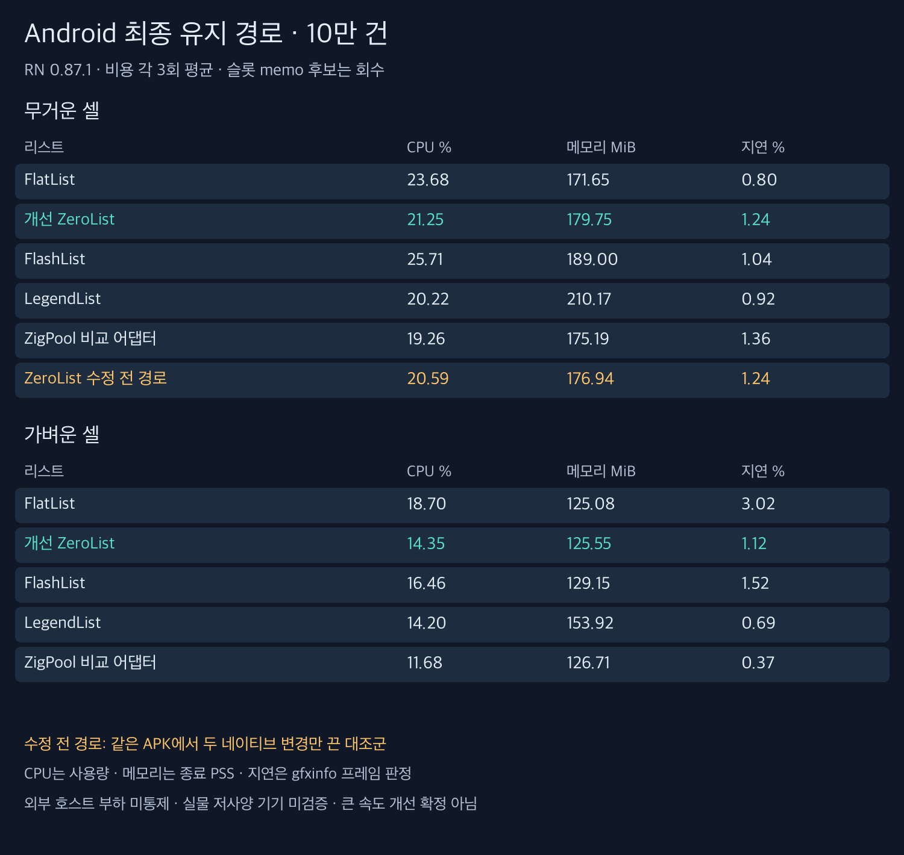

# Android 성능 개선 시도와 재검증

**Android의 중복 배치와 셀별 이동을 줄였지만, 큰 속도 개선이 입증된 단계는 아니다.** 이전의 CPU 42% 악화는 같은 코드로 재현되지 않았고 당시 높은 호스트 부하를 확인했다. 슬롯 memo 후보는 긴 스크롤에서 불리한 결과가 나와 실제 구현에서 회수했다.

공개 ZeroList API·준비 행 수·항목 상태 보호를 유지했다. Android는 부모 View의 공통 스크롤 변환을 사용하고 Fabric이 배치한 자식을 FrameLayout에서 다시 측정·배치하지 않는다. 먼 인덱스에서는 기준 좌표를 다시 잡아 float 정밀도를 유지한다. GPU API와 그래픽 설정은 바꾸지 않았다. [구현 범위](implementation-ko.md) · [원인과 판단](findings-ko.md) · [동작 영상과 화면](contract-ko.md).

## 최종 유지한 구현의 비교

같은 APK의 비용 각 3회 평균이다. RN 0.87.1, Android 16 arm64 Release 에뮬레이터, 10만 건, 한쪽 5행 준비 목표, 강제 JS 점유 없음. 이 표에는 **회수한 슬롯 memo가 들어 있지 않다.** 메모리는 측정 종료 시 PSS다.

### 무거운 셀

| 리스트                | CPU % | 메모리 MiB | 지연 프레임 % |
| --------------------- | ----: | ---------: | ------------: |
| FlatList              | 23.68 |     171.65 |          0.80 |
| 개선 ZeroList         | 21.25 |     179.75 |          1.24 |
| FlashList             | 25.71 |     189.00 |          1.04 |
| LegendList            | 20.22 |     210.17 |          0.92 |
| ZigPool 비교 어댑터   | 19.26 |     175.19 |          1.36 |
| ZeroList 수정 전 경로 | 20.59 |     176.94 |          1.24 |

### 가벼운 셀

| 리스트              | CPU % | 메모리 MiB | 지연 프레임 % |
| ------------------- | ----: | ---------: | ------------: |
| FlatList            | 18.70 |     125.08 |          3.02 |
| 개선 ZeroList       | 14.35 |     125.55 |          1.12 |
| FlashList           | 16.46 |     129.15 |          1.52 |
| LegendList          | 14.20 |     153.92 |          0.69 |
| ZigPool 비교 어댑터 | 11.68 |     126.71 |          0.37 |

무거운 셀에서 현재 ZeroList의 CPU는 FlatList보다 낮았지만 지연 프레임과 메모리는 더 높았다. 같은 APK의 수정 전 경로와 비교하면 CPU·메모리가 약간 높고 지연 평균은 같았다. 따라서 이번 두 변경의 성능 우위를 확정하지 않는다. 코드의 중복 작업을 줄인 것과 실행 수치가 확실히 좋아진 것은 구분한다.

[전체 실행 범위·준비율·실제 이동량·작업량](native-stage-ko.md). 별도 화면 검사 11회는 제목 오류·겹침·평균 공백이 모두 0이었다. 실물 기기나 모든 스크롤에서 무공백이라는 뜻은 아니다.

## 수행한 비교와 회수한 후보

| 단계                    | 비용 측정 | 별도 화면 검사 | 목적                                        |
| ----------------------- | --------: | -------------: | ------------------------------------------- |
| 수정 전 재측정          |         6 |              0 | 이전 고부하 결과 재현 확인                  |
| 네이티브 변경 4종       |        12 |              4 | 부모 이동·중복 배치 제거를 각각 분리        |
| 네이티브 변경 재확인    |        10 |              0 | 기존/두 변경을 5회씩 교차 비교              |
| 최종 네이티브 구현 비교 |        33 |             11 | 5개 리스트와 수정 전 경로, 두 종류 셀       |
| 슬롯 memo 짧은 비교     |        10 |              2 | 같은 native 경로에서 React 래퍼 memo만 분리 |
| 슬롯 memo 긴 비교       |         6 |              0 | 90회 스와이프로 지속 스크롤 확인            |
| 합계                    |        77 |             17 | 총 94회의 유효 결과                         |

이 밖에 시스템 추적 3회와 동작 계약 화면 2개는 비용 측정과 별도로 수집했다. 긴 비교의 마지막 대조 실행은 내용 로그가 비어 유효성 검사에 실패했고, 완료 5회를 보존한 채 해당 실행만 재개했다. 실패 자료와 [실행 기록](runner-events.json)도 보존했다.

슬롯 memo는 짧은 5회에서 CPU 평균 20.14→18.32%였지만, 긴 3회에서는 25.38→29.57%, 종료 PSS 194.85→207.58MiB로 불리했다. 긴 실행은 스와이프 90회여서 18회인 짧은 실행의 CPU 값과 직접 비교하지 않는다. 이점이 유지되지 않아 최종 구현에서 제외했다. [후보 패치](memo-candidate.patch)와 짧은/긴 원본을 모두 남긴다.

## 검증과 한계

104개 테스트, 라이브러리 타입 검사·lint, Android arm64 Release 빌드와 기존 4개 CI를 확인했다. Android/iOS 앱 빌드 CI는 추가하지 않았다. iOS 런타임 구현은 최종 변경 대상이 아니다.

확대해서 실행한 워크스페이스 전체 타입 검사는 예제의 기존 RN 내부 타입 import·LegendList ref·템플릿 이벤트·통합 검사 화면 ref 등에서 실패했다. 이를 전체 타입 검사 통과로 표시하지 않는다. [오류 원문](workspace-types.txt). 현재 CI의 타입 검사 범위는 라이브러리다.

CPU는 사용량이며 처리 속도 개선율이 아니다. 에뮬레이터의 gfxinfo 지연과 실제 표시 지연도 구분한다. 외부 호스트 부하를 완전히 통제하지 못했고, 실물 저사양 기기·전력·시작 중 최대 메모리·장시간 동적 데이터 변경은 미검증이다. 현 단계에서 범용 성능 우위나 도입 준비 완료를 주장하지 않는다.

## 재현

최종 네이티브 경로 비교는 `run.py`가 Android 그룹을 순차 실행한다. `report.py`는 그 44회를 native-stage 문서로 집계한다. 기존 출력 폴더는 덮어쓰지 않으므로 새 BENCH_ROOT를 지정한다. 후보 실험은 각각 provenance의 기반 커밋·소스 또는 패치를 적용해 빌드해야 하며, 회수한 memo 후보를 현재 기본 구현에서 켤 수는 없다. 긴 실행은 `CYCLES=5`로 90회 스와이프를 사용했다.
