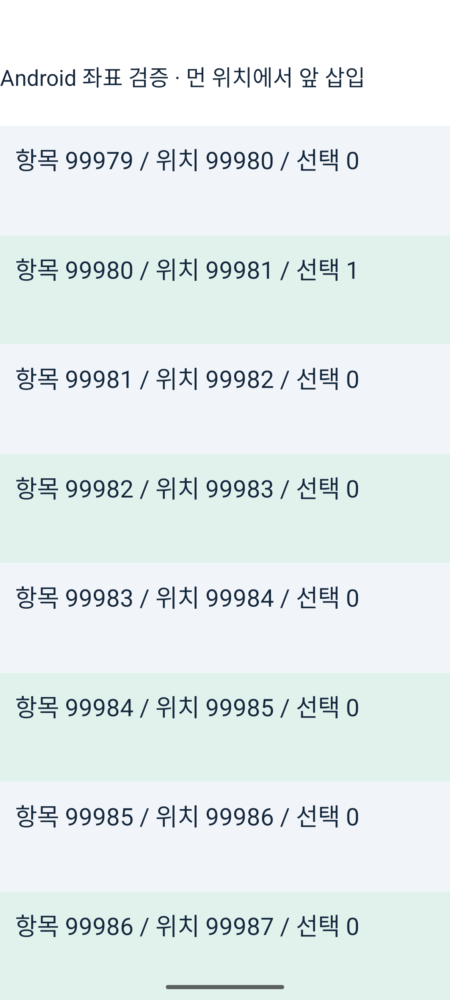
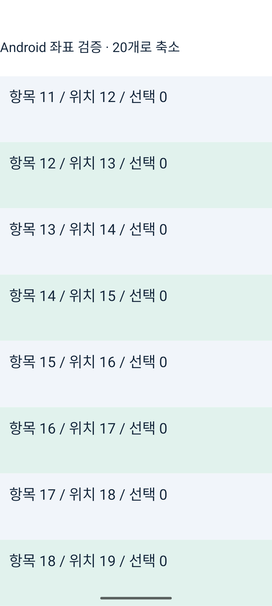
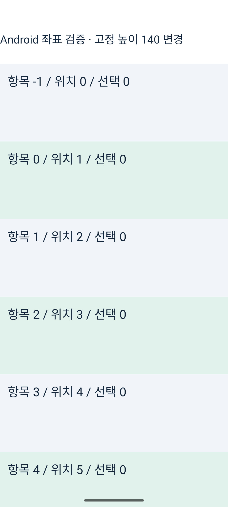

# Android 실제 동작 검증

최종 유지한 네이티브 경로를 Android Release 에뮬레이터에서 촬영했다. 비용 측정과 별도 실행이다. 영상은 회수한 슬롯 memo 후보를 사용하지 않는다.

## 상태·데이터·동적 크기

선택 → 재정렬 → 앞 삽입 → 내용 교체 → 위치 30 → 처음 → 비우기 → 복원 → 동적 높이 → 첫 행 크기 변경을 실행했다. 준비 창에 남는 항목의 상태를 보존하고 다른 항목으로 상태가 넘어가지 않는지 확인했다.

https://github.com/user-attachments/assets/d03217be-b240-40cc-8eb4-a32d85ab221f

## 큰 인덱스·터치·축소

10만 건의 위치 99,980으로 이동한 뒤 실제 터치로 해당 항목의 선택 값이 1이 되는 것을 확인했다. 앞 삽입 후 같은 항목이 위치 99,981에서 선택 값 1을 유지했다. 이어 20개로 축소, 처음 이동, 고정 높이 140 변경, 끝 이동을 확인했다.

https://github.com/user-attachments/assets/0d958f9d-d23f-4048-af58-98d63cac0cae

[자동 로그 검사](contract-results.json) · [큰 인덱스와 터치 로그](android-far.log) · [상태 검사 로그](android.log). 스크린샷·영상으로 표시 위치를 확인했고 measureInWindow 좌표는 배치 판정에 사용하지 않았다. 내부 경로 전환 시 상태·스크롤 위치 보존을 보장한 검사는 아니다.
