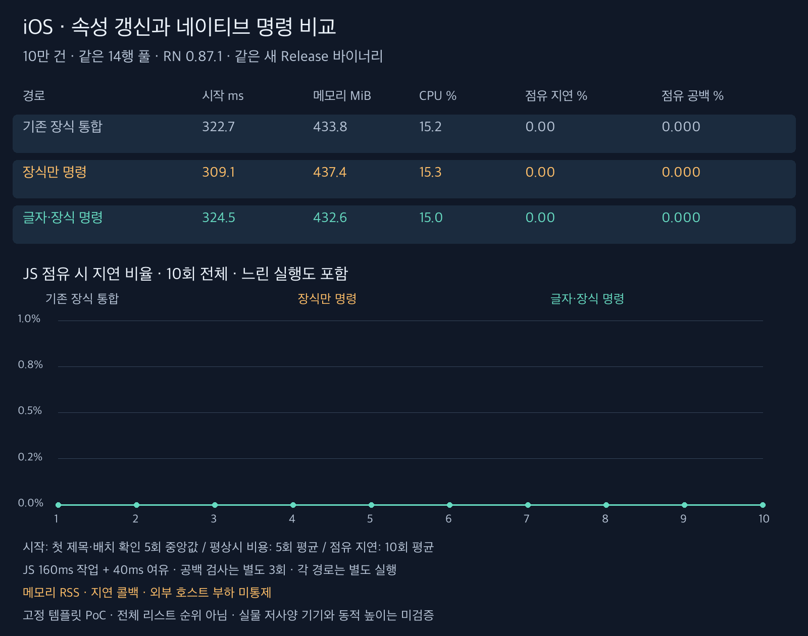
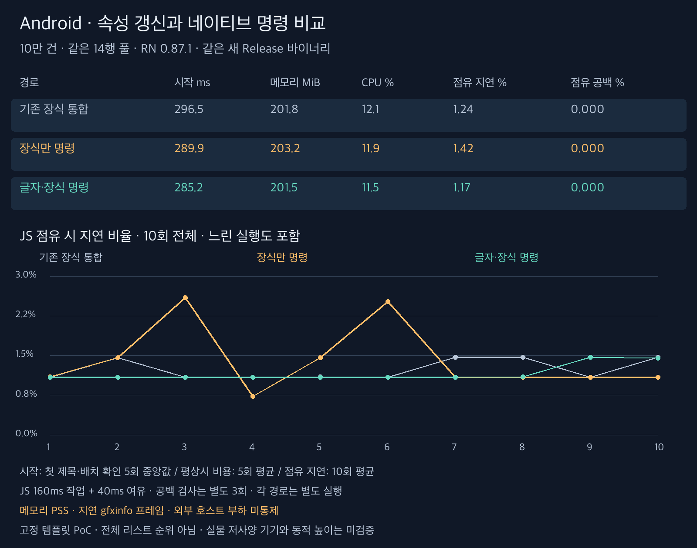

# 네이티브 명령 경로 138회 비교

**기존 장식 통합·장식만 명령·글자와 장식 명령의 세 경로를 같은 새 바이너리에서 비교했다.** 전체 라이브러리 순위 비교가 아니며 앞선 8종 자료의 수치를 섞지 않았다. [조건과 검증 범위](methodology-ko.md) · [판단과 남은 과제](findings-ko.md)

RN 0.87.1 arm64 Release, 10만 건 고정 높이 무거운 셀, 14개 슬롯. 시작·평상시 각 5회, JS 점유 비용 각 10회, 화면 검사 각 3회로 정식 138회다. 별도 시작 준비 6회도 원본에 보존했다.

## iOS 시작과 평상시 비용

첫 제목·배치 확인은 중앙값, 비용은 평균이다. 괄호는 실행별 범위다. 시작은 실제 패널 표시나 앱 전체 실행 시간이 아니다.

| 경로           |      시작 ms (범위) | UI 데이터 준비 ms |   메모리 MiB (범위) |     CPU % (범위) | 지연 % |
| -------------- | ------------------: | ----------------: | ------------------: | ---------------: | -----: |
| 기존 장식 통합 | 322.7 (300.8~339.8) |             454.0 | 433.8 (430.8~436.3) | 15.2 (14.7~15.7) |   0.00 |
| 장식만 명령    | 309.1 (281.1~327.0) |             465.0 | 437.4 (436.2~438.1) | 15.3 (14.7~15.6) |   0.00 |
| 글자·장식 명령 | 324.5 (309.6~339.3) |             462.0 | 432.6 (430.6~433.9) | 15.0 (14.3~15.6) |   0.00 |

## iOS JS 160ms 점유·40ms 여유

| 경로           | 지연 평균 % (범위) | p95 평균 ms | 메모리 MiB | CPU % | 공백 평균 % | 무공백 / 3 | 오류 / 겹침 프레임 |
| -------------- | -----------------: | ----------: | ---------: | ----: | ----------: | ---------: | -----------------: |
| 기존 장식 통합 |   0.00 (0.00~0.00) |       16.67 |      436.1 |  85.2 |       0.000 |          3 |              0 / 0 |
| 장식만 명령    |   0.00 (0.00~0.00) |       16.67 |      435.9 |  85.2 |       0.000 |          3 |              0 / 0 |
| 글자·장식 명령 |   0.00 (0.00~0.00) |       16.67 |      432.0 |  84.9 |       0.000 |          3 |              0 / 0 |

지연과 공백은 별도 실행·서로 다른 지표다. CPU는 앱 전체 평균 사용률이며 처리 속도 향상률이 아니다.

### JS 점유 지연의 실행별 수치

| 경로           |    1 |    2 |    3 |    4 |    5 |    6 |    7 |    8 |    9 |   10 |
| -------------- | ---: | ---: | ---: | ---: | ---: | ---: | ---: | ---: | ---: | ---: |
| 기존 장식 통합 | 0.00 | 0.00 | 0.00 | 0.00 | 0.00 | 0.00 | 0.00 | 0.00 | 0.00 | 0.00 |
| 장식만 명령    | 0.00 | 0.00 | 0.00 | 0.00 | 0.00 | 0.00 | 0.00 | 0.00 | 0.00 | 0.00 |
| 글자·장식 명령 | 0.00 | 0.00 | 0.00 | 0.00 | 0.00 | 0.00 | 0.00 | 0.00 | 0.00 | 0.00 |

## Android 시작과 평상시 비용

첫 제목·배치 확인은 중앙값, 비용은 평균이다. 괄호는 실행별 범위다. 시작은 실제 패널 표시나 앱 전체 실행 시간이 아니다.

| 경로           |      시작 ms (범위) | UI 데이터 준비 ms |   메모리 MiB (범위) |     CPU % (범위) | 지연 % |
| -------------- | ------------------: | ----------------: | ------------------: | ---------------: | -----: |
| 기존 장식 통합 | 296.5 (277.3~402.7) |             467.0 | 201.8 (201.6~201.9) | 12.1 (10.3~12.7) |   1.59 |
| 장식만 명령    | 289.9 (270.1~309.6) |             463.0 | 203.2 (202.9~203.5) | 11.9 (10.8~13.5) |   1.31 |
| 글자·장식 명령 | 285.2 (265.4~292.5) |             451.0 | 201.5 (201.2~201.6) | 11.5 (11.2~11.8) |   1.17 |

## Android JS 160ms 점유·40ms 여유

| 경로           | 지연 평균 % (범위) | p95 평균 ms | 메모리 MiB | CPU % | 공백 평균 % | 무공백 / 3 | 오류 / 겹침 프레임 |
| -------------- | -----------------: | ----------: | ---------: | ----: | ----------: | ---------: | -----------------: |
| 기존 장식 통합 |   1.24 (1.09~1.47) |       18.90 |      202.7 |  81.3 |       0.000 |          3 |              0 / 0 |
| 장식만 명령    |   1.42 (0.73~2.59) |       19.40 |      202.7 |  81.5 |       0.000 |          3 |              0 / 0 |
| 글자·장식 명령 |   1.17 (1.09~1.47) |       18.60 |      201.0 |  81.3 |       0.000 |          3 |              0 / 0 |

지연과 공백은 별도 실행·서로 다른 지표다. CPU는 앱 전체 평균 사용률이며 처리 속도 향상률이 아니다.

### JS 점유 지연의 실행별 수치

| 경로           |    1 |    2 |    3 |    4 |    5 |    6 |    7 |    8 |    9 |   10 |
| -------------- | ---: | ---: | ---: | ---: | ---: | ---: | ---: | ---: | ---: | ---: |
| 기존 장식 통합 | 1.09 | 1.46 | 1.09 | 1.09 | 1.10 | 1.09 | 1.47 | 1.47 | 1.09 | 1.47 |
| 장식만 명령    | 1.10 | 1.46 | 2.59 | 0.73 | 1.46 | 2.52 | 1.09 | 1.09 | 1.09 | 1.09 |
| 글자·장식 명령 | 1.09 | 1.09 | 1.09 | 1.09 | 1.09 | 1.09 | 1.09 | 1.10 | 1.47 | 1.45 |

## 정확성과 한계

화면 검사 18회·7,158프레임에서 제목 오류 0프레임, 겹침 0프레임을 관측했다.
초기 화면의 글자·색 비교와 14개 슬롯 밖 실제 화면의 제목·본문 접두부·합계·색 검사도 별도로 수행했다. 모든 프레임의 모든 내용과 장시간 동작을 검증한 것은 아니다.

외부 호스트 부하를 통제하지 못했다. 느린 실행을 제외하지 않았으며 큰 지연은 [관측 기록](high-latency-observations.json)에 따로 모았다. 같은 시점의 외부 빌드를 유일한 원인으로 단정하지 않는다. 실제 기기·동적 높이·임의 React 셀·데이터 변경은 미검증이다.

소스 `ba8b86f`의 Android/iOS Release, 76개 테스트, 라이브러리 타입 검사, 린트와 웹 빌드를 검증했다. 예제 전체 타입 검사에는 조건 문서에 적은 기존 오류가 남는다.

한글 비교 영상은 [드래프트 PR 본문](https://github.com/ohah/zerolist/pull/1)에 포함했다.
