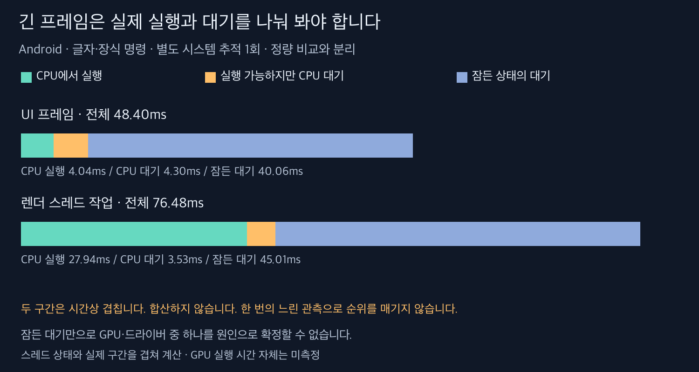

# 별도 시스템 추적: 긴 프레임의 대기 구간

**글자·장식 명령 버전에도 UI·렌더 스레드의 긴 대기가 남았다.** Android 경로별 한 번씩 수집한 진단이며 138회 정량 결과와 분리한다. 이 한 번의 추적으로 세 경로의 성능 순위를 다시 매기지 않는다.

15초 Perfetto 추적에 준비 스와이프 12회 이후 측정 스와이프 18회를 넣었다. 스케줄링·view·FrameTimeline을 사용했고, 앞선 실험에서 관측 경로를 바꾼 `gfx` 범주는 제외했다. 파서에 기록된 오류·자료 손실 항목은 없었다. Perfetto Trace Processor는 v58.2-add693d8b다. 계측을 켠 동작이 무계측과 같다고 보장하지 않으며, 이 추적은 GPU 실행 시간 자체를 측정하지 않는다.

| 경로           | gfxinfo 지연 % | gfxinfo p95 | FrameTimeline의 앱 마감 초과 |
| -------------- | -------------: | ----------: | ---------------------------: |
| 기존 장식 통합 |           1.09 |        19ms |                      0 / 274 |
| 장식만 명령    |           1.09 |        18ms |                      0 / 274 |
| 글자·장식 명령 |           2.88 |        26ms |                      5 / 277 |

FrameTimeline과 gfxinfo는 같은 판정이 아니다. 예를 들어 기존 경로의 249개는 `Unknown Jank`이면서 `Early Present`로 기록됐다. 이를 249개 체감 끊김으로 세지 않는다. 명령 버전에서는 앱 마감 초과와 합성기 마감 초과·버퍼 관련 판정도 함께 관측됐다. 모든 지연이 하나의 원인이라는 증거는 아니다.

## 글자·장식 명령 실행의 긴 구간

| 구간                             | 전체 경과 | CPU 실행 | 실행 가능하지만 CPU 대기 | 잠든 상태의 대기 |
| -------------------------------- | --------: | -------: | -----------------------: | ---------------: |
| UI `Choreographer#doFrame`       |   48.40ms |   4.04ms |                   4.30ms |          40.06ms |
| 위 프레임의 `postAndWait`        |   40.10ms |   0.01ms |                   0.04ms |          40.06ms |
| 겹치는 RenderThread `DrawFrames` |   76.48ms |  27.94ms |                   3.53ms |          45.01ms |

스레드 스케줄링 상태와 해당 slice의 시간 구간을 겹쳐 계산했다. `Running`은 CPU 실행, `R/R+`는 실행 가능 상태, `S`는 잠든 상태다. `postAndWait`는 UI 프레임 안에 들어 있고 렌더 작업도 시간상 겹치므로 **세 행의 시간을 더하면 안 된다.**

UI `postAndWait`에서 거의 전부를 기다린 이 관측은, 그 프레임이 글자 변경이나 JS 계산만 오래 실행해서 늦었다는 해석과 맞지 않는다. 렌더 스레드에도 실제 CPU 실행과 대기가 함께 있다. 명령 경로를 바꿔도 네이티브 그리기·동기화·스케줄링에 의한 지연은 남을 수 있다.

다만 잠든 상태만으로 GPU 계산·완료 신호·드라이버·합성기 중 무엇을 기다렸는지 확정할 수 없다. 커널 대기 지점과 실제 기기의 GPU/표시 추적까지 연결하지 않았다. 외부 호스트 부하도 통제하지 못했으며 명령 변경이 이 긴 대기를 만들었다고 인과적으로 입증한 것도 아니다. 정상 10회 비교에서의 두 프레임 차이와 이 진단 실행을 혼합하지 않는다.

## 원자료와 재현

- [추적 설정](trace.cfg), [수집 스크립트](trace.py), [진단 실행 결과](trace-results.json)
- [원본 추적 ZIP](trace-raw.zip), [분석 스크립트](analyze_trace.py), [조회 SQL](trace-queries.json), [분석 결과](trace-analysis.json)
- `TRACE_PROCESSOR=<trace_processor_shell 경로> python3 -I docs/benchmarks/2026-09-06-commands/analyze_trace.py`

원본 ZIP을 `/private/tmp/zerolist-command-traces`에 풀면 분석 스크립트를 다시 실행할 수 있다.
