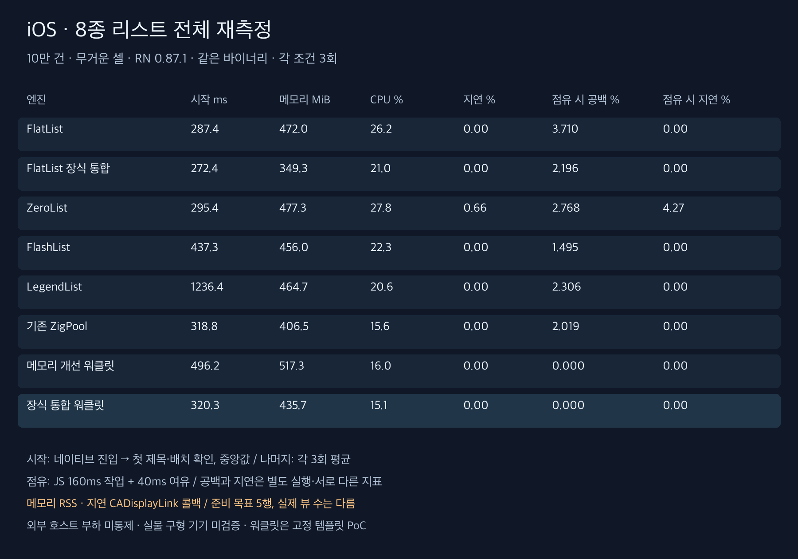
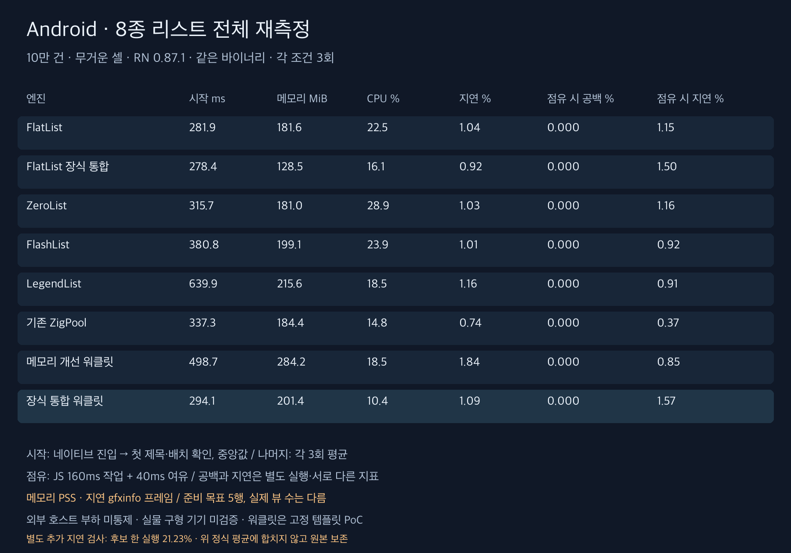
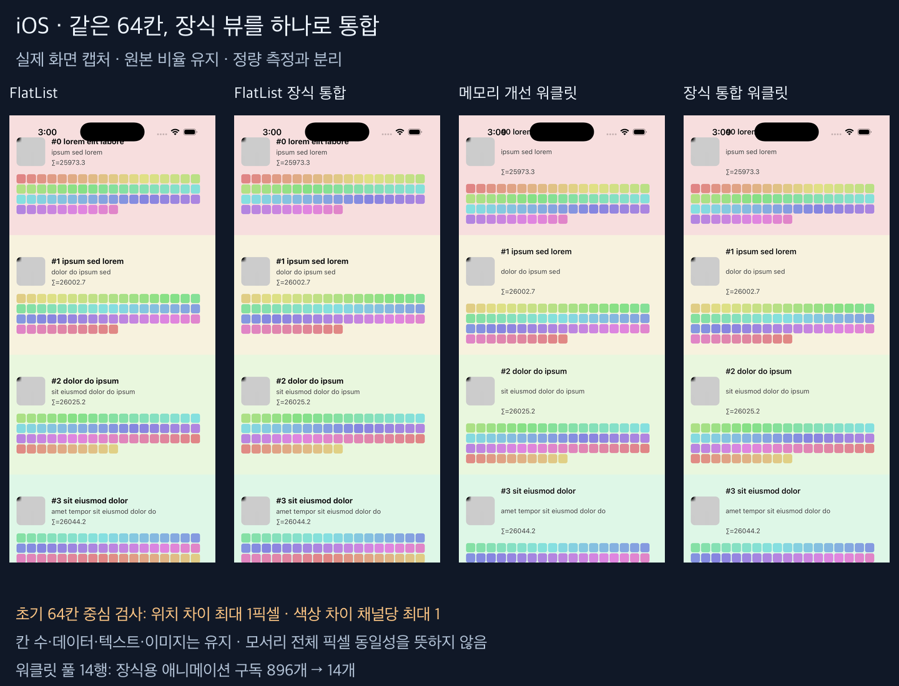
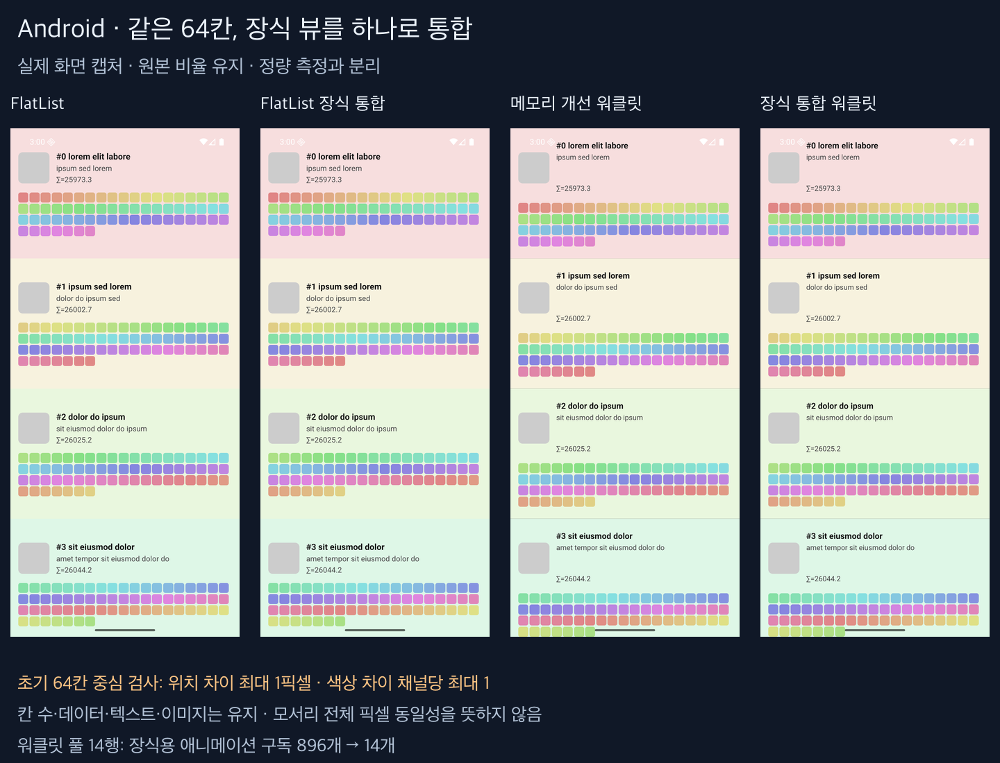

# 8종 리스트 전체 비교

**FlatList·장식 통합 FlatList·ZeroList·FlashList·LegendList·기존 ZigPool·메모리 개선 워클릿·장식 통합 워클릿을 모두 같은 바이너리에서 새로 측정했다.** 정식 192회와 별도 시작 준비 16회이며 과거 수치를 섞지 않았다. [조건·API 차이·측정 경계](methodology-ko.md)

RN 0.87.1 / FlashList 2.3.1 / LegendList 2.0.19. 10만 건 고정 높이 무거운 셀, 한쪽 5행 준비 목표. 실제 뷰 수와 지원 기능은 엔진마다 다르다. 에뮬레이터·시뮬레이터에서 외부 호스트 부하를 통제하지 못한 탐색 비교다.

**지연 안정성은 해결하지 못했다.** Android JS 점유 지연은 직전 워클릿 0.85% → 후보 1.57%였다. 별도 추가 6회에서는 후보 한 실행이 21.23%까지 높아졌다. 정식 평균과 섞지 않았으며 [추가 검사](followup-ko.md)와 [개선 폭·대조군 해석](findings-ko.md)에 원자료와 한계를 남겼다.

## iOS 시작과 평상시 비용

시작은 네이티브 진입부터 첫 제목·배치 확인까지의 3회 중앙값, 비용은 3회 평균이다. 괄호는 실행별 범위다. 실제 패널 표시 시각이나 앱 전체 시작 시간은 아니다.

| 엔진 | 시작 ms (범위) | 첫 확인 시 붙은 행 수 중앙값 | 메모리 MiB | CPU % | 지연 % | p95 ms |
|---|---:|---:|---:|---:|---:|---:|
| FlatList | 287.4 (275.9~288.4) | 4 | 472.0 | 26.2 | 0.00 | 16.67 |
| FlatList 장식 통합 | 272.4 (270.2~285.7) | 4 | 349.3 | 21.0 | 0.00 | 16.67 |
| ZeroList | 295.4 (295.2~302.5) | 4 | 477.3 | 27.8 | 0.66 | 16.67 |
| FlashList | 437.3 (435.9~441.2) | 14 | 456.0 | 22.3 | 0.00 | 16.67 |
| LegendList | 1236.4 (992.6~1257.5) | 12 | 464.7 | 20.6 | 0.00 | 16.67 |
| 기존 ZigPool | 318.8 (297.1~323.1) | 14 | 406.5 | 15.6 | 0.00 | 16.67 |
| 메모리 개선 워클릿 | 496.2 (495.7~532.4) | 14 | 517.3 | 16.0 | 0.00 | 16.67 |
| 장식 통합 워클릿 | 320.3 (317.4~321.6) | 14 | 435.7 | 15.1 | 0.00 | 16.67 |

## iOS JS 160ms 점유 조건

공백 검사와 비용 검사는 별도 실행이다. 평균 공백은 움직이는 구간의 화면 공백 면적 비율이며 지연 프레임 비율과 다르다.

| 엔진 | 평균 공백 % (범위) | 무공백 / 3 | 내용 오류 / 겹침 프레임 | 붙은 행 최대 | 메모리 MiB | CPU % | 지연 % (범위) | p95 ms |
|---|---:|---:|---:|---:|---:|---:|---:|---:|
| FlatList | 3.710 (2.997~4.387) | 0 | 0 / 0 | 6 | 503.9 | 89.3 | 0.00 (0.00~0.00) | 16.67 |
| FlatList 장식 통합 | 2.196 (1.571~2.563) | 0 | 0 / 0 | 6 | 347.7 | 87.1 | 0.00 (0.00~0.00) | 16.67 |
| ZeroList | 2.768 (1.942~4.227) | 0 | 0 / 0 | 15 | 510.4 | 94.6 | 4.27 (3.76~4.65) | 19.96 |
| FlashList | 1.495 (0.859~1.863) | 0 | 0 / 0 | 15 | 462.7 | 87.5 | 0.00 (0.00~0.00) | 16.67 |
| LegendList | 2.306 (1.857~2.757) | 0 | 0 / 0 | 15 | 480.6 | 86.7 | 0.00 (0.00~0.00) | 16.67 |
| 기존 ZigPool | 2.019 (0.279~3.395) | 0 | 0 / 0 | 14 | 417.2 | 85.2 | 0.00 (0.00~0.00) | 16.67 |
| 메모리 개선 워클릿 | 0.000 (0.000~0.000) | 3 | 0 / 0 | 14 | 510.2 | 87.7 | 0.00 (0.00~0.00) | 16.67 |
| 장식 통합 워클릿 | 0.000 (0.000~0.000) | 3 | 0 / 0 | 14 | 437.4 | 85.5 | 0.00 (0.00~0.00) | 16.67 |

## Android 시작과 평상시 비용

시작은 네이티브 진입부터 첫 제목·배치 확인까지의 3회 중앙값, 비용은 3회 평균이다. 괄호는 실행별 범위다. 실제 패널 표시 시각이나 앱 전체 시작 시간은 아니다.

| 엔진 | 시작 ms (범위) | 첫 확인 시 붙은 행 수 중앙값 | 메모리 MiB | CPU % | 지연 % | p95 ms |
|---|---:|---:|---:|---:|---:|---:|
| FlatList | 281.9 (272.9~316.0) | 4 | 181.6 | 22.5 | 1.04 | 20.67 |
| FlatList 장식 통합 | 278.4 (246.2~288.0) | 4 | 128.5 | 16.1 | 0.92 | 22.00 |
| ZeroList | 315.7 (287.6~320.9) | 4 | 181.0 | 28.9 | 1.03 | 26.67 |
| FlashList | 380.8 (374.5~388.4) | 4 | 199.1 | 23.9 | 1.01 | 23.00 |
| LegendList | 639.9 (610.4~735.5) | 12 | 215.6 | 18.5 | 1.16 | 20.00 |
| 기존 ZigPool | 337.3 (325.1~361.0) | 14 | 184.4 | 14.8 | 0.74 | 21.33 |
| 메모리 개선 워클릿 | 498.7 (467.0~514.9) | 14 | 284.2 | 18.5 | 1.84 | 21.67 |
| 장식 통합 워클릿 | 294.1 (288.0~334.8) | 14 | 201.4 | 10.4 | 1.09 | 20.33 |

## Android JS 160ms 점유 조건

공백 검사와 비용 검사는 별도 실행이다. 평균 공백은 움직이는 구간의 화면 공백 면적 비율이며 지연 프레임 비율과 다르다.

| 엔진 | 평균 공백 % (범위) | 무공백 / 3 | 내용 오류 / 겹침 프레임 | 붙은 행 최대 | 메모리 MiB | CPU % | 지연 % (범위) | p95 ms |
|---|---:|---:|---:|---:|---:|---:|---:|---:|
| FlatList | 0.000 (0.000~0.000) | 3 | 0 / 0 | 5 | 179.6 | 92.6 | 1.15 (1.04~1.38) | 23.00 |
| FlatList 장식 통합 | 0.000 (0.000~0.000) | 3 | 0 / 0 | 5 | 129.2 | 84.3 | 1.50 (0.69~2.08) | 21.00 |
| ZeroList | 0.000 (0.000~0.000) | 3 | 0 / 0 | 15 | 184.3 | 93.8 | 1.16 (1.04~1.39) | 28.33 |
| FlashList | 0.000 (0.000~0.000) | 3 | 0 / 0 | 15 | 198.2 | 91.6 | 0.92 (0.69~1.04) | 20.00 |
| LegendList | 0.000 (0.000~0.000) | 3 | 0 / 0 | 15 | 219.6 | 88.1 | 0.91 (0.69~1.34) | 19.33 |
| 기존 ZigPool | 0.000 (0.000~0.000) | 3 | 0 / 0 | 14 | 185.2 | 84.8 | 0.37 (0.37~0.37) | 18.00 |
| 메모리 개선 워클릿 | 0.000 (0.000~0.000) | 3 | 0 / 0 | 14 | 281.5 | 88.3 | 0.85 (0.73~1.09) | 18.33 |
| 장식 통합 워클릿 | 0.000 (0.000~0.000) | 3 | 0 / 0 | 14 | 202.1 | 82.1 | 1.57 (1.09~2.18) | 19.33 |

## 지표별 정렬

아래는 이 조건에서 낮은 수치 순으로 정렬한 결과다. 종합 제품 순위나 통계적으로 확정된 우위를 의미하지 않는다. 지원 범위와 실행별 편차를 함께 봐야 한다.

- ios 첫 제목·배치 확인: FlatList 장식 통합 (272.42) → FlatList (287.39) → ZeroList (295.43) → 기존 ZigPool (318.84) → 장식 통합 워클릿 (320.25) → FlashList (437.34) → 메모리 개선 워클릿 (496.18) → LegendList (1236.37)
- ios 평상시 메모리: FlatList 장식 통합 (349.34) → 기존 ZigPool (406.46) → 장식 통합 워클릿 (435.66) → FlashList (456.01) → LegendList (464.74) → FlatList (472.01) → ZeroList (477.27) → 메모리 개선 워클릿 (517.31)
- ios JS 점유 평균 공백: 메모리 개선 워클릿 = 장식 통합 워클릿 (0.00) → FlashList (1.50) → 기존 ZigPool (2.02) → FlatList 장식 통합 (2.20) → LegendList (2.31) → ZeroList (2.77) → FlatList (3.71)
- android 첫 제목·배치 확인: FlatList 장식 통합 (278.37) → FlatList (281.90) → 장식 통합 워클릿 (294.06) → ZeroList (315.67) → 기존 ZigPool (337.34) → FlashList (380.78) → 메모리 개선 워클릿 (498.73) → LegendList (639.93)
- android 평상시 메모리: FlatList 장식 통합 (128.47) → ZeroList (180.96) → FlatList (181.60) → 기존 ZigPool (184.37) → FlashList (199.06) → 장식 통합 워클릿 (201.41) → LegendList (215.63) → 메모리 개선 워클릿 (284.25)
- android JS 점유 평균 공백: FlatList = FlatList 장식 통합 = ZeroList = FlashList = LegendList = 기존 ZigPool = 메모리 개선 워클릿 = 장식 통합 워클릿 (0.00)

## 워클릿 보조 지표

UI 전체 데이터 접근 시점은 워클릿에만 있는 별도 지표다. 일반 리스트의 값은 해당 없음이며 0으로 간주하지 않는다. 이 시간으로 전체 리스트 시작 순위를 매기지 않았다.

| 플랫폼 | 워클릿 | UI 데이터 접근 가능 중앙값 ms |
|---|---|---:|
| ios | 메모리 개선 워클릿 | 682.0 |
| ios | 장식 통합 워클릿 | 458.0 |
| android | 메모리 개선 워클릿 | 731.0 |
| android | 장식 통합 워클릿 | 471.0 |

## 정확성과 검증 한계

스크롤 화면 검사 48회·19,145프레임에서 내용 오류 0프레임, 겹침 0프레임을 관측했다.
시작 검사(준비 포함) 64회에서 내용 오류 0프레임, 겹침 0프레임이었다.

FlatList·ZeroList·FlashList·LegendList는 공통 React 셀을 사용한다. 장식 통합 FlatList는 그 셀의 장식만 네이티브 뷰로 바꾼 대조군이다. 워클릿은 고정 템플릿과 전용 텍스트를 사용해 React 재렌더와 데이터 전달 경로가 다르다. 고정 높이 힌트가 주어진 이번 결과를 동적 높이·이미지 다운로드·데이터 변경·실물 구형 기기의 종합 성능으로 일반화하지 않는다.

이번 변경은 장식용 64개 뷰와 워클릿을 한 뷰로 합쳤다. GPU API 변경이나 범용 리스트 알고리즘의 개선으로 해석하지 않는다. 외부 호스트 부하와 3회 편차가 있어 Android 지연 회귀가 일반적으로 해결됐다고 단정하지 않는다.

장식 통합 소스 `864b6e6`으로 Android/iOS Release를 새로 빌드했다. 76개 테스트, 라이브러리 타입 검사, 린트, 웹 빌드를 통과했다. 초기 64칸 비교와 스크롤 후 384칸의 기대 색 검사도 통과했다. 자세한 검사 범위는 조건 문서에 명시했다.

## 변경 해석과 실제 화면

[개선 폭·대조군·남은 과제](findings-ko.md). 한글 비교 영상은 [드래프트 PR 본문](https://github.com/ohah/zerolist/pull/1)에 포함했다. 아래는 정량 측정과 분리한 실제 초기 화면이다. 원본 16장은 `screens/`에 보존했다.

