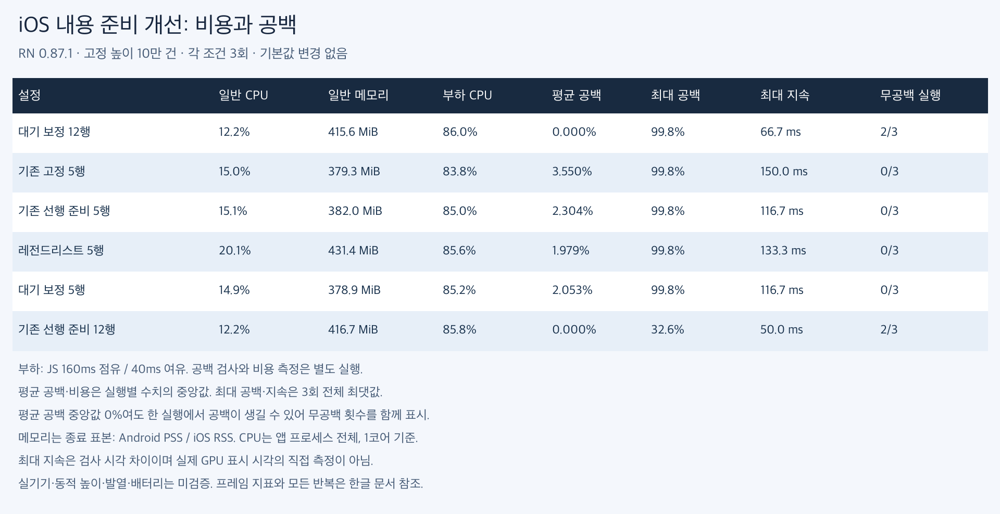
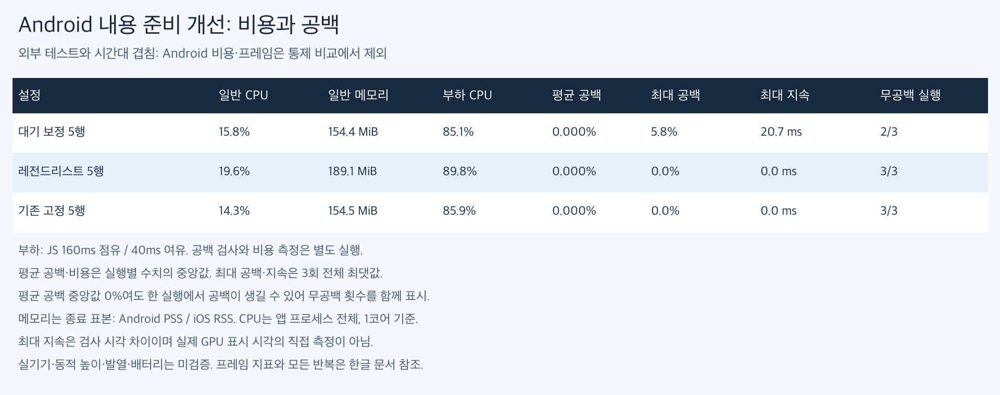
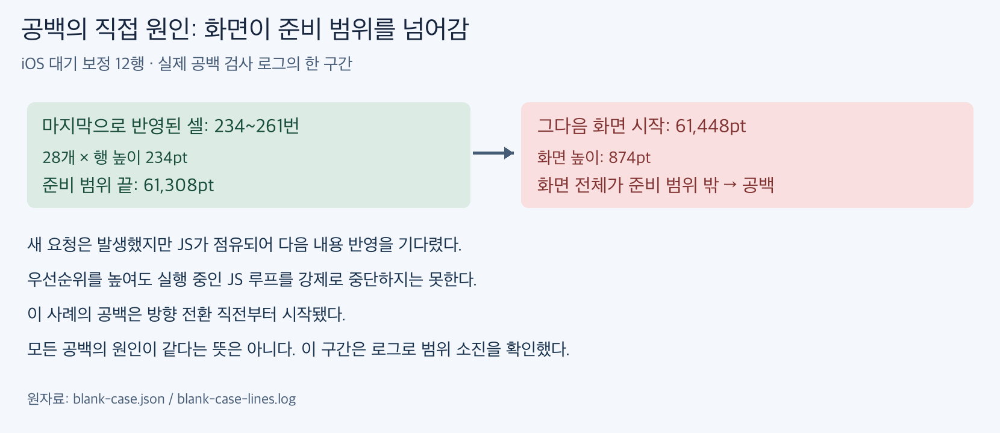

# 내용 준비 대기: 원인 추적과 개선 PoC

[원인·개선 효과·채택 판단](interpretation-ko.md)

RN 0.87.1에서 총 106회 실행했다. 진단·탐색·재검증을 구분한다. 앱 기본값은 유지했고 GPU 경로는 바꾸지 않았다. [실험 방법과 옵션](methodology-ko.md)

## 단계별 대기

JS를 160ms 점유하는 진단 실행에서 주요 대기는 요청의 JS 수신 이전이었다. 우선순위는 이미 실행 중인 JS 루프를 중단하지 않는다. 수신 이후 렌더 시작이 대체로 빠른 상황에서는 우선순위만으로 큰 개선을 기대하기 어렵다.

| 진단 설정 | 요청 수 | 반영 수 | 수신 대기 p95 ms | 렌더 시작 대기 p95 ms | 렌더 시작→네이티브 p95 ms | 배치 대기 p95 ms | 최신 요청 대기 중앙값 ms | 가장 오래된 요청 대기 중앙값 ms |
|---|---|---|---|---|---|---|---|---|
| 대기 보정 12행 | 92 | 44 | 159.0 | 1.0 | 20.0 | 2.0 | 29.0 | 80.5 |
| 우선순위 5행 | 97 | 52 | 159.0 | 1.0 | 12.0 | 1.0 | 29.0 | 53.5 |
| 기존 선행 준비 12행 | 91 | 48 | 160.0 | 1.0 | 10.0 | 1.0 | 22.5 | 74.0 |
| 기존 고정 5행 | 101 | 54 | 143.0 | 1.0 | 9.0 | 1.0 | 13.0 | 21.0 |

각 설정 1회 진단이다. 요청은 합쳐질 수 있어 단계별 표본 수가 다르며 p95끼리 더하지 않는다. 벽시계 반올림 오차 약 1ms가 있다.

## 탐색 결과: 2회씩

| 설정 | 실행별 평균 공백 % | 무공백 횟수 / 2 | 최대 공백 % |
|---|---|---|---|
| 대기 보정 12행 | 0.000, 0.000 | 2 | 0.0 |
| 우선순위+선행 5행 | 2.592, 1.368 | 0 | 99.8 |
| 기존 고정 5행 | 3.056, 2.344 | 0 | 99.8 |
| 우선순위 5행 | 3.590, 4.240 | 0 | 99.8 |
| 대기 보정 5행 | 2.287, 2.384 | 0 | 99.8 |
| 기존 선행 준비 5행 | 2.439, 3.080 | 0 | 99.8 |
| 우선순위+보정 12행 | 0.195, 0.000 | 1 | 87.7 |
| 우선순위+선행 12행 | 0.535, 0.000 | 1 | 99.8 |
| 기존 선행 준비 12행 | 0.000, 0.000 | 2 | 0.0 |

우선순위 단독은 탐색에서 우위를 보이지 않았다. 대기 보정은 별도 순서의 재검증에서 기존 선행 준비와 직접 비교한다. 탐색과 재검증을 합산하지 않는다.

## ios 별도 재검증: 각 조건 3회

| 설정 | 일반 CPU % | 일반 종료 메모리 MiB | 부하 CPU % | 부하 종료 메모리 MiB | 평균 공백 % | 최대 공백 % | 최대 지속 ms | 무공백 횟수 | 진입 시 준비 % | 부하 p95 ms | 부하 지연 비율 % |
|---|---|---|---|---|---|---|---|---|---|---|---|
| 대기 보정 12행 | 12.2 | 415.6 | 86.0 | 421.3 | 0.000 | 99.8 | 66.7 | 2/3 | 100.0 | 16.67 | 0.00 |
| 기존 고정 5행 | 15.0 | 379.3 | 83.8 | 380.4 | 3.550 | 99.8 | 150.0 | 0/3 | 76.5 | 16.67 | 0.00 |
| 기존 선행 준비 5행 | 15.1 | 382.0 | 85.0 | 378.6 | 2.304 | 99.8 | 116.7 | 0/3 | 82.5 | 16.67 | 0.00 |
| 레전드리스트 5행 | 20.1 | 431.4 | 85.6 | 444.2 | 1.979 | 99.8 | 133.3 | 0/3 | 86.9 | 16.67 | 0.00 |
| 대기 보정 5행 | 14.9 | 378.9 | 85.2 | 383.3 | 2.053 | 99.8 | 116.7 | 0/3 | 81.4 | 16.67 | 0.00 |
| 기존 선행 준비 12행 | 12.2 | 416.7 | 85.8 | 421.3 | 0.000 | 32.6 | 50.0 | 2/3 | 100.0 | 16.67 | 0.00 |

| 설정 | 일반 p95 ms | 일반 지연 비율 % |
|---|---|---|
| 대기 보정 12행 | 16.67 | 0.00 |
| 기존 고정 5행 | 16.67 | 0.00 |
| 기존 선행 준비 5행 | 16.67 | 0.00 |
| 레전드리스트 5행 | 16.67 | 0.00 |
| 대기 보정 5행 | 16.67 | 0.00 |
| 기존 선행 준비 12행 | 16.67 | 0.00 |

| 설정 | 실행별 평균 공백 % | 실행별 최대 공백 % | 실행별 최대 지속 ms |
|---|---|---|---|
| 대기 보정 12행 | 0.663, 0.000, 0.000 | 99.8, 0.0, 0.0 | 66.7, 0.0, 0.0 |
| 기존 고정 5행 | 2.487, 3.550, 3.964 | 99.8, 99.8, 99.8 | 133.3, 133.3, 150.0 |
| 기존 선행 준비 5행 | 2.304, 3.063, 2.056 | 99.8, 99.8, 99.8 | 116.7, 116.7, 116.7 |
| 레전드리스트 5행 | 1.523, 1.979, 2.129 | 99.8, 99.8, 99.8 | 100.0, 100.0, 133.3 |
| 대기 보정 5행 | 2.053, 2.020, 2.756 | 99.8, 99.8, 99.8 | 116.7, 100.0, 116.7 |
| 기존 선행 준비 12행 | 0.000, 0.000, 0.126 | 0.0, 0.0, 32.6 | 0.0, 0.0, 50.0 |

**Android 비용 측정 두 그룹은 외부 Zig 테스트와 시간대가 겹쳐 통제된 성능 우위 판단에서 제외한다. 아래 비용·프레임은 참고 원자료다. [호스트 관측](host-contention.json)**

## android 별도 재검증: 각 조건 3회

| 설정 | 일반 CPU % | 일반 종료 메모리 MiB | 부하 CPU % | 부하 종료 메모리 MiB | 평균 공백 % | 최대 공백 % | 최대 지속 ms | 무공백 횟수 | 진입 시 준비 % | 부하 p95 ms | 부하 지연 비율 % |
|---|---|---|---|---|---|---|---|---|---|---|---|
| 대기 보정 5행 | 15.8 | 154.4 | 85.1 | 156.4 | 0.000 | 5.8 | 20.7 | 2/3 | 97.8 | 23.00 | 0.72 |
| 레전드리스트 5행 | 19.6 | 189.1 | 89.8 | 194.0 | 0.000 | 0.0 | 0.0 | 3/3 | 100.0 | 36.00 | 4.38 |
| 기존 고정 5행 | 14.3 | 154.5 | 85.9 | 155.1 | 0.000 | 0.0 | 0.0 | 3/3 | 100.0 | 48.00 | 7.95 |

| 설정 | 일반 p95 ms | 일반 지연 비율 % |
|---|---|---|
| 대기 보정 5행 | 20.00 | 0.74 |
| 레전드리스트 5행 | 23.00 | 1.38 |
| 기존 고정 5행 | 20.00 | 0.37 |

| 설정 | 실행별 평균 공백 % | 실행별 최대 공백 % | 실행별 최대 지속 ms |
|---|---|---|---|
| 대기 보정 5행 | 0.000, 0.023, 0.000 | 0.0, 5.8, 0.0 | 0.0, 20.7, 0.0 |
| 레전드리스트 5행 | 0.000, 0.000, 0.000 | 0.0, 0.0, 0.0 | 0.0, 0.0, 0.0 |
| 기존 고정 5행 | 0.000, 0.000, 0.000 | 0.0, 0.0, 0.0 | 0.0, 0.0, 0.0 |

## Android 우선순위 조합 동작 검사

| 설정 | 평균 공백 % | 내용 불일치 | 겹침 |
|---|---|---|---|
| 우선순위 5행 | 0.000 | 0 | 0 |
| 우선순위+보정 12행 | 0.000 | 0 | 0 |
| 우선순위+선행 5행 | 0.000 | 0 | 0 |

각 1회 동작 검사이며 우선순위 옵션의 성능 순위를 정하는 근거로 사용하지 않는다.

## 정확성과 남은 범위

공백 검사 52회에서 내용 불일치·겹침은 모두 0이었다. 이는 모든 설정이 무공백이었다는 뜻이 아니다. 일반 비용과 JS 부하 비용은 검사를 끈 별도 실행이다. 메모리는 종료 표본이며 피크가 아니다. iOS p95·지연 비율은 화면 갱신 콜백 계측으로 실제 GPU 표시 지연과 같지 않다.

실물 저사양 기기·동적 높이·발열·배터리는 미검증이다. 우선순위와 대기 보정은 기본값으로 승격하지 않은 PoC 옵션이다.

## 원자료

[행렬](matrix.json) · [한글 CSV](comparison-ko.csv) · [재검증 집계](confirmation-summary.json) · [단계 추적](trace-summary.json) · [바이너리 해시](provenance.json)

- [zerolist-readiness-android-priority-smoke-raw.zip](zerolist-readiness-android-priority-smoke-raw.zip)
- [zerolist-readiness-confirm-android-audit-160-raw.zip](zerolist-readiness-confirm-android-audit-160-raw.zip)
- [zerolist-readiness-confirm-android-perf-0-raw.zip](zerolist-readiness-confirm-android-perf-0-raw.zip)
- [zerolist-readiness-confirm-android-perf-160-raw.zip](zerolist-readiness-confirm-android-perf-160-raw.zip)
- [zerolist-readiness-confirm-ios-audit-160-raw.zip](zerolist-readiness-confirm-ios-audit-160-raw.zip)
- [zerolist-readiness-confirm-ios-perf-0-raw.zip](zerolist-readiness-confirm-ios-perf-0-raw.zip)
- [zerolist-readiness-confirm-ios-perf-160-raw.zip](zerolist-readiness-confirm-ios-perf-160-raw.zip)
- [zerolist-readiness-ios-screen-raw.zip](zerolist-readiness-ios-screen-raw.zip)
- [zerolist-readiness-ios-trace-raw.zip](zerolist-readiness-ios-trace-raw.zip)