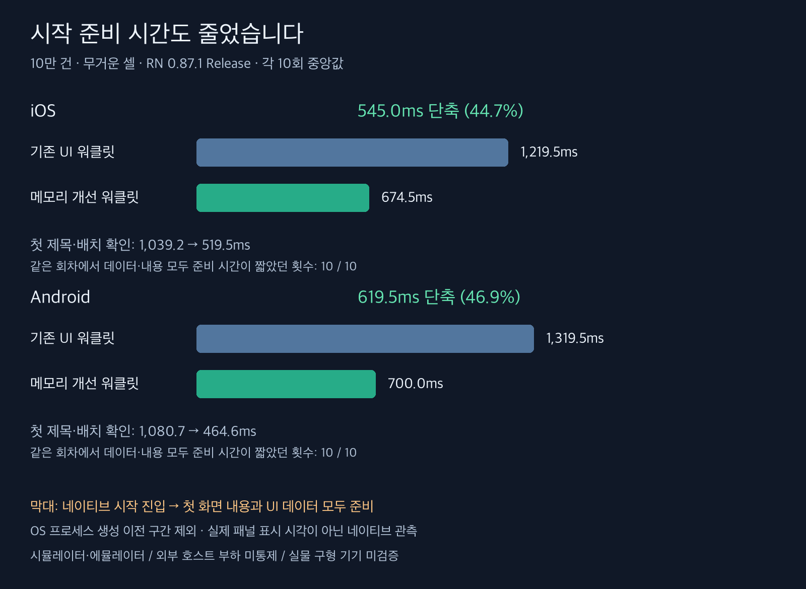

# 시작 속도와 스크롤 지연 재검증

10만 건 무거운 셀, RN 0.87.1 Release. 시작 40회·스크롤 비용 40회·화면 검사 4회와 별도 Android 지연 보조 6회다. 시작 준비 4회는 통계에서 제외했다. [측정 경계와 재현 방법](methodology-ko.md)

**시작 준비는 개선됐지만 Android 스크롤 지연 비율은 증가했다.** 앞선 스크롤 성능 유지 설명을 수정한다. 호스트 외부 부하가 겹쳤으며 구현 비용과의 인과관계는 아직 분리하지 못했다.

## 시작 시간

네이티브 시작 진입부터의 시간이다. OS 프로세스 생성 이전부터의 앱 전체 시작 시간이나 실제 패널 표시 시각은 아니다. 아래는 각 10회 중앙값(ms)이다.

| 플랫폼 | 엔진 | React 진입 | UI 데이터 접근 가능 | 첫 제목·배치 확인 | 둘 다 준비 |
|---|---|---:|---:|---:|---:|
| ios | 기존 UI 워클릿 | 251.0 | 1219.5 | 1039.2 | 1219.5 |
| ios | 메모리 개선 워클릿 | 250.0 | 674.5 | 519.5 | 674.5 |
| android | 기존 UI 워클릿 | 228.5 | 1319.5 | 1080.7 | 1319.5 |
| android | 메모리 개선 워클릿 | 235.0 | 700.0 | 464.6 | 700.0 |

| 플랫폼 | 기존 둘 다 준비 범위 ms | 개선 둘 다 준비 범위 ms | 중앙값 감소 | 같은 회차에서 개선 / 10 |
|---|---:|---:|---:|---:|
| ios | 1202.0~1259.0 | 650.0~689.0 | 545.0ms (44.7%) | 10 |
| android | 1296.0~1538.0 | 668.0~741.0 | 619.5ms (46.9%) | 10 |

## 스크롤 비용 재측정

각 5회 평균. 괄호는 실행별 최솟값~최댓값이다. Android 지연 프레임과 iOS 지연 콜백은 서로 다른 지표다.

| 플랫폼 | JS 점유 ms | 엔진 | 지연 % (범위) | 간격/시간 p95 ms | CPU % | 종료 메모리 MiB |
|---|---:|---|---:|---:|---:|---:|
| ios | 0 | 기존 UI 워클릿 | 0.00 (0.00~0.00) | 16.67 | 15.9 | 599.1 |
| ios | 160 | 기존 UI 워클릿 | 0.00 (0.00~0.00) | 16.67 | 87.9 | 588.0 |
| ios | 0 | 메모리 개선 워클릿 | 0.00 (0.00~0.00) | 16.67 | 15.6 | 516.7 |
| ios | 160 | 메모리 개선 워클릿 | 0.00 (0.00~0.00) | 16.67 | 87.7 | 507.2 |
| android | 0 | 기존 UI 워클릿 | 1.09 (0.73~1.46) | 20.00 | 16.2 | 363.5 |
| android | 160 | 기존 UI 워클릿 | 0.95 (0.73~1.09) | 18.80 | 87.5 | 363.8 |
| android | 0 | 메모리 개선 워클릿 | 1.22 (0.73~1.71) | 20.80 | 16.0 | 282.2 |
| android | 160 | 메모리 개선 워클릿 | 2.68 (0.73~8.00) | 24.60 | 88.7 | 280.0 |

## 해석

시작 준비와 스크롤 처리량을 구분한다. React 진입 이후에는 데이터 전달, 워클릿 초기화, React 커밋과 네이티브 뷰 준비가 포함된다. 기존 경로는 객체 배열을 shared value 초기값으로 넣고 effect에서도 대입한다. 개선 경로는 빈 공유값으로 시작해 필드 배열을 한 번 전달한다. 결과는 이 변경 묶음의 비교이며 JSON 표현 한 가지만의 효과를 분리한 실험은 아니다.

스크롤 p95와 지연 비율은 작은 차이와 실행별 범위를 함께 봐야 한다. 지연 프레임 비율이 절반이 됐다고 스크롤 처리 속도가 두 배라는 뜻은 아니다. 초기 UI 복원 작업 자체는 남지만, 기존 경로의 총 준비 비용보다 작은지 시작 지표로 직접 비교했다.

## 정확성과 한계

추가 스크롤 화면 검사 4회에서 공백 발생 0회, 내용 오류 0프레임, 겹침 0프레임이었다.
시작 검사(준비 포함) 44회·1074프레임에서 내용 오류 0프레임, 겹침 0프레임이었다.

시작 진단은 첫 화면의 제목·좌표와 UI 데이터 접근을 관측한다. 초기 본문·합계·색상 전체, 실제 GPU 표시 완료, 장시간 누수, 동적 높이와 임의 React 자식, 실물 구형 기기는 검증하지 않았다. 초기 UI 복원 비용이 사라진 것은 아니다. 외부 호스트 부하 미통제 조건의 반복 측정이다.

검증: Android/iOS arm64 Release 빌드, 린트·라이브러리 타입 검사, 76개 테스트 통과.

## Android 점유 조건 보조 비교 6회

주 비교의 개선 후보 3회차에서 지연 8%, p95 40ms가 관측됐다. 같은 구간 외부 Zig 빌드·테스트와 호스트 부하 증가(1분 부하 약 17.4→20.9)가 기록됐지만 인과관계는 확정하지 않는다. 이 실행을 포함한 주 비교 평균 2.68%를 그대로 보존했다. 추가 6회는 주 비교 평균에 합치지 않는다.

| 엔진 | 지연 비율 각 3회 % | 평균 % | p95 평균 ms |
|---|---|---:|---:|
| 기존 UI 워클릿 | 0.73, 0.73, 1.8 | 1.09 | 19.67 |
| 메모리 개선 워클릿 | 1.09, 2.19, 1.09 | 1.46 | 20.00 |

시작 준비 개선은 양쪽 10/10회 확인했다. Android 지연 비율은 주 비교·보조 비교에서 증가했으므로 앞선 스크롤 성능 유지 설명을 수정한다. 외부 부하 영향과 구현 비용을 분리하는 검증은 남아 있다. 총 정식·보조 90회, 별도 시작 준비 4회다.
