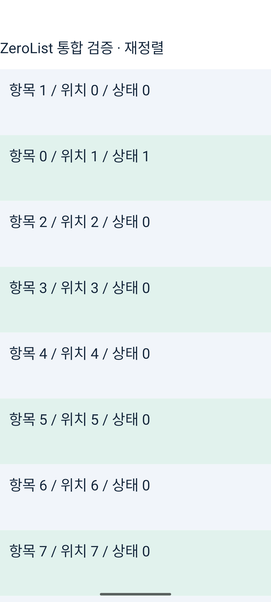
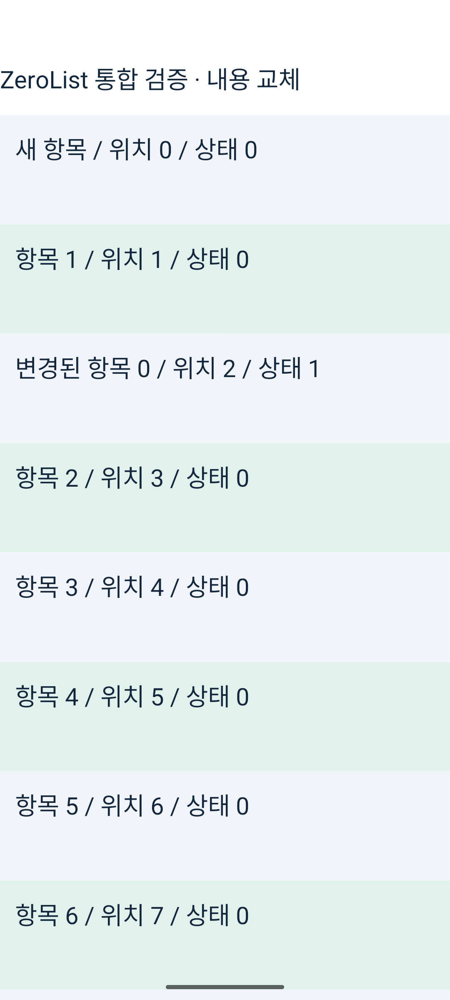
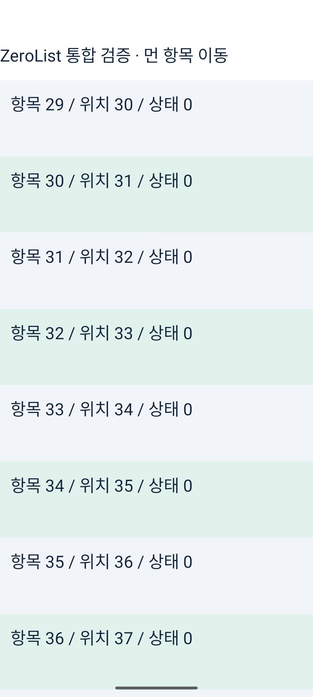
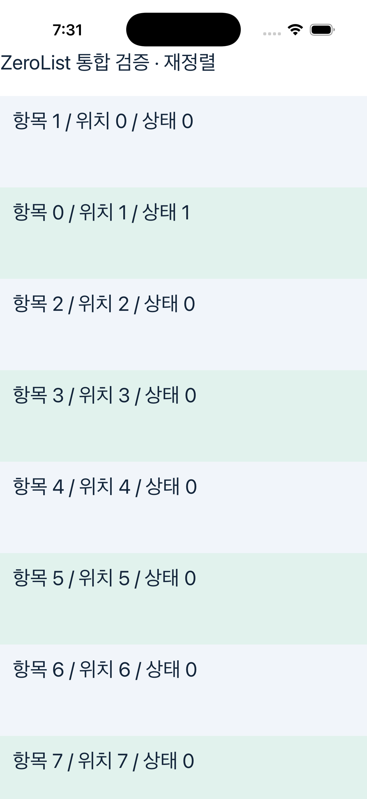
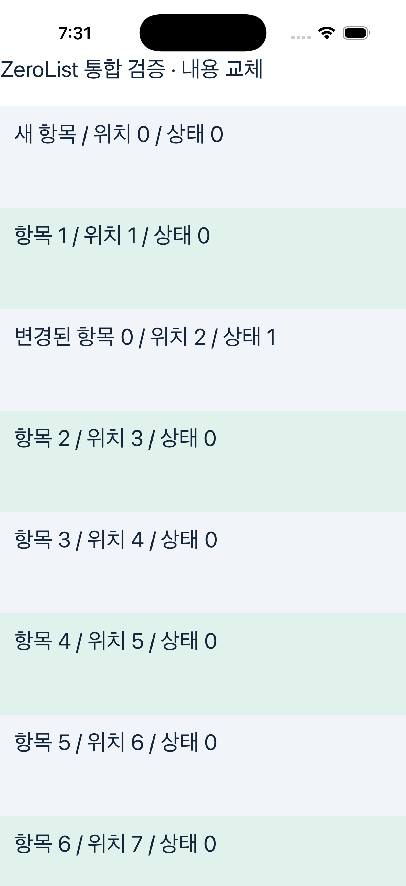
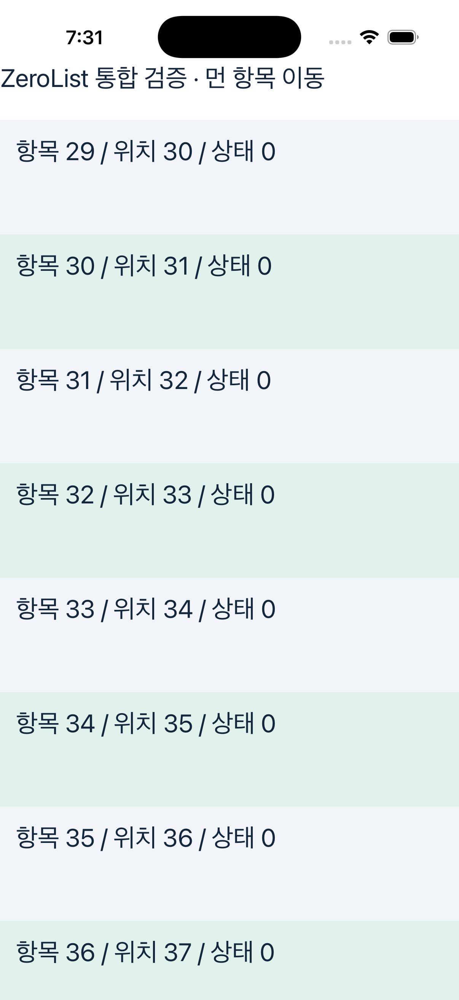
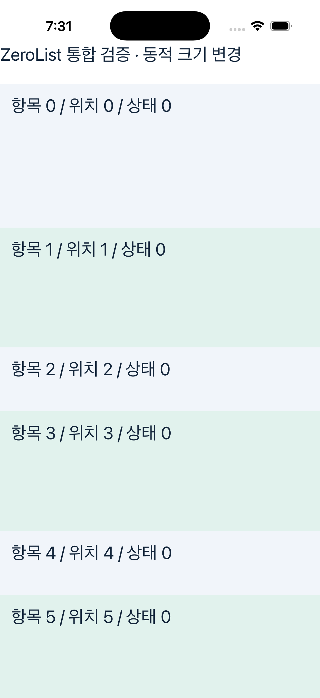

# 통합 ZeroList의 실제 변경 화면

동일한 `ZeroList` API로 자동 실행한 Android/iOS Release 화면이다. 성능 측정과 별도 실행하며, 실물 기기가 아닌 에뮬레이터·시뮬레이터다.

| 단계                         | 확인한 결과                                                                         |
| ---------------------------- | ----------------------------------------------------------------------------------- |
| 선택 후 재정렬               | 항목 0이 위치 0→1로 이동해도 상태 1 유지                                            |
| 앞 삽입·내용 교체            | 새 항목은 상태 0, 항목 0은 위치 2에서 변경된 내용과 상태 1 표시                     |
| `scrollToIndex({index: 30})` | 앞 삽입 이후 위치 30에 해당하는 항목 29로 이동                                      |
| 처음 이동·비우기·복원        | 처음으로 이동하고 전체 제거·복원 가능. 창 밖으로 제거됐던 항목의 로컬 상태는 초기화 |
| 동적 높이와 크기 변경        | 호환 경로에서 다른 행 높이를 표시하고 첫 행 `height: 180` 변경 반영                 |

[상태·내용·도달 로그의 검사 결과](contract-results.json)와 실제 화면을 함께 확인했다. `measureInWindow` 위치는 네이티브에서 옮긴 슬롯의 표시 위치와 달랐으므로 화면 배치 판정에서 제외했다. 이 검사는 모든 변경 패턴이나 경로 전환 시 상태·스크롤 위치 보존을 보장하지 않는다.

## Android

재정렬 후 상태 보존:

앞 삽입과 내용 교체:

스크롤 API와 영역 경계:

동적 크기 변경:

## iOS

재정렬 후 상태 보존:

앞 삽입과 내용 교체:

스크롤 API와 영역 경계:

동적 크기 변경:

## 전체 동작 영상

성능 측정과 별도로 촬영한 최종 통합 바이너리다.

https://github.com/user-attachments/assets/c735cc07-1c24-4be0-b88d-002a8cd395f9

https://github.com/user-attachments/assets/ba9d3daf-29ca-4361-98a3-b0ca7d17a700
