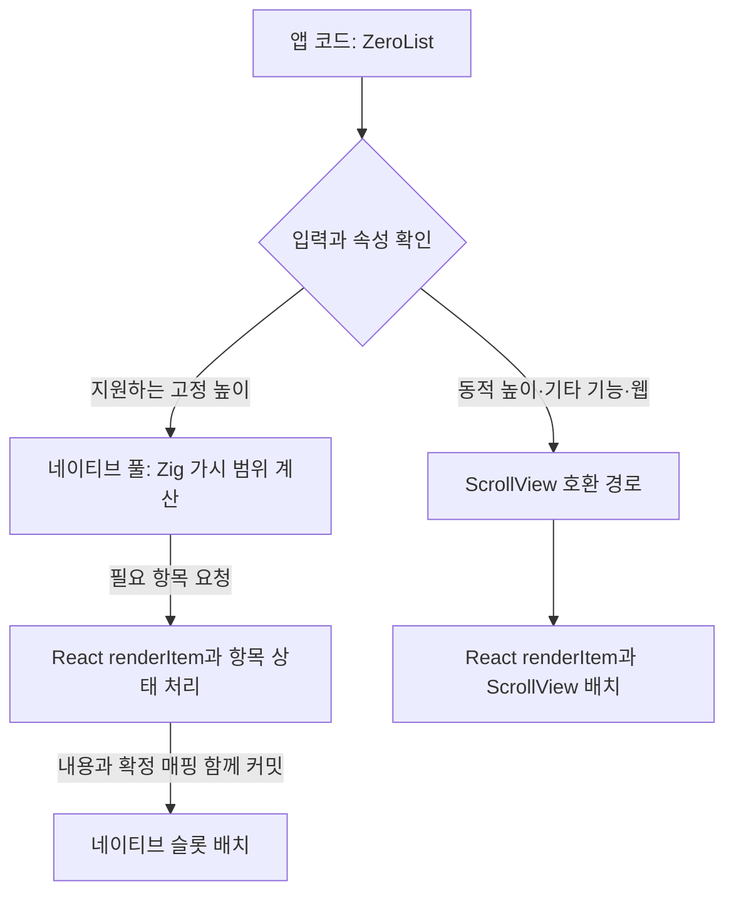

# ZeroList API 아래 네이티브 풀 통합

**사용자는 `ZeroList` 하나를 사용한다.** 예제 앱 안에 있던 ZigPool의 네이티브 뷰·JNI·codegen·등록을 `packages/zerolist`로 옮겼다. 내부 풀은 고정 높이 경로에 적용하고, 기존 기능은 ScrollView 기반 호환 경로로 유지한다. 동적 높이까지 전부 네이티브 풀로 옮긴 작업은 아니다.

## 달라진 코드 구조

- `list.tsx`: 공개 API. 입력과 지원 속성을 확인해 내부 경로를 결정한다. 사용자가 엔진을 선택하지 않는다.
- `pool-list.tsx`: 일반 `renderItem`을 풀 슬롯에 연결하고, 데이터 세대·요청 버전·확정된 항목 매핑을 네이티브에 함께 전달한다.
- `pool-layout.ts`: 전체 `getItemLayout` 결과의 고정 높이·연속 좌표 확인, 요청 검증, 기존 항목 슬롯 보존.
- `windowed-list.tsx`: 이전 ZeroList의 가상화 구현. 동적 측정과 아직 풀에 연결하지 않은 기능의 호환 경로.
- Android의 Kotlin ViewManager·Zig JNI와 iOS의 Fabric 뷰는 라이브러리 소유다. 패키지 codegen을 modules에서 all로 바꿔 TurboModule과 컴포넌트를 함께 생성한다.

예제의 `zigpool`과 전용 템플릿 항목은 과거 실험 비교용이다. 공개 패키지에는 별도 ZigPool API를 추가하지 않았다.

## API 지원 범위

네이티브 풀은 양의 정수 높이가 전체 항목에서 같고, 오프셋이 `index × height`인 세로 리스트에서 사용한다. `estimatedItemSize`를 확정 높이로 쓰거나 처음 몇 개 행만 검사하지 않는다. `data`, `renderItem`, `keyExtractor`, `extraData`, 준비 창, `onScroll`, `onEndReached`, 초기 인덱스, 스크롤 ref를 연결했다. 스크롤 이벤트 간격이 16ms보다 크게 지정되면 호환 경로로 보낸다.

동적·비균일 높이, 헤더·푸터·구분자, 가로·다중 열·inverted, 가시성 콜백, 기타 ScrollView 속성은 기존 구현으로 처리한다. 지원하지 않는 속성을 풀에 전달하고 조용히 무시하지 않는다. 기존 구현 자체의 헤더 좌표·inverted·스크롤 앵커 등 모든 제한이 해결됐다는 뜻은 아니다.

실행 중 속성 변경으로 내부 경로가 전환되면 트리가 새로 생성될 수 있다. 특히 풀/호환 경로 사이의 스크롤 위치·로컬 상태 이전은 구현하지 않았다. 전체 FlatList 대체품을 완성했다고 주장하지 않는다.

## 하나의 API 안에서의 실행 흐름

그림의 네이티브 배치는 풀 경로에 해당한다. 호환 경로의 배치는 기존 ScrollView가 처리한다. 일반 `renderItem`은 여전히 JS에서 실행되며, `onScroll` 또는 `onEndReached`를 제공하면 풀에서도 스크롤 이벤트가 JS로 전달된다. 모든 JS 작업을 없앤 구현은 아니다.

## 상태와 늦은 이벤트

기존 실험은 슬롯 번호를 React key로 사용해 다른 항목의 셀 트리를 그대로 재사용했다. 일반 셀에 이를 그대로 적용하면 `useState`나 입력 상태가 다른 항목으로 넘어갈 수 있다.

통합 구현은 살아 있는 항목의 키가 같으면 슬롯을 유지하고, 다른 항목을 맡은 슬롯의 내부 트리는 항목 key로 새로 생성한다. 재정렬·앞 삽입 후 준비 창에 남는 항목의 상태를 보존하며, 창 밖으로 제거된 항목의 상태를 무기한 보관하지 않는다. 이 안전장치 때문에 **이전 ZigPool의 mount=0 이점은 그대로 유지되지 않을 수 있다.** 비용 비교에서 생성·제거 횟수를 함께 공개한다.

데이터·키 추출기·높이·풀 크기가 바뀌면 세대를 바꾼다. 이전 세대의 요청, 이전 버전, 중복·누락·범위 밖 인덱스는 거부한다. 스크롤 구독이 없는 경우에도 마지막 준비 창을 사용해 데이터 갱신 시 처음으로 돌아가는 요청을 피한다.

## 검증

전체 104개 테스트가 통과했다. 새 검사는 네이티브 풀 선택, 늦은 요청과 오래된 JS 핸들러 차단, 상태 누수 방지, 재정렬 상태 보존, 새 객체·extraData·비우기·복원, 실제 스크롤 명령 값과 끝 도달, 비균일 높이·추가 속성의 호환 경로 선택을 확인한다. 기존 동적 높이 회귀 검사도 유지한다.

Android/iOS arm64 Release 빌드, 라이브러리 코드·타입 정의·codegen 빌드, 웹 빌드를 확인했다. 네이티브 빌드 CI는 추가하지 않았다.

실제 에뮬레이터·시뮬레이터의 별도 계약 화면에서 선택→재정렬→앞 삽입→내용 교체→먼 항목 이동→처음 이동→비우기→복원→동적 높이→크기 변경을 실행하고 녹화했다. 항목 0의 상태 1이 위치 0→1→2로 이동해도 유지되고 다른 항목은 0인 것을 확인했다. 먼 항목 이동과 첫 행 높이 180 반영도 확인했다.

이 과정에서 Android의 셀이 스크롤 영역 밖 제목을 가리는 문제를 발견했다. 네이티브 `dispatchDraw`에서 뷰포트를 명시적으로 자르도록 수정한 뒤 다시 녹화해 제목이 유지되는 것을 확인했다. `measureInWindow`는 네이티브에서 옮긴 슬롯의 실제 표시 위치와 다른 Fabric 좌표를 반환하므로 해당 좌표를 화면 배치 정확성의 증거로 사용하지 않았다. 상태·내용 로그와 실제 스크린샷·영상을 함께 사용한다.

정상 부하 수치는 별도 실행이며 녹화와 동시에 측정하지 않는다. 실물 저사양 기기와 전력, 장시간 동적 데이터 교체는 아직 검증하지 않았다.

## 기본 스크롤바와 비교 실행 구분

공개 ZeroList의 기본 스크롤바를 켜고 `showsVerticalScrollIndicator={false}`도 연결했다. 초기 통합 실행은 Android의 예전 ZigPool 기본값(스크롤바 꺼짐)을 따르고 있어 최종 비교에 사용하지 않았다. 이 실행분은 `before-indicator-raw.zip`으로 별도 보존하며 느린 실행을 골라 버린 것이 아니다. 최종 비교는 수정한 동일 바이너리에서 처음부터 실행한다. 비교용 기존 ZigPool은 과거 기본값을 유지하므로 스크롤바·상태 보호·콜백 지원이 통합 ZeroList와 완전히 같은 제품은 아니다.

## 측정 재개 기록

최종 비교 중 Android 무거운 셀 LegendList 1회차에서 시작 로그의 RN 버전 확인이 되지 않아 CPU 측정 창을 열기 전에 중단했다. 완료된 26회는 유지하고 해당 실행부터 명시적으로 재개했다. 시작 로그를 확인 전에 파일로 남기도록 보완했다. 최초 누락 원문은 보존되지 않아 원인을 단정하지 않으며, 실패한 준비 시도를 성능 수치로 처리하지 않는다. [실행 기록](runner-events.json).
