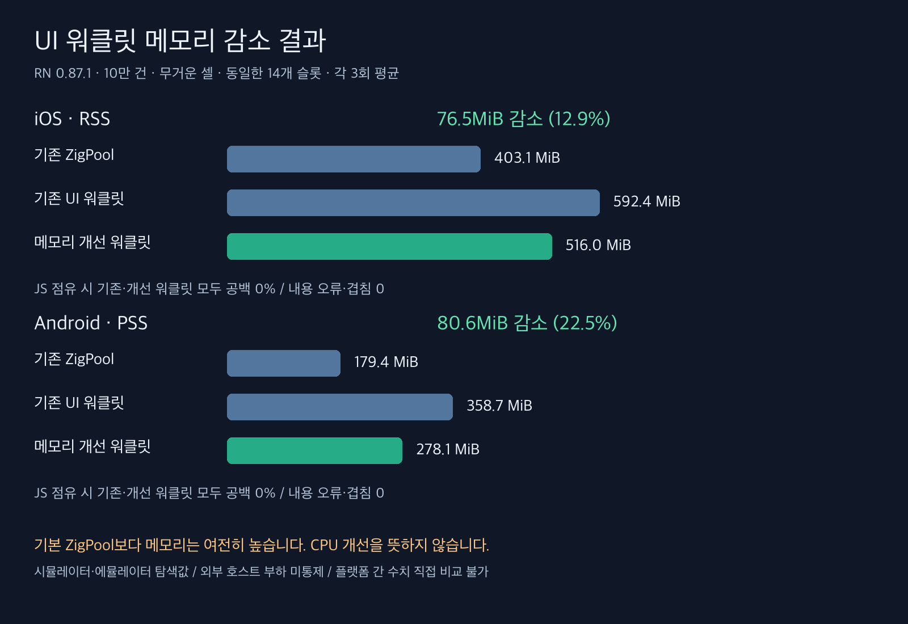
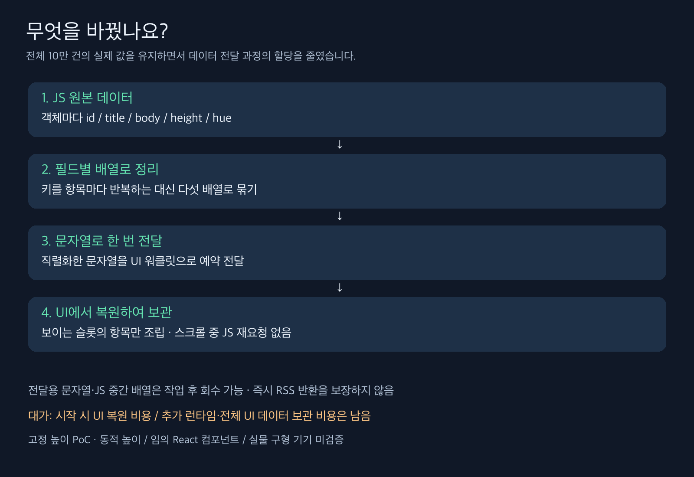

# UI 워클릿의 메모리 감소 검증

RN 0.87.1에서 정식 비교·단순 셀 58회와 시작 메모리 관측 12회를 실행했다. [구현과 측정 방법](methodology-ko.md)

객체 배열 전체의 공유 변환을 필드별 배열의 일회성 전달로 바꿨다. UI에서 데이터를 복원하고 슬롯의 항목만 조립한다. 실제 값과 전체 10만 건 접근을 유지하며, 스크롤 중 JS 데이터 재요청을 추가하지 않았다.

## 평상시 메모리와 CPU

동일한 새 바이너리, 10만 건 무거운 셀, 14개 슬롯, 각 3회 평균이다. Android는 PSS, iOS는 RSS로 서로 직접 비교하지 않는다. 호스트 외부 부하를 통제하지 못한 탐색값이다.

| 플랫폼 | 엔진 | 종료 메모리 MiB | CPU % | 지연 % |
|---|---|---:|---:|---:|
| ios | 기존 ZigPool | 403.1 | 16.1 | 0.00 |
| ios | 기존 UI 워클릿 | 592.4 | 15.9 | 0.00 |
| ios | 메모리 개선 워클릿 | 516.0 | 16.1 | 0.00 |
| android | 기존 ZigPool | 179.4 | 13.1 | 0.37 |
| android | 기존 UI 워클릿 | 358.7 | 16.3 | 1.21 |
| android | 메모리 개선 워클릿 | 278.1 | 16.4 | 0.97 |

- ios: 워클릿 전체 사용량 76.5MiB 감소(12.9%). 기본 ZigPool 대비 추가 사용량은 189.4→112.9MiB다.
- android: 워클릿 전체 사용량 80.6MiB 감소(22.5%). 기본 ZigPool 대비 추가 사용량은 179.3→98.7MiB다.

## JS 160ms 점유 상태

화면 검사와 CPU·메모리 검사를 별도로 실행했다. 지연은 Android gfxinfo 지연 프레임, iOS CADisplayLink 지연 콜백이다. 단계가 다른 지표를 같은 표시 누락률로 해석하지 않는다.

| 플랫폼 | 엔진 | 평균 공백 % | 무공백 / 3 | 내용 오류 / 겹침 | CPU % | 메모리 MiB | 지연 % |
|---|---|---:|---:|---:|---:|---:|---:|
| ios | 기존 ZigPool | 3.764 | 0 | 0 / 0 | 85.3 | 407.8 | 0.00 |
| ios | 기존 UI 워클릿 | 0.000 | 3 | 0 / 0 | 87.5 | 587.6 | 0.00 |
| ios | 메모리 개선 워클릿 | 0.000 | 3 | 0 / 0 | 87.5 | 508.2 | 0.00 |
| android | 기존 ZigPool | 0.000 | 3 | 0 / 0 | 84.3 | 179.1 | 0.85 |
| android | 기존 UI 워클릿 | 0.000 | 3 | 0 / 0 | 87.2 | 359.6 | 1.34 |
| android | 메모리 개선 워클릿 | 0.000 | 3 | 0 / 0 | 87.3 | 276.4 | 0.73 |

## 시작 시 비용

각 엔진·플랫폼 2회, 시작 8초 동안 외부에서 표본을 얻었다. 조회 시간과 100ms 간격 사이의 순간 피크는 놓칠 수 있어 **관측 최고치**라고 부른다. 스크롤 전 수치이므로 위 종료 메모리와 측정 구간이 다르다.

| 플랫폼 | 엔진 | 관측 최고 메모리 MiB, 각 2회 |
|---|---|---:|
| ios | 기존 ZigPool | 296.2, 295.2 |
| ios | 기존 UI 워클릿 | 515.2, 513.5 |
| ios | 메모리 개선 워클릿 | 426.1, 423.8 |
| android | 기존 ZigPool | 138.8, 139.9 |
| android | 기존 UI 워클릿 | 325.7, 325.7 |
| android | 메모리 개선 워클릿 | 241.6, 241.3 |

최종 후보의 초기 변환 시간은 주 비교 9회에서 얻은 중앙값이다. 앱 시작 전체 시간이 아니며, UI 복원은 UI 스레드를 점유한다.

| 플랫폼 | JS 배열 구성·직렬화 ms | UI 복원·공유값 대입 ms |
|---|---:|---:|
| ios | 46.6 | 48.6 |
| android | 69.4 | 41.5 |

## 단순 셀 보조 검사

각 1회로 주 비교 평균에 섞지 않았다.

| 플랫폼 | 엔진 | 평균 공백 % | 내용 오류 / 겹침 프레임 |
|---|---|---:|---:|
| android | 메모리 개선 워클릿 | 0.000 | 0 / 0 |
| android | 기존 UI 워클릿 | 0.000 | 0 / 0 |
| ios | 메모리 개선 워클릿 | 0.000 | 0 / 0 |
| ios | 기존 UI 워클릿 | 0.000 | 0 / 0 |

## 판단과 남은 범위

전체 데이터의 UI 접근과 내용 갱신 경로를 유지하면서 메모리 전달 표현을 줄이는 방향이다. 기본 ZigPool 수준까지 줄였다는 의미는 아니다. 템플릿·전용 뷰·추가 런타임의 비용이 남는다.

고정 높이 simple/heavy의 Solo PoC다. 동적 높이, 임의 React 컴포넌트, 데이터 변경의 전체 원자성, 장시간 누수, 실물 구형 기기의 메모리 압박과 시작 체감은 검증하지 않았다. 기본 엔진이나 GPU API, CI 구성은 바꾸지 않았다.

검증: Android/iOS arm64 Release 로컬 빌드, 린트, 라이브러리 타입 검사, 웹 빌드, 76개 테스트. 초기 문자열 보관 방식의 예비 결과 1회는 별도 보존하고 정식 평균에서 제외했다.

## 별도 녹화

기존 ZigPool / 기존 UI 워클릿 / 메모리 개선 워클릿. 각기 다른 실행을 1배속·60fps로 합성했다. 정량 비교와 프레임 동기 비교가 아니다.

android

https://github.com/user-attachments/assets/a0c10c2d-3c41-466f-900c-9506dfb3a2dd

ios

https://github.com/user-attachments/assets/e874ff2d-8952-4612-9a8e-aa4289073516

화면 검사 22회, 8,593프레임에서 내용 오류 0회, 겹침 0회였다. 개선 워클릿은 무거운 셀 6회와 단순 셀 2회 모두 공백 0이었다.
