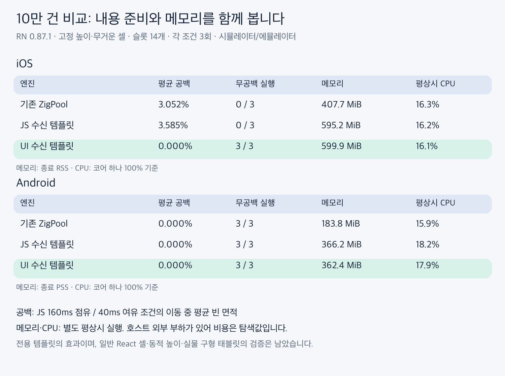
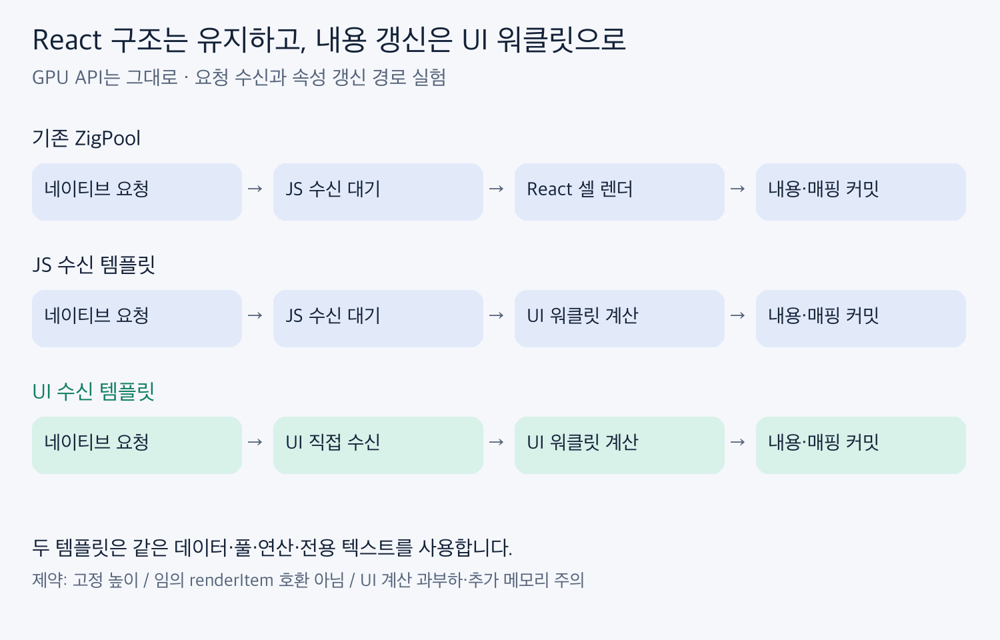

# JS 수신을 우회하는 UI 워클릿 템플릿 PoC

RN 0.87.1에서 70회 실행했다. **고정 높이 셀의 내용 갱신이 RN JS의 처리를 기다리지 않는 경로**를 구현했다. GPU API는 바꾸지 않았다. [구현·제약·측정 방법](methodology-ko.md)

## JS를 160ms씩 막았을 때 실제 화면

각 엔진 3회, 10만 건 heavy, 동일 14개 슬롯이다. 평균 공백은 이동 중 화면에서 비어 있던 면적의 실행별 평균을 다시 평균한 값이다. 제목·위치 불일치와 겹침은 별도로 검사했다.

| 플랫폼 | 엔진 | 평균 공백 % | 최대 공백 % | 최대 지속 ms | 진입 시 준비 % | 무공백 / 3 | 내용 오류 / 겹침 프레임 |
|---|---|---:|---:|---:|---:|---:|---:|
| ios | 기존 ZigPool | 3.052 | 99.8 | 150.0 | 77.3 | 0 | 0 / 0 |
| ios | JS 수신 템플릿 | 3.585 | 99.8 | 173.5 | 74.0 | 0 | 0 / 0 |
| ios | UI 수신 템플릿 | 0.000 | 0.0 | 0.0 | 100.0 | 3 | 0 / 0 |
| android | 기존 ZigPool | 0.000 | 0.0 | 0.0 | 100.0 | 3 | 0 / 0 |
| android | JS 수신 템플릿 | 0.000 | 0.0 | 0.0 | 100.0 | 3 | 0 / 0 |
| android | UI 수신 템플릿 | 0.000 | 0.0 | 0.0 | 99.2 | 3 | 0 / 0 |

Android UI 수신의 준비 비율 99.2%에는 행 경계의 1px 공백이 있는 표본 1개가 포함된다. 공백 지표는 2px 오차를 허용하므로 무공백 판정과 모순되지 않는다.

## 비용: 화면 검사 없이 별도 실행

**호스트의 외부 작업을 완전히 통제하지 못한 탐색값이다.** 실제 저사양 태블릿의 속도·전력·발열 순위로 일반화하지 않는다. CPU는 코어 하나 기준 앱 전체 사용률이다. Android는 종료 PSS, iOS는 종료 RSS다. 시작 최고 메모리는 측정하지 않았다.

| 플랫폼 | 엔진 | 평상시 CPU % | 평상시 메모리 MiB | 평상시 지연 % | JS 부하 CPU % | JS 부하 메모리 MiB | JS 부하 지연 % |
|---|---|---:|---:|---:|---:|---:|---:|
| ios | 기존 ZigPool | 16.3 | 407.7 | 0.00 | 84.6 | 411.3 | 0.00 |
| ios | JS 수신 템플릿 | 16.2 | 595.2 | 0.00 | 87.1 | 600.2 | 0.52 |
| ios | UI 수신 템플릿 | 16.1 | 599.9 | 0.00 | 87.7 | 590.8 | 0.00 |
| android | 기존 ZigPool | 15.9 | 183.8 | 1.35 | 84.8 | 184.4 | 0.99 |
| android | JS 수신 템플릿 | 18.2 | 366.2 | 1.68 | 88.3 | 363.3 | 1.46 |
| android | UI 수신 템플릿 | 17.9 | 362.4 | 1.10 | 88.2 | 364.7 | 0.98 |

지연은 Android에서는 gfxinfo 지연 프레임, iOS에서는 CADisplayLink 지연 콜백이다. 두 플랫폼의 지연 비율은 직접 비교하지 않는다. 과거 바이너리의 결과도 이 표에 섞지 않았다.

## 수신 대기의 변화

별도 진단 각 1회에서 같은 버전의 첫 요청·수신·반영·배치를 연결했다. 반복 커밋은 첫 반영 이후의 수신 대기로 중복 계산하지 않았다. UI 로그는 출력이 늦어질 수 있어 로그 접두 시각 대신 워클릿 안에서 기록한 wall 값을 사용했다. 벽시계 반올림 오차 약 1ms가 있으며 단계별 p95를 더하지 않는다.

| 플랫폼 | 엔진 | 요청 / 수신 / 반영 수 | 요청→수신 p95 ms | 수신→반영 p95 ms | 반영→배치 p95 ms |
|---|---|---:|---:|---:|---:|
| android | JS 수신 템플릿 | 43 / 26 / 23 | 143 | 39 | 2 |
| android | UI 수신 템플릿 | 46 / 46 / 46 | 1 | 17 | 8 |
| android | 기존 ZigPool | 46 / 30 / 30 | 127 | 22 | 2 |
| ios | JS 수신 템플릿 | 96 / 95 / 50 | 158 | 22 | 1 |
| ios | UI 수신 템플릿 | 100 / 100 / 100 | 0 | 4 | 1 |
| ios | 기존 ZigPool | 100 / 100 / 53 | 159 | 10 | 1 |

요청은 합쳐질 수 있어 단계별 표본 수가 다르다. 원시 분포의 최소값·음수 표본 수는 traces.json에 남겼다.

## 보조 검사: 단순 셀과 데이터 크기

단순 셀 검사는 각 템플릿·플랫폼 1회이며, 고정 높이 heavy 주 비교와 분리했다.

| 플랫폼 | 엔진 | 평균 공백 % | 내용 오류 프레임 | 겹침 프레임 |
|---|---|---:|---:|---:|
| android | UI 수신 템플릿 | 0.000 | 0 | 0 |
| android | JS 수신 템플릿 | 4.867 | 0 | 0 |
| ios | UI 수신 템플릿 | 0.000 | 0 | 0 |
| ios | JS 수신 템플릿 | 8.355 | 0 | 0 |

heavy의 풀 크기를 유지하고 데이터만 1만 건으로 줄인 평상시 1회 대조다. 10만 건 열은 주 비교 3회 평균이다. 세부 메모리 원인을 각각 분리한 실험은 아니다.

| 플랫폼 | 엔진 | 1만 건 메모리 MiB | 10만 건 메모리 MiB |
|---|---|---:|---:|
| android | JS 수신 템플릿 | 221.0 | 366.2 |
| android | UI 수신 템플릿 | 221.2 | 362.4 |
| android | 기존 ZigPool | 167.1 | 183.8 |
| ios | JS 수신 템플릿 | 439.7 | 595.2 |
| ios | UI 수신 템플릿 | 440.7 | 599.9 |
| ios | 기존 ZigPool | 383.3 | 407.7 |

## 해석

같은 텍스트 컴포넌트와 UI 계산을 사용하는 두 템플릿을 비교해야 요청 수신 우회의 효과를 구분할 수 있다. 기존 ZigPool 대비 차이는 React 재렌더 제거와 전용 텍스트 구현의 영향도 포함한다. 워클릿은 계산량을 없애지 않고 실행 위치를 바꾸며, 관측된 메모리에는 데이터 전달, 추가 런타임 상태, 워클릿과 전용 뷰의 비용이 함께 포함된다.

이번 결과는 고정 템플릿 경로를 더 개발해볼 근거이지, 일반 React 컴포넌트를 그대로 지원하는 범용 리스트의 완성이나 기본값 전환의 근거가 아니다. 메모리 절감, 동적 높이, 데이터 변경의 일관성, 실제 구형 기기 검증이 남았다.

## 자료

- summary.json: 표의 집계값. matrix.json: 실행별 수치. groups.json: 조건. traces.json: 단계별 진단.
- 각 그룹의 raw.zip: 정량 구간, 호스트 부하, 실행 로그, 프레임 원자료.
- provenance.json: 소스와 앱 바이너리 해시. run_matrix.py: 비교 재실행.
- 별도 녹화: 아래 영상은 1배속이며 서로 다른 실행을 나란히 합성한 설명용 자료다. 정량 측정과 프레임별 동기 비교가 아니다.

### android 비교 영상

https://github.com/user-attachments/assets/2cd313ee-8278-4b5c-b290-22417f0046cc

### ios 비교 영상

https://github.com/user-attachments/assets/f21381c9-b8ce-43e8-9b81-0001a3a6f9ae
