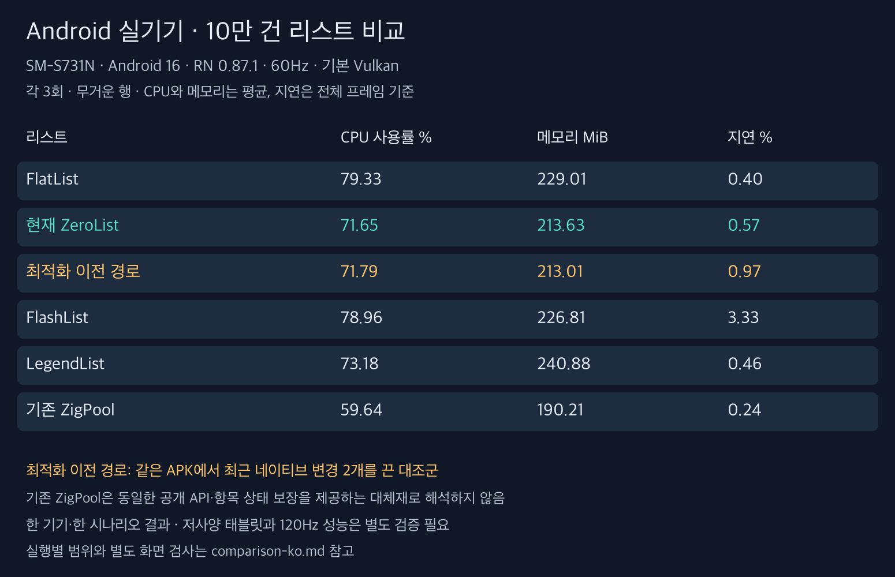

# Android 실기기 검증 — 2026-09-07

**실기기에서도 최근 네이티브 변경의 큰 CPU 개선은 확인되지 않았다. 다만 현재 ZeroList는 이번 조건에서 FlatList·LegendList보다 CPU와 종료 메모리 평균이 낮았다. 지연 프레임과 진입 준비율까지 모두 앞서지는 않았다.**

연결된 SM-S731N 한 대에서 비용 18회, 별도 화면 검사 6회, 상세 추적 3회를 완료했다. 제품 코드는 수정하지 않았다. [전체 비교표와 실행별 범위](comparison-ko.md), [한국어 비교 이미지](comparison-ko.png).

## 조건

- SM-S731N, SoC s5e9945, Android 16 / API 36, 1080×2340, density 450.
- RN 0.87.1 릴리스 APK. 코드 기준 `74ed97a`, APK SHA-256은 `provenance.json`에 기록했다. 이전 에뮬레이터 진단과 같은 APK다.
- 실기기 기본 그래픽 경로는 **Skia Vulkan**이다. 그래픽 API 설정은 바꾸지 않았다. 이전 에뮬레이터의 Skia OpenGL과 다르므로 기기와 API 중 어느 하나의 효과로 비교 차이를 귀속할 수 없다.
- peak/min refresh rate를 임시 60Hz로 설정했다. 비용·화면 검사 24회 모두 전후 화면 정보에서 60Hz를 확인했다. 테스트 종료 후 refresh rate, 화면 꺼짐 시간, 회전 설정 5개를 원래 값으로 복구하고 앱을 종료했다.
- 무거운 행 100,000개, bufferRows 5, 인위적 JS 점유 0ms. 실행마다 새 프로세스, 시작 대기 3초, 워밍업 12회 스와이프, 정지 후 2초 대기. 측정은 보통 3회·빠르게 6회·역방향 6회·보통 3회 스와이프와 2초 안정화다. 실행 사이 10초 대기, 순서는 시드 870917로 반복마다 섞었다.
- 비용 측정 중 전체 FrameMetrics 리스너, 내용 검사, Perfetto는 끈다. 앱 PID로 필터링한 기존 로그를 연속 저장했다. CPU는 `/proc/<pid>/stat` 차이, 메모리는 종료 시 `dumpsys meminfo` PSS, 지연은 `gfxinfo` 집계다.
- USB 연결 상태를 유지했다. 비용 18회 전후 배터리 온도는 31.7~33.2°C, thermal status는 모두 0이었다. CPU 주파수나 개인 기기의 다른 앱을 통제한 것은 아니다.

이 실험은 60Hz의 한 기기·한 시나리오 결과다. 저사양 태블릿, 120Hz, 장시간 스크롤, 인위적 JS 점유, 동적 크기·항목 상태 변경 계약을 이번 실기기에서 모두 검증했다는 뜻이 아니다. 100,000개 데이터는 적재하지만 실제 스크롤은 약 53~56행 분량이다. 전체 데이터를 끝까지 순회한 결과가 아니다.

## 비용과 내용 검사에서 확인한 것

현재 ZeroList 평균 CPU는 71.65%, 이전 경로는 71.79%로 **0.14%p 차이**다. 종료 PSS는 213.63MiB / 213.01MiB다. 지연은 7/1238 / 12/1232건이지만 각각 3회뿐이어서 이 차이만으로 최근 변경의 안정적인 개선 효과를 확정하지 않는다.

FlatList 대비 현재 ZeroList 평균 CPU는 약 9.7%, 종료 PSS는 약 6.7% 낮았다. LegendList 대비는 각각 약 2.1%, 11.3% 낮았다. 반면 지연 비율은 ZeroList 0.57%, FlatList 0.40%, LegendList 0.46%였다. FlatList CPU 실행 범위가 72.24~84.30%로 넓으므로 평균 차이를 보편적인 개선율로 사용하지 않는다.

화면 검사 6회에서는 잘못된 내용·겹침·2px 허용치를 넘는 빈 화면이 모두 0이었다. 진입 준비율은 ZeroList 98.15%, FlatList 100%로 차이가 남았다. 이동량은 약 52.8~55.5행으로 엔진마다 완전히 같지는 않았다. 검사는 각 1회이며 비용 측정과 분리했다.

기존 ZigPool은 CPU·메모리 수치가 가장 낮았다. 하지만 동일한 공개 API와 항목 상태 보장을 갖춘 대체재로 취급하지 않는다. 첫 비용 실행의 내용 컴포넌트 마운트/언마운트 증가량은 현재 ZeroList 57/57, 기존 ZigPool 0/0이었다. 서로 다른 항목으로 바뀔 때 내부 상태를 초기화하는 현재 경로와, 슬롯을 재사용하는 기존 경로의 계약 차이를 함께 봐야 한다.

## 실기기에서 특정한 지연 구간

상세 추적은 위 비용 실행과 별도로 3회 수집했다. `view`와 스케줄러 추적을 켰고 `gfx` 카테고리는 켜지 않았다. 전체 FrameMetrics를 보존했으며 콜백 누락 0, Perfetto error/data_loss 0이었다.

| 경로 | 추적 프레임 | 마감 초과 | GPU 시간 중앙값 | GPU 시간 p95 |
|---|---:|---:|---:|---:|
| 현재 ZeroList | 398 | 6 | 1.248ms | 1.588ms |
| 이전 경로 | 382 | 8 | 1.210ms | 1.484ms |
| FlatList | 406 | 4 | 1.257ms | 1.531ms |

GPU 시간은 완료까지의 경과 시간이며 다른 프레임 단계와 겹칠 수 있다. 비용 측정의 지연 비율과 위 계측 실행의 비율은 합산하지 않는다.

**대표 ZeroList 지연 프레임**: intended VSync `56538774801313`, 전체 28.611ms, 마감 16.667ms.

| 해당 프레임에 겹친 작업 | 시간 |
|---|---:|
| 메인 스레드 실제 CPU 실행 | 26.904ms |
| JS 스레드 실제 CPU 실행 | 0.414ms |
| UI의 `Choreographer#doFrame` | 26.125ms |
| RN 마운트 처리 전체 | 20.103ms |
| 그 안의 네이티브 뷰 69개 생성 | 15.104ms |
| 레이아웃 측정 | 0.251ms |
| GPU 완료까지의 경과 시간 | 1.139ms |

마운트 전체와 뷰 생성은 포함 관계이므로 합산하지 않는다. 69는 행 수가 아니라 무거운 행을 구성하는 네이티브 뷰의 개수다. 해당 프레임에서 UI 마운트 작업이 이미 프레임 예산을 넘었다. **이 표본에서는 작은 좌표·레이아웃 비용보다 새 행의 네이티브 뷰 생성 비용이 큰 문제였다.**

나머지 ZeroList 지연 표본에서도 GPU 시간은 1.178~1.414ms였다. 추가 3건에는 뷰 69개 생성 구간이 9.248 / 13.692 / 11.882ms로 기록됐고, 나머지 2건은 `premountViews`와 `preMountItems`를 거치는 준비·마운트 작업이 있었다. 34.505ms 프레임에는 UI 그리기 준비 구간도 16.547ms로 길어, 모든 지연을 하나의 생성 구간만으로 설명하지는 않는다.

현재 [pool-list.tsx](../../../packages/zerolist/src/pool-list.tsx)의 `<Fragment key={slot.key}>`는 슬롯의 항목이 바뀌면 내부 컴포넌트를 다시 마운트한다. 다른 항목의 React 상태가 새 항목으로 넘어가지 않도록 하는 경계다. 이 코드 구조, 실행 중 마운트 횟수, 실기기 CREATE 추적이 연결된다. 키를 단순히 고정해서 마운트 횟수를 없애는 것은 상태 계약을 깨뜨릴 수 있다.

따라서 다음 개선 후보는 GPU API 교체보다 **항목 상태 계약을 유지하면서 네이티브 뷰 생성·마운트 비용을 줄이는 방법**이다. 이번에는 원인 검증만 했고 해당 개선을 구현했다고 주장하지 않는다.

## 추적 시각과 공개 자료

실기기에는 절전 이력이 있으므로 앱의 MONOTONIC 시각과 Perfetto 시각이 같지 않았다. `clock_snapshot`에서 프레임과 가까운 MONOTONIC 스냅샷의 차이를 적용했다. 차이는 이 추적에서 102878983219999ns였다. 스레드 이름이 같은 경우는 TID로 구분하여 서로 다른 RenderThread의 시간을 한 스레드처럼 합산하지 않았다. [Perfetto 시계 동기화 문서](https://perfetto.dev/docs/concepts/clock-sync).

FlatList 로그에는 gfxinfo를 덤프한 뒤 추적 종료까지 추가 프레임이 있었다. gfxinfo의 Uptime 시점까지 완료된 프레임만 집계하니 세 경로 모두 전체 프레임 수와 지연 횟수가 gfxinfo와 정확히 일치했다. 의도된 VSync와 실제 프레임 마감을 사용하며 16.67ms 고정 기준으로 세지 않는다.

- `perf-results.json`, `audit-results.json`, `summary.json`: 실행별 비용·내용 검사와 요약.
- `perf-raw.zip`, `audit-raw.zip`: 앱 로그·gfxinfo·실행 조건·필터링한 상태 기록.
- `analysis.json`, `trace-app-data.zip`: 지연 프레임별 지표·앱 작업과 앱 로그. 원본 시스템 Perfetto 파일과 개인 기기 화면은 로컬에 보관하고 공개 ZIP에서 제외했다. 원본 추적 해시는 `provenance.json`에 남겼다.
- `record.py`, `record_trace.py`, `trace.cfg`: 실기기 수집 스크립트. `ANDROID_SERIAL` 환경 변수를 명시해야 한다. 기록 스크립트 실행 전후 60Hz 설정과 복구는 별도 수행했다.
- `report.py`, `visualize.py`, `analyze_trace.py`: 표·한국어 이미지·프레임 추적 분석 재현. 상세 추적을 다시 분석하려면 로컬 원본 `.trace`가 필요하다.

제품 코드와 Android/iOS 빌드 CI는 변경하지 않았다.

## 측정 정확도와 다음 검증

**오차 없는 측정이 아니다. 현재 자료는 원인 탐색과 예비 비교다.**

CPU 시작·종료값을 ADB로 순차 읽어 벽시계 시간과 완전히 같은 시각에 샘플링한 것은 아니다. 종료 PSS는 최대 사용량이 아니며 메모리 회수 시점에 영향을 받는다. `gfxinfo`의 마감 초과는 화면 표시 시각·입력부터 내용 표시까지의 지연을 직접 측정한 값이 아니다. 같은 스와이프도 리스트별 실제 이동량이 다르다. 예열, 순서 섞기, 60Hz 및 발열 확인으로 일부 변동을 줄였지만 각 3회·약 7초의 짧은 비용 구간으로 작은 차이를 확정할 수 없다.

상세 추적도 자체 오버헤드가 있다. 마운트 20.103ms는 추적을 켠 해당 프레임에서 관측한 값이며, 모든 비계측 프레임에서 정확히 같은 비용이라는 뜻이 아니다. CPU·메모리 순위와 지연 원인 추적을 분리한 이유다.

최종 채택 전에 반복 수와 실행 길이를 늘리고, 현재/이전 경로를 번갈아 비교하며 실행별 분포와 차이의 신뢰구간을 봐야 한다. 동일 입력의 실제 체감 비교와 동일 이동량·갱신량의 처리 비용 비교도 구분해야 한다. 기본 120Hz, 인위적 JS 점유, 가벼운 행·동적 크기, 장시간 메모리·상태 계약도 별도 검증해야 한다. 신뢰구간만으로 백그라운드 작업이나 시나리오 편향이 해결되는 것은 아니다.

구현 후보로 로컬 RN 0.87.1 소스의 `ViewManager.setupViewRecycling()`과 `prepareToRecycleView()`를 확인했다. `View`/`Text` 종류별 재활용 기능은 있지만 공통 `enableViewRecycling` 기본값은 false다. 이 내부 기능의 실제 런타임 상태와 적용 조건부터 확인한 뒤, React 항목 상태 초기화를 유지한 채 네이티브 뷰 재활용을 켜고 끄는 대조 실험이 우선이다. 이 기능을 켜기만 하면 빨라진다고 확정한 것은 아니다. 앱 전체에 영향을 줄 수 있으므로 모든 비교 리스트에 같은 조건을 적용해야 한다.
