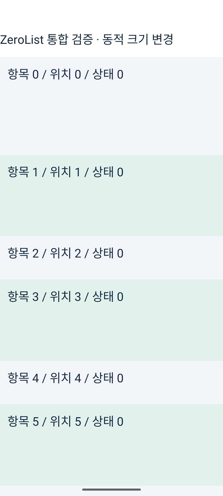

# 네이티브 뷰 재활용 대조 실험 — 준비 및 검증 상태

**실기기에서 빨라졌다는 유효한 결과는 아직 없다.** 같은 APK에서 RN 네이티브 뷰 재활용을 켜고 끄는 진단 경로를 구현했고, 릴리스 빌드 및 에뮬레이터 상태 검사는 통과했다. 실기기 첫 비교 시도는 테스트 앱의 전면 이탈 때문에 전체 제외했다. 휴대폰을 테스트 화면에 유지할 수 있는 시점에 재측정해야 한다.

## 구현

예제 앱의 `SoloActivity`에 `--ez viewRecycling true/false` 인자를 추가했다. ReactHost 생성 전, 새 프로세스에서만 설정할 수 있다. 일반 실행과 라이브러리 기본값은 바꾸지 않았다. `<Fragment key={slot.key}>`도 그대로 두어 다른 항목으로 바뀔 때 React 상태를 초기화한다.

RN 0.87.1의 `ReactNativeNewArchitectureFeatureFlagsDefaults`를 기반으로 공통 `enableViewRecycling` 한 항목만 바꾼다. 생성된 RN 진입점이 이미 기본 provider를 등록하므로 내부 `dangerouslyForceOverride` API가 필요했다. ReactHost 생성 후 호출, 중복 설정, 재활용 플래그가 미리 읽힌 경우에는 중단한다. 설정 전에 읽힌 플래그 목록과 실제 적용값도 로그로 남긴다. 실기기 켬 스모크는 `configured=true effective=true previous=null`이었다.

이는 RN 내부 API에 의존하는 예제 앱의 PoC다. 라이브러리의 안정된 공개 설정이나 채택 완료 기능이 아니다. 앱 전체 RN ViewManager에 영향을 줄 수 있으므로 경쟁 리스트도 동일하게 켬/끔을 적용해야 한다.

## 완료한 검증

- Android 릴리스 빌드 성공, 49초.
- 동일 APK 설치 및 실기기 플래그 적용값 확인.
- 에뮬레이터에서 켬/끔 각각 재정렬·앞 삽입·내용 교체·라벨 변경·먼 항목 이동·복원·동적 크기 상태 검사 7개 통과.
- 재정렬 뒤 항목 0의 상태 1이 항목 0에 남고 다른 항목은 0인 화면 확인. 복원·동적 크기 변경 후 상태 0 확인.
- `measureInWindow` 좌표는 실제 배치의 증거로 사용하지 않았다. 화면 PNG를 별도로 확인했다.

## 무효 처리한 실기기 실행

첫 켬 실행은 CPU 9.61%로 낮게 나왔지만, 워밍업 뒤 렌더 갱신 7회와 전체 163프레임으로 기대한 작업량보다 매우 적었다. 뒤이은 끔 실행은 프레임 부족 검사에서 중단됐다. Android 활동 로그에서 다음 전면 이탈을 확인했다.

- 01:49:58.867: SoloActivity `userLeaving=true` pause, 이후 stop.
- 01:50:33.711: 다음 SoloActivity도 `userLeaving=true` pause, 이후 stop.

따라서 낮은 CPU를 재활용 효과로 해석하지 않는다. `invalid-first-attempt.json` 및 테스트 앱만 추린 `invalid-activity-events.log`에 제외 이유를 보존했다. 원본은 로컬 `/private/tmp/zerolist-recycling-zero-perf`에 남아 있다. 개인 기기의 다른 앱 화면은 공개하지 않는다.

기존 검사는 프레임 수와 내용 갱신이 조금만 있어도 통과할 수 있었다. 재측정 스크립트는 매 스와이프 직전과 마지막 CPU 샘플 전에 테스트 앱의 전면 상태를 확인하고, 이탈하면 추가 입력을 중단한다. 이 검사의 ADB 비용도 켬/끔 벽시계 구간에 동일하게 들어가므로 이전 전면 검사 없는 결과와 직접 비교하면 안 된다.

실기기 자동 입력은 중단했고, refresh rate·회전·화면 꺼짐 설정을 원복했다. 실기기에서 테스트 화면을 유지할 수 있다는 응답을 기다리고 있다.

## 남은 검증

1. 실기기에서도 켬/끔 상태 검사를 먼저 실행한다.
2. ZeroList를 켬/끔 각 6회, 실행당 54회 스와이프로 순서를 바꿔 비교한다. 짧은 이전 18회 스와이프 평균과 직접 합산하지 않는다.
3. CPU·지연·종료 PSS 및 프로세스 RSS 최고치(VmHWM)를 함께 본다. VmHWM은 프로세스 시작부터의 RSS 최고치이며 최대 PSS가 아니다.
4. 별도 내용 검사와 Perfetto에서 마운트 비용 감소를 확인한다.
5. 유효한 이점이 있으면 FlatList·FlashList·LegendList에도 같은 공통 스위치를 적용해 RN 전체의 효과와 ZeroList의 차이를 구분한다.
6. 120Hz·장시간·다양한 속성 초기화는 추가 확인 사항이다. 기본 켬으로 채택하지 않는다.

`record.py`, `contract.py`는 `ANDROID_SERIAL`과 새 `OUT` 경로를 요구한다. 측정 전 60Hz 설정과 종료 후 복구는 별도 수행해야 한다. `candidate.patch`와 `provenance.json`에 실제 후보와 APK 해시를 보존했다.
